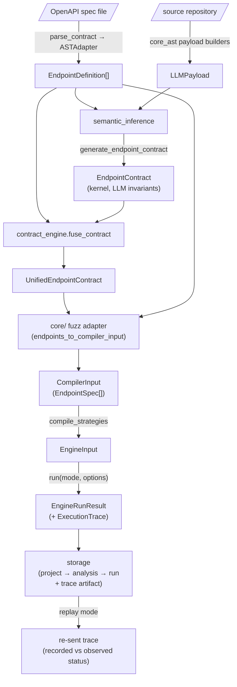

# Data Flow

The pipeline is a chain of stages, and every seam between two stages is a typed boundary object.
Nothing but a validated DTO crosses from one module to the next: a stage receives one shape,
performs a single transformation, and emits the next shape. This page names the object at each
seam, who produces it, who consumes it, and where it is validated.

For the module responsibilities and the design principles behind this shape, see the
[Overview](overview.md).

## The boundary objects, end to end

## Seam by seam

| Seam | Producer | Consumer | Boundary DTO | Validated at |
| :--- | :--- | :--- | :--- | :--- |
| Spec → endpoints | `contract_engine.parse_contract` → `ASTAdapter` | `semantic_inference`, `fuse_contract` | [`EndpointDefinition`](../modules/contract-engine/index.md) | `parse_contract` (OpenAPI 3.x / Swagger 2.0 validated on ingest) |
| Source → handler context | `core_ast` payload builders | `semantic_inference` | [`LLMPayload`](../modules/core-ast/index.md#public-api-re-exports) | `core_ast` stages (typed DTO per stage) |
| Context → invariants | `semantic_inference.generate_endpoint_contract` | `fuse_contract` | [`EndpointContract`](../modules/contracts/index.md#the-model) | `semantic_inference` validates the raw LLM output as `SemanticEndpointContract` (`extra="forbid"`) before converting it to the kernel contract |
| Base + invariants → unified | `contract_engine.fuse_contract` | `core/` fuzz adapter | [`UnifiedEndpointContract`](../modules/contract-engine/index.md) | `fuse_contract` (identity from the OpenAPI base, invariants merged in) |
| Unified → engine input | `core/` fuzz adapter (`endpoints_to_compiler_input`) | `compile_strategies` | [`CompilerInput` / `EndpointSpec`](../modules/custom-schemathesis/strategy-compiler.md) | the engine's `policy` layer validates each `EndpointSpec` |
| Compile → run | `custom_schemathesis.compile_strategies` | `custom_schemathesis.run` | [`EngineInput`](../modules/custom-schemathesis/engine-internals.md) | `compile_strategies` (translation only; never re-validates) |
| Run → result | `custom_schemathesis.run` | `core/` persistence | [`EngineRunResult`](../modules/custom-schemathesis/index.md#the-public-facade) (carries the [`ExecutionTrace`](../modules/custom-schemathesis/index.md#reproducibility)) | the engine emits it; the run's abort policy watches target-failure categories |
| Result → storage | `core/` persistence service | `storage` repositories | [`RunRecord` + trace artifact](../modules/storage/data-model.md#data-models-dtos) | one transaction per composed write (project → analysis → run) |
| Storage → replay | `storage` (recorded trace) | `custom_schemathesis` replay mode | [`ExecutionTrace`](../modules/custom-schemathesis/index.md#reproducibility) | replay checks the trace is replayable before sending, then compares recorded vs observed status per request |

The hierarchy `storage` writes is **project → analysis → run**: an *analysis* is the replayable
recipe (its resolved contracts plus the recorded trace), and a *run* is one execution of it. Replay
reads an analysis back and re-sends its trace verbatim.

## What never crosses a seam

Some things stay on one side of a boundary by design — a rule that keeps the dependency graph
acyclic and one-directional.

- **Raw LLM output never becomes a contract unchecked.** `semantic_inference` is the only place
  model output is validated: it is parsed into a strict model (`extra="forbid"`, so a hallucinated
  key fails loudly) and only then converted to the kernel `EndpointContract`. No downstream stage
  ever sees an unvalidated LLM response.
- **The execution engine never sees OpenAPI or the LLM's output.** `custom_schemathesis` consumes
  `EngineInput` alone. The OpenAPI shape is resolved away in ingestion, and the LLM's contribution
  reaches the engine only as constraints already merged into `UnifiedEndpointContract` and then
  translated by the orchestrator's adapter.
- **`storage` never imports the engine.** It is the leaf of the graph and holds no engine
  vocabulary; fields like a crash report's phase are plain text on its side. Guarantees that would
  otherwise require an import — that the phases storage documents are exactly the ones the engine
  writes — are enforced by cross-package gates that live in the orchestrator's tests (for example
  `core/tests/test_phase_vocabulary.py`), where both sides of the seam are installed together, not
  by a runtime dependency.
