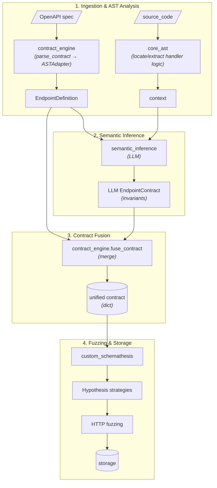

# Architecture Overview

Spec Forge is an AI-augmented Property-Based Testing (PBT) engine for web API security and
robustness: static AST analysis + LLM inference + OpenAPI specs + property-based fuzzing, to find
deep bugs (e.g. `500`s on invalid input instead of proper `4xx`s).

## Core pipeline

1. **Parse** — ingest OpenAPI specs, resolve endpoints.
2. **Analyze (AST)** — statically inspect handler code (tree-sitter, zero execution).
3. **Infer (LLM)** — extract unstated invariants (bounds, enums, cross-field logic).
4. **Fuse** — merge OpenAPI structure with LLM invariants into one unified contract.
5. **Fuzz** — compile the contract into Hypothesis strategies, run async HTTP tests.
6. **Persist** — log runs/endpoints/results to SQLite.



## Repository layout

The repository is a monorepo: a central CLI (`core/`) plus standalone `lib/` packages, each
managing its own dependencies, tests, and Docker setup.

```text
core/                       # specforge CLI orchestrator (specforge_cli)
lib/
├── contract_engine/        # OpenAPI ingestion + adaptation + fusion
├── core_ast/                # tree-sitter static analysis
├── semantic_inference/      # LLM router + inference
├── custom_schemathesis/     # questionnaire + strategy compiler + engine (stateless & stateful fuzzing)
└── storage/                 # SQLite persistence
docker-compose.yml           # monorepo orchestration (root entry point)
```

## Module responsibilities

| Module | Responsibility |
| :--- | :--- |
| `core/` | Interactive CLI/REPL (Typer, Rich, prompt_toolkit): navigation + command orchestration. |
| `lib/contract_engine/` | Validates OpenAPI 3.x (`prance`), flattens endpoints, fuses base schemas with LLM invariants. Rejects Swagger 2.0. |
| `lib/core_ast/` | Deterministic, stateless AST analysis (`tree-sitter`); locates routes/handlers/deps via `patterns.toml`. |
| `lib/semantic_inference/` | Provider-agnostic LLM interface (`LiteLLM`): retries, fallbacks, invariant inference. |
| `lib/custom_schemathesis/` | Compiles contracts to Hypothesis strategies; runs stateless/stateful async HTTP fuzzing (`httpx`). |
| `lib/storage/` | SQLite layer (Repository pattern, Pydantic DTOs) + on-disk artifact persistence with hash dedup. |

## Design principles

- **Layered pipeline** — each module is a stage: typed input → pure transform → typed output.
  Stages never reach backward into later stages.
- **Dependency direction** — upstream modules never import downstream ones at runtime (e.g.
  `contract_engine` knows nothing of `custom_schemathesis`). Only `core/` wires multiple pipeline
  engines together.
- **Boundary DTOs** — stages communicate only through Pydantic DTOs, never shared mutable state.
- **Determinism** — static/transform stages are deterministic and side-effect free: same input →
  same output or domain exception. I/O happens only at module edges. The execution engine uses
  explicit seeds for reproducible non-determinism.

## The unified contract

The boundary object between the AI side and the execution engine is `EndpointContract` /
`EndpointParameters` / `SchemaProperty`:

- Pure JSON Schema vocabulary (`type`, `minimum`/`maximum`, `pattern`, `enum`, `minLength`/
  `maxLength`, `minItems`/`maxItems`, `items`, `properties`, `required`, `format`) — engines
  compile it natively.
- camelCase on the wire, snake_case in Python.
- `extra="forbid"` forces LLM self-correction (hallucinated keywords fail validation).
- **Identity vs. invariants** — `method`/`path_url` are routing identity, always sourced from the
  OpenAPI base. The LLM only contributes validation constraints, never overrides identity.
