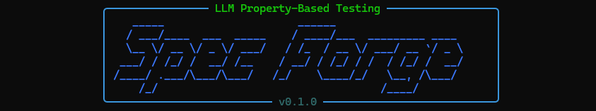
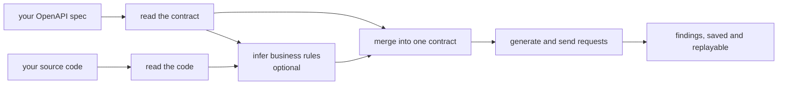

# Spec Forge

Spec Forge finds bugs in your API. You give it your API's OpenAPI description — and,
optionally, its source code — and it generates a stream of requests against a running copy of
the API, checking rules that must always hold: no unexpected server errors, responses that
match the schema, no undeclared status codes, and the business rules it can read from your
code. When a request breaks a rule, Spec Forge shrinks it to the smallest example that still
fails and saves the result so you can reproduce it exactly.

## Start here

### I want to test my API

- [Installation & Quick Start](user-guide/installation.md) — prerequisites and your first run.
- [Core Concepts](user-guide/concepts.md) — what Spec Forge does and the words it uses.
- [CLI Reference](user-guide/cli-reference.md) — every command, its flags and its output.
- [Example Walkthrough](user-guide/example-walkthrough.md) — the commands end to end against a
  sample API.

### I want to understand or extend the code

- [Architecture Overview](architecture/overview.md) — the pipeline stages and how they fit
  together.
- [Data Flow](architecture/data-flow.md) — the typed objects that cross between modules.
- [Developer Guide › Modules](modules/contract-engine/index.md) — a per-package implementation
  deep dive.
