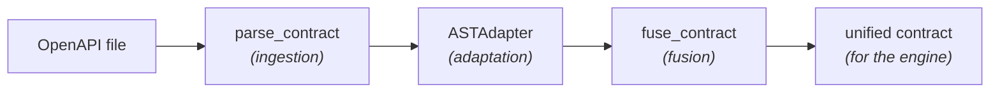
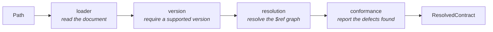

# Contract Engine

The Contract Engine turns an OpenAPI specification into a clean, typed contract
that the rest of the system can consume. It reads the spec, flattens it into a
list of endpoints, and (optionally) fuses it with the business rules inferred by
the LLM to produce the final contract the fuzzing engine attacks.

It works in three stages, each usable on its own:



The package targets Python 3.11+. Its installation, test and lint commands are in
[Development & Testing](../../getting-started/development.md#module-commands).

## Module layout

```
src/contract_engine/
├── exceptions.py     # domain exceptions
├── models/           # data models (ResolvedContract, EndpointDefinition, unified contract re-export)
├── ingestion/        # loader · version · resolution · conformance · facade
├── adapters/         # ASTAdapter
└── fusion/           # fuse_contract (normalizer, llm_input, merger, façade)
```

The unified contract model itself lives in the shared kernel `specforge-contracts`
(canonical class `EndpointContract`, at `lib/contracts` in the repository), which
this package depends on and re-exports as `UnifiedEndpointContract` for backward
compatibility. The kernel is the single owner shared with `semantic_inference`
and `custom_schemathesis`, so the contract shape never drifts between stages.

Everything you normally need is re-exported from the package root:

```python
from contract_engine import (
    parse_contract,
    ASTAdapter,
    fuse_contract,
    ResolvedContract,
    EndpointDefinition,
    UnifiedEndpointContract,
)
```

## How it works

### 1. Ingestion — `parse_contract`

Reads a YAML or JSON OpenAPI file, resolves its `$ref` pointers inline,
checks it against the OpenAPI 3.x standard, and returns an immutable
`ResolvedContract` carrying whatever defects it found.

```python
from contract_engine import parse_contract

contract = parse_contract("openapi.yaml")

print(contract.openapi_version)   # "3.0.3"
print(contract.spec["paths"])     # resolved spec dict
print(contract.deviations)        # defects reported, not rejected
```

A cyclic schema cannot be expanded forever, so a handful of pointers survive
resolution as bare document-relative `$ref`s — the marker the recursion handler
would attach does not reach them. Nothing distinguishes them, so a deliberate
cycle and a reference that could not be resolved look alike to anything
downstream.

#### The stages, and why the order matters

`parse_contract` is a façade over four units:



The version gate runs on the raw document, before any of the expensive work. It
rejects an unsupported declaration, an undeclared version, and a supported one
written unquoted (`openapi: 3.0` decodes as a float, which `prance` cannot parse
as a version). Running it first also means a document that declares nothing does
not pay for full `$ref` resolution before being turned away on a fact available
in its first line.

Judging the declaration on the raw document is what makes the verdict truthful:
otherwise any validation error preempts the version check, and a spec in an
unsupported dialect gets reported by whatever else happens to be wrong with it.
An acceptance gate over a real-world spec corpus pins the rule — every spec
declaring Swagger 2.0 fails on the version, not on a later stage.

#### Tolerance

A defect the pipeline never consumes does not justify turning a contract away.
`conformance` reports what it finds instead of rejecting, and the report travels
on the contract itself:

```python
contract = parse_contract("openapi.yaml")

for deviation in contract.deviations:
    print(deviation.scope, deviation.pointer, deviation.detail)
```

Each `ContractDeviation` says **where** the defect is and **what the validator
said** — nothing more. It carries no usability verdict, because ingestion cannot
know one: whether an endpoint is actually fuzzable is decided later, by the
component that compiles it.

| Field | Meaning |
|---|---|
| `scope` | `DOCUMENT`, `PATH_ITEM` or `OPERATION` — how precisely the defect was located |
| `pointer` | JSON Pointer (RFC 6901) to the node, when the error anchors in one |
| `path_url` / `method` | the endpoint, on `PATH_ITEM` and `OPERATION` scope |
| `code` | `SPEC_CONFORMANCE`, or `SPEC_SEMANTICS` when the validator gave the rule its own exception type |
| `detail` | the validator's message, verbatim |

`scope` fixes which of `path_url`/`method` must be present, and the DTO enforces
that pairing: a misattributed deviation fails to construct rather than reading
like a well-attributed one.

> **A deviation is only located as precisely as the validator located it.** The
> pointer comes from the error's own path, walked against the document and checked
> against the failing instance. When it does not anchor there — a defect inside a
> `default` value, or a rule the validator reports without a path — the deviation
> is `DOCUMENT`-scoped with no pointer. A location the library did not give us is
> not re-derived: a plausible-but-wrong pointer is worse than none.

Still fatal: an unreadable or undecodable file, a document that is not a mapping,
a version below OpenAPI 3.x, and a `$ref` that cannot be resolved.

The CLI prints the deviations after a successful load and closes with a warning
rather than a success, so a degraded load never looks like a clean one.

#### Error taxonomy

Every failure is a typed domain exception carrying context; the module never
returns `None`, prints, or lets a third-party error escape.

```
ContractEngineError
├── SchemaIngestionError            (always carries .filepath)
│   ├── SchemaFileNotFoundError     missing file or unsupported extension
│   ├── SchemaDecodeError           unreadable, unparseable, or not a mapping
│   ├── UnsupportedSchemaVersionError   not OpenAPI 3.x (Swagger 2.0, 4.x, undeclared)
│   ├── SchemaResolutionError       a $ref could not be resolved
│   ├── SchemaComplexityError       too deeply nested to resolve
│   └── SchemaValidationError       does not conform to the standard
└── SemanticContractError           the LLM contract is malformed (fusion)
```

Catch `SchemaIngestionError` to handle any *raised* ingestion failure uniformly;
catch a leaf to tell them apart. The `loader` and `resolution` units are adapters
over `prance` and translate every failure of the parse, so a third-party error
surfaces as a domain exception rather than reaching the caller raw.

Not every failure is raised: ingestion enforces no timeout and no depth cap, so
a sufficiently recursive spec never returns. Parse untrusted specs under your
own budget.

> **`prance` is pinned to an exact version:** it decides how `$ref` resolution
> behaves, which is exactly what the ingestion tests characterize. An unpinned
> upgrade silently rewrites that behavior.

### 2. Adaptation — `ASTAdapter`

Flattens the resolved spec into a plain list of `EndpointDefinition` objects. It
merges path-level parameters into each operation (operation-level parameters win
on conflict) and keeps only the routing-relevant metadata.

```python
from contract_engine import ASTAdapter, parse_contract

contract = parse_contract("openapi.yaml")
endpoints = ASTAdapter(contract).extract_endpoints()

for endpoint in endpoints:
    print(endpoint.method, endpoint.path, endpoint.operation_id)
```

Each `EndpointDefinition` holds `path`, `method`, `operation_id`, `parameters`
(raw OpenAPI form), `request_body` and `responses`.

### 3. Fusion — `fuse_contract`

Combines the structural rules from OpenAPI with the business invariants inferred
by the LLM, and returns a single unified contract (a plain dict) ready for the
execution engine.

The two inputs come in different shapes, so the OpenAPI base is first normalized
into the unified shape and then merged with the LLM contract. The merge policy:

- **LLM invariants win on conflict.** If OpenAPI says `age: integer` and the LLM
  adds `minimum: 18, maximum: 99`, the result keeps the type and applies the
  tighter bounds.
- **The base fills the gaps.** Anything the LLM does not mention is kept from the
  OpenAPI base.
- **Routing identity stays fixed.** `method` and `path_url` always come from the
  base; the LLM cannot change them.
- **The output stays coherent.** Constraints that no longer match a field's type
  are dropped, and an `enum` collapses the field to its allowed values.

```python
from contract_engine import ASTAdapter, fuse_contract, parse_contract

endpoint = ASTAdapter(parse_contract("openapi.yaml")).extract_endpoints()[0]

llm_contract = """
{
  "method": "post",
  "path_url": "/users",
  "parameters": {
    "query": {"age": {"type": "integer", "minimum": 18, "maximum": 99}}
  }
}
"""

unified = fuse_contract(endpoint, llm_contract)
# -> {"method": "post", "path_url": "/users",
#     "parameters": {"path": {}, "query": {"age": {...}}, "header": {}}, "body": {...}}
```

`llm_contract` may be a JSON string or a dict. A malformed or invalid LLM
contract raises `SemanticContractError` (it never merges corrupted data).

## CLI

A small executable parses a contract and prints the extracted endpoints:

```bash
python -m contract_engine path/to/openapi.yaml
```
