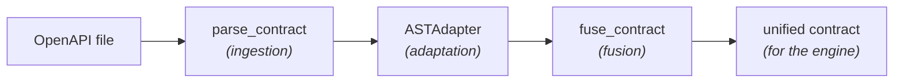
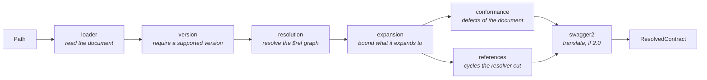

# Contract Engine

The Contract Engine turns an OpenAPI specification into a clean, typed contract
that the rest of the system can consume. It reads the spec, flattens it into a
list of endpoints, and (optionally) fuses it with the business rules inferred by
the LLM to produce the final contract the fuzzing engine attacks.

It works in three stages, each usable on its own:



The package targets Python 3.11+. Its installation, test and lint commands are in
[Contributing & Testing](../../developer-guide/contributing.md#test-a-compose-module).

## Module layout

```
src/contract_engine/
├── exceptions.py     # domain exceptions
├── models/           # data models (ResolvedContract, EndpointDefinition, unified contract re-export)
├── ingestion/        # loader · version · resolution · expansion · conformance · references · location · swagger2/ · facade
├── adapters/         # ASTAdapter
└── fusion/           # fuse_contract (normalizer, llm_input, merger, façade)
```

The unified contract model itself lives in the shared kernel `specforge-contracts`
(canonical class `EndpointContract`, at `lib/contracts` in the repository), which
this package depends on and re-exports as `UnifiedEndpointContract` for backward
compatibility. The kernel is the single owner shared with `semantic_inference`
and `custom_schemathesis`, so the contract shape never drifts between stages.

Everything you normally need is re-exported from the package root:

```python
from contract_engine import (
    parse_contract,
    ASTAdapter,
    fuse_contract,
    ResolvedContract,
    EndpointDefinition,
    UnifiedEndpointContract,
)
```

## How it works

### 1. Ingestion — `parse_contract`

Reads a YAML or JSON OpenAPI file, resolves its `$ref` pointers inline,
checks it against the OpenAPI 3.x standard, and returns an immutable
`ResolvedContract` carrying whatever defects it found. A Swagger 2.0 document is
accepted too, and translated on the way in.

```python
from contract_engine import parse_contract

contract = parse_contract("openapi.yaml")

print(contract.openapi_version)   # "3.0.3" — the dialect of contract.spec
print(contract.source_version)    # "3.0.3" — what the file declared
print(contract.spec["paths"])     # resolved spec dict
print(contract.deviations)        # defects reported, not rejected
```

A cyclic schema cannot be expanded forever, so a handful of pointers survive
resolution as document-relative `$ref`s carrying `x-recursive: true`. Each one is
reported as a `REFERENCE_CYCLE` finding anchored at its destination. The marker
is what separates them from a pointer that survived for any other reason, and is
public as `TRUNCATION_MARKER` for that reason (ADR-053).

A pointer that names nothing at all is not fatal either. It is dropped before
resolution runs and reported as a `DANGLING_REFERENCE`, because one absent schema
would otherwise cost the contract every endpoint it describes correctly
(ADR-052).

#### The stages, and why the order matters

`parse_contract` is a façade over six units:



`conformance` reads the document as written; `references` reads the resolved
spec, since a truncated cycle only exists there. Both report through the same
`ContractDeviation`, and a seventh unit, `location`, holds the vocabulary they
share: how a path into the document becomes a scope, a JSON Pointer and an
endpoint.

The version gate runs on the raw document, before any of the expensive work. It
accepts OpenAPI 3.x and Swagger 2.0, and rejects an unsupported declaration, an
undeclared version, and a supported one written unquoted (`openapi: 3.0` decodes
as a float, which `prance` cannot parse as a version). Running it first also
means a document that declares nothing does not pay for full `$ref` resolution
before being turned away on a fact available in its first line.

Judging the declaration on the raw document is what makes the verdict truthful:
otherwise any validation error preempts the version check, and a document gets
reported by whatever else happens to be wrong with it. An acceptance gate over a
real-world spec corpus pins the rule from the other side — no spec is ever turned
away on its dialect, and every residual rejection names a cause of its own.

#### Tolerance

A defect the pipeline never consumes does not justify turning a contract away.
`conformance` reports what it finds instead of rejecting, and the report travels
on the contract itself:

```python
contract = parse_contract("openapi.yaml")

for deviation in contract.deviations:
    print(deviation.scope, deviation.pointer, deviation.detail)
```

Each `ContractDeviation` says **where** the defect is and **what the validator
said** — nothing more. It carries no usability verdict, because ingestion cannot
know one: whether an endpoint is actually fuzzable is decided later, by the
component that compiles it.

| Field | Meaning |
|---|---|
| `scope` | `DOCUMENT`, `PATH_ITEM` or `OPERATION` — how precisely the defect was located |
| `pointer` | JSON Pointer (RFC 6901) to the node, when the error anchors in one |
| `path_url` / `method` | the endpoint, on `PATH_ITEM` and `OPERATION` scope |
| `code` | one of the five below |
| `detail` | the validator's message, verbatim |

| Code | Says |
|---|---|
| `SPEC_CONFORMANCE` | the document violates the OpenAPI meta-schema |
| `SPEC_SEMANTICS` | it violates a rule the validator gives its own exception type |
| `REFERENCE_CYCLE` | the resolver truncated a recursive schema |
| `DANGLING_REFERENCE` | a `$ref` names a node the document never defines |
| `CONFORMANCE_NOT_ASSESSED` | the validator could not run at all |

Not every finding faults the document. A `REFERENCE_CYCLE` is legal OpenAPI,
worth knowing about but not a defect. `CONFORMANCE_NOT_ASSESSED` faults the
validator rather than the spec, which may well be flawless — it exists so that an
empty report is never mistaken for a clean bill of health when nobody looked
(ADR-054). Ask `describes_document_defect(code)` rather than counting deviations:
it is a total mapping over the enum, so a code it does not classify raises instead
of quietly landing on the safe side.

`scope` fixes which of `path_url`/`method` must be present, and the DTO enforces
that pairing: a misattributed deviation fails to construct rather than reading
like a well-attributed one.

> **A deviation is only located as precisely as the validator located it.** The
> pointer comes from the error's own path, walked against the document and checked
> against the failing instance. When it does not anchor there — a defect inside a
> `default` value, or a rule the validator reports without a path — the deviation
> is `DOCUMENT`-scoped with no pointer. A location the library did not give us is
> not re-derived: a plausible-but-wrong pointer is worse than none.

Still fatal: an unreadable or undecodable file, a document that is not a mapping,
a version outside OpenAPI 3.x and Swagger 2.0, a construct with no 3.x equivalent,
and a `$ref` that cannot be resolved.

The CLI prints every finding after a successful load, and closes with a warning
rather than a success **when the document is at fault**, so a degraded load never
looks like a clean one — and a valid contract that merely happens to be recursive
never looks degraded.

#### Swagger 2.0

A Swagger 2.0 document is accepted and translated into OpenAPI 3.x. The dialect
does not survive ingestion: `contract.spec` is always 3.x, and no stage
downstream branches on where it came from.

```python
contract = parse_contract("swagger.json")

contract.source_version    # "2.0"   — what the file declared
contract.openapi_version   # "3.0.3" — the dialect of contract.spec
```

Both fields exist because collapsing them would be a lie in one direction or the
other. Downstream needs to know what it is reading; the user needs to see the
file described as what they wrote. The CLI renders exactly that:
`Swagger 2.0, translated to OpenAPI 3.0.3`.

**Translation runs after resolution**, which is the decision the whole unit rests
on. Once every `$ref` is inlined there are no JSON Pointers left to rewrite —
the expensive, fragile half of any spec converter — and what remains is
structural mapping: `host`/`basePath`/`schemes` into `servers`, a `body`
parameter into a `requestBody`, `consumes`/`produces` into media types,
`collectionFormat` into `style`/`explode`, `securityDefinitions` into
`components.securitySchemes`.

Two consequences worth knowing:

- **`definitions` stays where it is.** Moving it under `components.schemas`
  would break the document-relative `$ref` that a truncated reference cycle
  leaves behind, and no consumer reads it: after resolution, every schema an
  endpoint uses is already inlined.
- **Deviations are reported in the source dialect.** `conformance` and
  `references` both run before translation, so a finding points at the file the
  user wrote, not at an intermediate document they never saw.

Where a Swagger 2.0 construct has no 3.x equivalent at all — an unknown
`securityDefinitions` type, an unknown OAuth2 flow — translation raises
`SchemaConversionError` rather than guessing. Approximating would change the
contract's meaning with no symptom: the contract loads, the fuzzer runs, and the
requests go out in a shape the document never declared.

#### Error taxonomy

Every failure is a typed domain exception carrying context; the module never
returns `None`, prints, or lets a third-party error escape.

```
ContractEngineError
├── SchemaIngestionError            (always carries .filepath)
│   ├── SchemaFileNotFoundError     missing file or unsupported extension
│   ├── SchemaDecodeError           unreadable, unparseable, or not a mapping
│   ├── UnsupportedSchemaVersionError   neither OpenAPI 3.x nor Swagger 2.0 (1.x, 4.x, undeclared)
│   ├── SchemaResolutionError       a $ref could not be resolved
│   ├── SchemaComplexityError       too deep to resolve, or expands past the bound
│   ├── SchemaConversionError       a Swagger 2.0 construct with no OpenAPI 3.x equivalent
│   └── SchemaValidationError       does not conform to the standard
└── SemanticContractError           the LLM contract is malformed (fusion)
```

Catch `SchemaIngestionError` to handle any *raised* ingestion failure uniformly;
catch a leaf to tell them apart. `SchemaComplexityError` raised while *validating*
is the one exception that no longer reaches the caller: the contract resolved, so
it is delivered with a `CONFORMANCE_NOT_ASSESSED` deviation instead (ADR-054). The `loader` and `resolution` units are adapters
over `prance` and translate every failure of the parse, so a third-party error
surfaces as a domain exception rather than reaching the caller raw.

#### Bounds

Resolution inlines a `$ref` by sharing the target object, so the spec it produces
is a **DAG, not a tree**. Directus resolves in 0.09 s into 6 632 unique nodes —
which a tree-shaped walk sees as 3.33e10. Nothing hangs *inside* ingestion; the
cost belongs to whoever walks what ingestion returns, and the validator is only
first in line, ahead of `json.dumps`, the adapter and persistence.

So what is bounded is **the artifact**, not the running time:

- a cyclic `$ref` is expanded **once** and then truncated — the recursion limit
  was acting as an exponent (3.33e10 → 6.01e4 on the same spec), and it only ever
  applies to a `$ref` that re-enters itself;
- the expanded size is computed over the DAG by memoizing per subtree —
  `O(unique nodes)`, milliseconds even on the pathological cases — and a spec past
  the bound is rejected with `SchemaComplexityError` before anything downstream
  walks it.

Every stage is bounded by a computable function of its input, so ingestion
terminates. That is an argument, not a promise: there is **no wall-clock
timeout**, and no static bound rules out a spec nobody has seen. If you need a
hard deadline for untrusted specs, impose it at the call site.

> **`prance` is pinned to an exact version:** it decides how `$ref` resolution
> behaves, which is exactly what the ingestion tests characterize. An unpinned
> upgrade silently rewrites that behavior.

### 2. Adaptation — `ASTAdapter`

Flattens the resolved spec into a plain list of `EndpointDefinition` objects. It
merges path-level parameters into each operation (operation-level parameters win
on conflict) and keeps only the routing-relevant metadata.

```python
from contract_engine import ASTAdapter, parse_contract

contract = parse_contract("openapi.yaml")
endpoints = ASTAdapter(contract).extract_endpoints()

for endpoint in endpoints:
    print(endpoint.method, endpoint.path, endpoint.operation_id)
```

Each `EndpointDefinition` holds `path`, `method`, `operation_id`, `parameters`
(raw OpenAPI form), `request_body` and `responses`.

### 3. Fusion — `fuse_contract`

Combines the structural rules from OpenAPI with the business invariants inferred
by the LLM, and returns a single unified contract (a plain dict) ready for the
execution engine.

The two inputs come in different shapes, so the OpenAPI base is first normalized
into the unified shape and then merged with the LLM contract. The merge policy:

- **LLM invariants win on conflict.** If OpenAPI says `age: integer` and the LLM
  adds `minimum: 18, maximum: 99`, the result keeps the type and applies the
  tighter bounds.
- **The base fills the gaps.** Anything the LLM does not mention is kept from the
  OpenAPI base.
- **Routing identity stays fixed.** `method` and `path_url` always come from the
  base; the LLM cannot change them.
- **The output stays coherent.** Constraints that no longer match a field's type
  are dropped, and an `enum` collapses the field to its allowed values.

```python
from contract_engine import ASTAdapter, fuse_contract, parse_contract

endpoint = ASTAdapter(parse_contract("openapi.yaml")).extract_endpoints()[0]

llm_contract = """
{
  "method": "post",
  "path_url": "/users",
  "parameters": {
    "query": {"age": {"type": "integer", "minimum": 18, "maximum": 99}}
  }
}
"""

unified = fuse_contract(endpoint, llm_contract)
# -> {"method": "post", "path_url": "/users",
#     "parameters": {"path": {}, "query": {"age": {...}}, "header": {}}, "body": {...}}
```

`llm_contract` may be a JSON string or a dict. A malformed or invalid LLM
contract raises `SemanticContractError` (it never merges corrupted data).

## CLI

A small executable parses a contract and prints the extracted endpoints:

```bash
python -m contract_engine path/to/openapi.yaml
```
