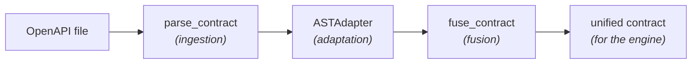

# Contract Engine

The Contract Engine turns an OpenAPI specification into a clean, typed contract
that the rest of the system can consume. It reads the spec, flattens it into a
list of endpoints, and (optionally) fuses it with the business rules inferred by
the LLM to produce the final contract the fuzzing engine attacks.

It works in three stages, each usable on its own:



## Installation

The package targets Python 3.11+.

```bash
pip install -e ".[dev]"
```

## Module layout

```
src/contract_engine/
├── exceptions.py     # domain exceptions
├── models/           # data models (ResolvedContract, EndpointDefinition, unified contract re-export)
├── ingestion/         # parse_contract
├── adapters/          # ASTAdapter
└── fusion/             # fuse_contract (normalizer, llm_input, merger, façade)
```

The unified contract model itself lives in the shared kernel `specforge-contracts`
(canonical class `EndpointContract`, at `lib/contracts` in the repository), which
this package depends on and re-exports as `UnifiedEndpointContract` for backward
compatibility. The kernel is the single owner shared with `semantic_inference`
and `custom_schemathesis`, so the contract shape never drifts between stages.

Everything you normally need is re-exported from the package root:

```python
from contract_engine import (
    parse_contract,
    ASTAdapter,
    fuse_contract,
    ResolvedContract,
    EndpointDefinition,
    UnifiedEndpointContract,
)
```

## How it works

### 1. Ingestion — `parse_contract`

Reads a YAML or JSON OpenAPI file, resolves every internal `$ref` inline
(handling circular references safely), validates it against the OpenAPI 3.x
standard, and returns an immutable `ResolvedContract`.

```python
from contract_engine import parse_contract

contract = parse_contract("openapi.yaml")

print(contract.openapi_version)   # "3.0.3"
print(contract.spec["paths"])     # fully resolved spec dict (no $ref left)
```

Invalid input raises a domain exception instead of failing silently:

- `SchemaFileNotFoundError` — file missing or unsupported extension.
- `UnsupportedSchemaVersionError` — Swagger 2.0 or anything below OpenAPI 3.0.
- `SchemaValidationError` — the spec does not conform to the standard.

### 2. Adaptation — `ASTAdapter`

Flattens the resolved spec into a plain list of `EndpointDefinition` objects. It
merges path-level parameters into each operation (operation-level parameters win
on conflict) and keeps only the routing-relevant metadata.

```python
from contract_engine import ASTAdapter, parse_contract

contract = parse_contract("openapi.yaml")
endpoints = ASTAdapter(contract).extract_endpoints()

for endpoint in endpoints:
    print(endpoint.method, endpoint.path, endpoint.operation_id)
```

Each `EndpointDefinition` holds `path`, `method`, `operation_id`, `parameters`
(raw OpenAPI form), `request_body` and `responses`.

### 3. Fusion — `fuse_contract`

Combines the structural rules from OpenAPI with the business invariants inferred
by the LLM, and returns a single unified contract (a plain dict) ready for the
execution engine.

The two inputs come in different shapes, so the OpenAPI base is first normalized
into the unified shape and then merged with the LLM contract. The merge policy:

- **LLM invariants win on conflict.** If OpenAPI says `age: integer` and the LLM
  adds `minimum: 18, maximum: 99`, the result keeps the type and applies the
  tighter bounds.
- **The base fills the gaps.** Anything the LLM does not mention is kept from the
  OpenAPI base.
- **Routing identity stays fixed.** `method` and `path_url` always come from the
  base; the LLM cannot change them.
- **The output stays coherent.** Constraints that no longer match a field's type
  are dropped, and an `enum` collapses the field to its allowed values.

```python
from contract_engine import ASTAdapter, fuse_contract, parse_contract

endpoint = ASTAdapter(parse_contract("openapi.yaml")).extract_endpoints()[0]

llm_contract = """
{
  "method": "post",
  "path_url": "/users",
  "parameters": {
    "query": {"age": {"type": "integer", "minimum": 18, "maximum": 99}}
  }
}
"""

unified = fuse_contract(endpoint, llm_contract)
# -> {"method": "post", "path_url": "/users",
#     "parameters": {"path": {}, "query": {"age": {...}}, "header": {}}, "body": {...}}
```

`llm_contract` may be a JSON string or a dict. A malformed or invalid LLM
contract raises `SemanticContractError` (it never merges corrupted data).

## CLI

A small executable parses a contract and prints the extracted endpoints:

```bash
python -m contract_engine path/to/openapi.yaml
```

## Development & Testing

Tests and linting run in an isolated container via the `contract-engine`
service defined in `docker-compose.yml`.

```bash
## Run the test suite with coverage
docker compose run --rm contract-engine pytest tests/ -v --cov=src/ --cov-report=term-missing

## Check linting
docker compose run --rm contract-engine ruff check src/ tests/

## Open an interactive shell in the container
docker compose run --rm contract-engine bash
```
