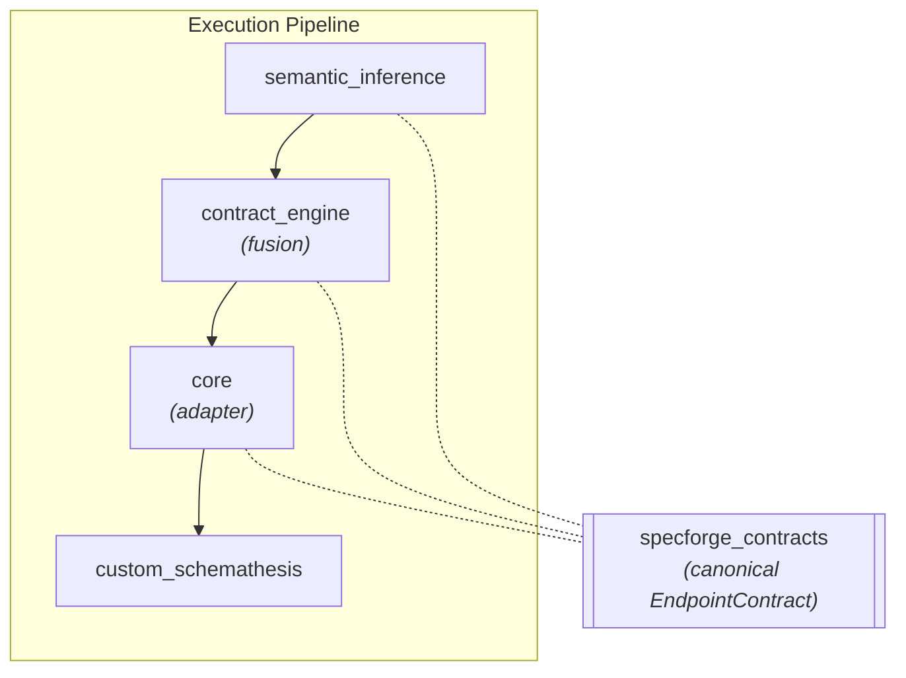

# Spec Forge Contracts (shared kernel)

`specforge-contracts` is the **single source of truth** for the unified endpoint
contract — the boundary object that travels across the whole pipeline:



It is a **dependency-light kernel**: only `pydantic`, no logic, no I/O. Every
stage that produces or fuses the contract imports the same models from here, so
the AI layer, the fusion stage and the orchestrator speak exactly the same shape
and the contract can never drift between them. The execution engine keeps its
own input models; the orchestrator projects the contract onto them.

## Why a separate package?

`semantic_inference` is the most *upstream* module that uses the contract. If the
models lived in `contract_engine` (a downstream stage), `semantic_inference` would
have to import a downstream package — an inverted dependency, which the
architecture forbids. A neutral kernel sits at the **leaf** of the dependency
graph, so every stage can depend on it while the data flow stays one-directional
and acyclic.

## The model

```python
from specforge_contracts import (
    EndpointContract, EndpointParameters, SchemaProperty,
    EndpointRisk, EndpointAttack, FieldAttack,
    TransitionInvariant, SemanticProperty, PropertyClass,
)
```

`EndpointContract` holds the routing identity (`method`, `path_url`) plus two
kinds of content, each with its own wire dialect:

| Section | Model | What it says | Wire names |
| --- | --- | --- | --- |
| `parameters` (path/query/header), `body` | `SchemaProperty` | The request shape as JSON Schema, refined by the LLM with the constraints the spec leaves implicit | camelCase aliases (`minLength`), snake_case in Python |
| `risk` | `EndpointRisk` | How critical and sensitive the endpoint is: score, criticality, sensitivity, auth surface, write operation, external side effects | snake_case, no alias |
| `attack` | `EndpointAttack` | Which payload families to run, where to focus, how hard, and per-field hints in `field_hints` keyed by `zone.field` (`FieldAttack`) | snake_case, no alias |
| `transitions` | `TransitionInvariant` | What a follow-up request must observe after this endpoint succeeds: expected statuses, echoed fields, trigger statuses | snake_case, no alias |
| `semantic_properties` | `SemanticProperty` | Business rules as a closed expression tree of six node kinds discriminated by `kind` | snake_case, no alias |

The rule behind the two dialects: a word that exists in JSON Schema is spelled
the way JSON Schema spells it; a word that is Spec Forge's own is snake_case and
has no alias, so `riskScore` is a hallucination, not an alternative spelling.
Per-field attack hints live in `attack.field_hints`, never inside a
`SchemaProperty`, which keeps the schema fragments pure JSON Schema.

The four Spec Forge sections are **optional**: a producer that knows nothing
beyond the schema still emits a valid contract, and an unset section is absent
from the wire.

## Design invariants

- **Pure JSON Schema vocabulary in `SchemaProperty`** (`type`, `minimum`,
  `maximum`, `pattern`, `enum`, `minLength`/`maxLength`, `minItems`/`maxItems`,
  `items`, `properties`, `required`, `format`) so engines compile it natively.
- **Closed vocabularies everywhere else**: attack profiles, risk levels, zones,
  operators and node kinds are `Literal` sets, so an unknown value fails
  validation instead of reaching the engine.
- **`extra="forbid"`** on every model, so a hallucinated keyword fails
  validation, forcing the LLM to self-correct.

> `contract_engine` re-exports `EndpointContract` under its historical name
`UnifiedEndpointContract` (a backward-compatible alias).

## Development

The package supports Python 3.10+. Consumers add it to their test path
(`pythonpath = ["src", "../contracts/src"]`) and install it in their runtime image.
Installation, test and lint commands are centralized in
[Development & Testing](../../getting-started/development.md#module-commands).
