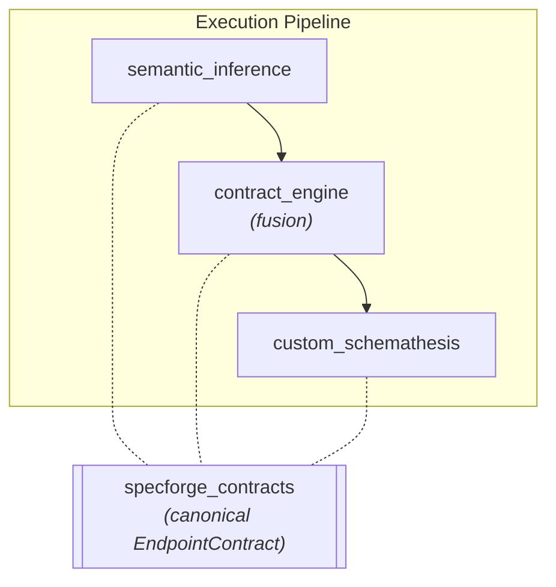

# Spec Forge Contracts (shared kernel)

`specforge-contracts` is the **single source of truth** for the unified endpoint
contract — the boundary object that travels across the whole pipeline:



It is a **dependency-light kernel**: only `pydantic`, no logic, no I/O. Every
pipeline stage imports the same models from here, so the AI layer, the fusion
stage and the execution engine speak exactly the same shape and the contract can
never drift between them.

## Why a separate package?

`semantic_inference` is the most *upstream* module that uses the contract. If the
models lived in `contract_engine` (a downstream stage), `semantic_inference` would
have to import a downstream package — an inverted dependency, which the
architecture forbids. A neutral kernel sits at the **leaf** of the dependency
graph, so all three stages can depend on it while the data flow stays
one-directional and acyclic.

## The model

```python
from specforge_contracts import EndpointContract, EndpointParameters, SchemaProperty
```

- `EndpointContract` — routing identity (`method`, `path_url`) plus `parameters`
  (path/query/header zones) and an optional `body`.
- `EndpointParameters` — the three HTTP parameter zones.
- `SchemaProperty` — a recursive JSON Schema fragment.

## Design invariants:

- **Pure JSON Schema vocabulary** (`type`, `minimum`, `maximum`, `pattern`,
  `enum`, `minLength`/`maxLength`, `minItems`/`maxItems`, `items`, `properties`,
  `required`, `format`) so engines compile it natively.
- **camelCase aliases on the wire, snake_case in Python** (`populate_by_name`).
- **`extra="forbid"`** so a hallucinated keyword fails validation, forcing the LLM
  to self-correct.

> `contract_engine` re-exports `EndpointContract` under its historical name
`UnifiedEndpointContract` (a backward-compatible alias).

## Development

The package supports Python 3.10+. Consumers add it to their test path
(`pythonpath = ["src", "../contracts/src"]`) and install it in their runtime image.
Installation, test and lint commands are centralized in
[Contributing & Testing](../../developer-guide/contributing.md#exceptions).
