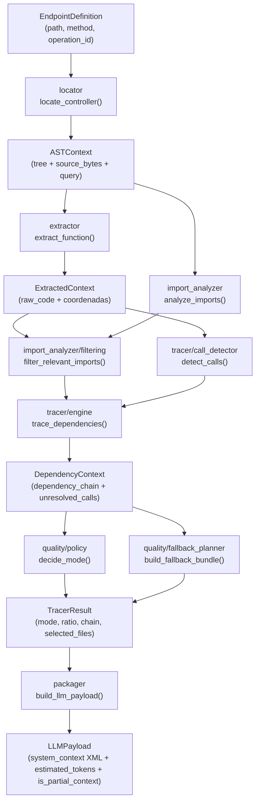

# Architecture Reference — core_ast

Decisiones de diseño, elección de tecnologías y trade-offs de los módulos `locator`, `ast_builder` y `extractor`.

---

## Contexto general del pipeline

Los tres módulos implementan una cadena de extracción estática:

```
EndpointDefinition
      │
      ▼
 [locator]        → LocatorResult (filepath)
      │
      ▼
 [ast_builder]    → ASTContext (tree + query + bytes)
      │
      ▼
 [extractor]      → ExtractedContext (raw_code + coordenadas)
```

Cada módulo tiene una única responsabilidad, interfaz mínima y puede testearse de forma aislada. US-4 (dependency tracer) consumirá los tres en modo recursivo.

## Flujo completo

El siguiente diagrama resume el flujo completo desde la definición del endpoint
hasta la salida final que se exporta para el análisis o la escritura en archivo:



Lectura rápida del diagrama:
- `locator` encuentra el archivo del endpoint.
- `ast_builder` convierte ese archivo en `ASTContext`.
- `extractor` saca el código exacto de la función objetivo.
- `import_analyzer` lista los imports del archivo y `filtering` conserva solo los relevantes.
- `tracer` detecta llamadas, resuelve dependencias y arma la cadena recursiva.
- `quality` decide si el contexto es suficiente o si hace falta fallback.
- `packager` ensambla el `LLMPayload` final (XML etiquetado + tokens + flag de contexto parcial);
  `build_endpoint_payload()` orquesta todo el pipeline y `build_endpoint_code_bundle()` devuelve
  su `system_context` como string.

---

## Módulo 1 — `locator`

### Objetivo arquitectónico

Traducir coordenadas lógicas (`path`, `method`, `operation_id`) del contrato OpenAPI a una ruta física en el filesystem.

### Tecnologías elegidas

#### `pathspec` para gitignore

**Por qué:** Implementa el formato gitignore de Git con soporte completo para globstar, negaciones y patrones de directorio. Es la referencia estándar de facto en el ecosistema Python para este propósito.

**Alternativas consideradas:**
- `fnmatch` nativo: no soporta el formato completo de gitignore (ej. `**`, negaciones)
- Parseo manual: propenso a errores y costoso de mantener

**Desventaja:** dependencia externa adicional. El tamaño del paquete es pequeño (<50KB).

#### `re` (regex estándar) para búsqueda de firmas

**Por qué:** La heurística primaria necesita un solo pass O(n) sobre el texto de cada archivo. regex compilado es suficientemente rápido y sin dependencias externas.

**Alternativas consideradas:**
- `tree-sitter` para la búsqueda primaria: mayor precisión semántica, pero costo de parseo completo para cada archivo candidato (O(n) parseo + O(m) query vs O(n) regex). En repositorios grandes la diferencia es significativa.
- `grep` subprocess: dependencia del SO, no portable, difícil de testear

**Desventaja:** regex puede tener falsos positivos en strings o comentarios. En la práctica, la combinación con el filtro de archivos (extensión + exclusión de tests) lo hace tolerable.

#### `tomllib` para configuración de patrones

**Por qué:** Biblioteca estándar desde Python 3.11. Sin dependencias externas. TOML es más legible que JSON para configuración de reglas.

**Ventaja:** agregar un lenguaje nuevo (keywords + decoradores) no requiere modificar código Python, solo editar `cte/patterns.toml`.

**Desventaja:** requiere Python ≥ 3.11. Para ≥ 3.10 habría que agregar `tomli` como dependencia.

### Principios de diseño

**Determinismo:** misma entrada → mismo resultado o misma excepción. No hay aleatoriedad ni estado global mutable entre llamadas.

**Stateless:** el módulo no indexa ni cachea el repositorio entre llamadas. Esto simplifica el despliegue en contenedores efímeros (CI/CD).

**Fallar con información:** `AmbiguousControllerError` incluye la lista de candidatos. `ControllerNotFoundError` incluye `path` y `method`. La capa superior decide la política de resolución.

**Tolerancia a encoding defectuoso:** archivos que no pueden leerse en UTF-8 se saltan silenciosamente. El criterio es robustez operacional > estrictez.

### Trade-offs explícitos

| Decisión | Ventaja | Desventaja |
|---|---|---|
| regex para búsqueda primaria | Velocidad O(n) | Posibles falsos positivos en strings/comentarios |
| pathspec para gitignore | Fidelidad total al formato git | Dependencia externa |
| TOML para patrones | Extensible sin tocar Python | Requiere Python ≥ 3.11 |
| Cascade fija (op_id → decorator) | Predecible, auditable | No admite personalización del orden |
| AmbiguousControllerError en vez de desambiguar | Separación de responsabilidades | El orquestador debe manejar el caso |

### Invariantes

- Nunca imprime ni solicita entrada al usuario
- Nunca modifica el repositorio analizado
- Siempre retorna `LocatorResult` o lanza una excepción de dominio definida en `exceptions.py`

---

## Módulo 2 — `ast_builder`

### Objetivo arquitectónico

Convertir un archivo de código fuente en una representación semántica (`ASTContext`) que el extractor pueda recorrer sin saber nada del lenguaje.

### Tecnologías elegidas

#### `tree-sitter` para parsing

**Por qué:** Parser incremental, determinista y multi-lenguaje. Soporta 100+ lenguajes mediante gramáticas binarias compiladas. Es el estándar de la industria para análisis estático ligero (usado por GitHub, Neovim, Helix, VS Code, etc.).

**Alternativas consideradas:**
- `ast` nativo de Python: solo funciona para Python, sin extensibilidad
- `libCST`: solo Python, mayor overhead por preservar comentarios/formato
- `ANTLR`: requiere generar parsers por lenguaje, setup costoso
- `pygments` (tokenizer): solo tokeniza, no construye árbol semántico

**Ventaja:** una sola API para todos los lenguajes. El árbol es inmutable y serializable.

**Desventaja:** la API de tree-sitter evoluciona (v0.21 → v0.23 → v0.25 introdujeron breaking changes en `Query` y `QueryCursor`). Requiere mantenimiento al actualizar.

#### Estrategia Golden Path (11 lenguajes + TSX)

**Por qué:** En lugar de soportar todos los lenguajes posibles, se eligió un conjunto de alta cobertura para APIs HTTP. El 95% de los proyectos de backend usan Python, JS/TS, Go, Java, C#, Ruby, PHP, Rust, Kotlin o Swift.

**Ventaja:** distribución más liviana, menor superficie de testing, menor riesgo de roturas por gramáticas de lenguajes exóticos.

**Desventaja:** repositorios en lenguajes fuera del Golden Path reciben `UnsupportedLanguageError`. El orquestador debe implementar el fallback (texto plano al LLM).

#### Gramáticas dinámicas para lenguajes opcionales

**Por qué:** Java, C#, Ruby, PHP, Rust, Kotlin y Swift se cargan con `importlib.import_module` bajo demanda. Están listados en `[project.optional-dependencies.golden-path]`.

**Ventaja:** quien no necesita Java no instala el binario de 2MB. La instalación mínima es más liviana.

**Desventaja:** error en runtime si se usa un lenguaje dinámico sin el paquete instalado. Requiere que el Dockerfile instale `.[golden-path]` para cobertura completa.

#### Queries `.scm` (S-expressions)

**Por qué:** tree-sitter usa su propio DSL declarativo para definir qué nodos capturar. Externalizar las queries en archivos `.scm` desacopla la lógica de extracción del lenguaje de los detalles de cada gramática.

**Capturas estandarizadas:** los tres módulos solo dependen de `@name`, `@definition.function`, `@definition.method`, `@definition.class`. Agregar un lenguaje nuevo solo requiere un archivo `.scm` que use esos cuatro captures.

**Desventaja:** el DSL `.scm` tiene una curva de aprendizaje y su debugging es incómodo (no hay errores descriptivos en tiempo de compilación).

### Principios de diseño

**Lectura estricta en bytes:** `read_bytes()` garantiza que `source_bytes` es exactamente lo que está en disco, sin transformaciones de encoding. El byte-slicing del extractor depende de esta garantía.

**Cache de parsers y languages:** `LanguageEngine` cachea en `dict`. En un proceso de larga vida (servidor, daemon), esto evita reinstanciar el parser para cada archivo.

**Validación del AST:** se verifica que el root node no sea `ERROR`. Archivos con sintaxis irrecuperable disparan `SyntaxParseError` en vez de entregar un `ASTContext` inútil.

### Trade-offs explícitos

| Decisión | Ventaja | Desventaja |
|---|---|---|
| tree-sitter | Multi-lenguaje, rápido, estándar | API cambia entre versiones menores |
| Golden Path limitado | Distribución liviana, tests manejables | Repositorios exóticos quedan sin soporte |
| Gramáticas dinámicas | Instalación mínima liviana | RuntimeError si falta paquete |
| `.scm` externo | Extensible sin modificar Python | DSL con poca tooling de debugging |
| Bytes en vez de str | Coherencia con offsets del AST | Requiere decode explícito |

---

## Módulo 3 — `extractor`

### Objetivo arquitectónico

Extraer el bloque exacto de código de una función, preservando decoradores, indentación y comentarios, usando únicamente las coordenadas del AST.

### Tecnologías elegidas

#### Byte-slicing con offsets del AST

**Por qué:** tree-sitter expone `start_byte` y `end_byte` en cada nodo. Haciendo `source_bytes[start_byte:end_byte]` se obtiene el código exactamente como está en disco, sin ninguna reinterpretación.

**Alternativas consideradas:**
- Slicing por líneas (`splitlines()[start_line:end_line]`): pierde información de la primera y última línea parcial; tampoco captura bien archivos con CRLF
- regex sobre el texto: no respeta el árbol semántico; puede romper con funciones de nombre idéntico en el mismo archivo
- Re-parseo local: caro e innecesario dado que ya se tiene el árbol

**Ventaja:** garantía matemática de que el output es una subcadena exacta del archivo original. Preserva encoding, CRLF, Unicode.

**Desventaja:** requiere que `source_bytes` sea la lectura binaria exacta del archivo (garantizada por `ast_builder`).

#### `QueryCursor` (tree-sitter v0.25)

**Por qué:** En tree-sitter ≥ 0.23, `QueryCursor` es el mecanismo correcto para ejecutar queries. `cursor.matches(root_node)` devuelve un iterador lazy de matches con sus captures.

**Alternativas:** En versiones < 0.21 se usaba `language.query(scm).captures(node)`. Se migró porque la API de `captures` cambió su formato de retorno en v0.23.

#### Ascenso al nodo `decorated_definition`

**Por qué:** en Python (y otros lenguajes), los decoradores no son hijos del nodo `function_definition` sino hermanos que se agrupan bajo un nodo `decorated_definition`. Sin el ascenso, el byte-slice comenzaría en `def`, no en `@decorator`.

**Implementación:** `_include_decorators` verifica `node.parent.type in DECORATOR_NODE_TYPES` y retorna el padre si corresponde. `DECORATOR_NODE_TYPES` es una `frozenset` en `cte/constants.py` para facilitar extensión sin tocar la función.

### Principios de diseño

**Prohibición de regex/string parsing:** el módulo opera exclusivamente sobre bytes y nodos del AST. No usa regex ni splitlines. Esta restricción garantiza integridad sintáctica.

**Fallback al padre del nodo:** si la query `.scm` no produce un capture `@definition.*` para el match encontrado, se usa `name_node.parent`. Esto hace al extractor tolerante a queries `.scm` incompletas mientras se desarrollan nuevos lenguajes.

**Función pública mínima:** `extract_function(ast_context, target_identifier)` es la única interfaz pública. Las funciones privadas (`_find_target_in_matches`, `_include_decorators`) son testeables por importación directa pero no forman parte del contrato del módulo.

### Trade-offs explícitos

| Decisión | Ventaja | Desventaja |
|---|---|---|
| Byte-slicing | Exactitud matemática, preserva encoding | Depende de que `source_bytes` sea binario exacto |
| QueryCursor | API oficial de tree-sitter >= 0.23 | Incompatible con tree-sitter < 0.21 |
| Ascenso a decorator parent | Incluye decoradores automáticamente | Asume convención del AST de cada gramática |
| Fallback a `name_node.parent` | Tolerante a queries incompletas | Puede retornar un nodo mayor del esperado |
| Función pública única | Interfaz simple para el orquestador | Menor flexibilidad para casos de uso alternativos |

### Extensión para búsqueda por coordenada de línea

El módulo actual solo busca por nombre (`target_identifier`). El contrato de US-3 también menciona búsqueda por número de línea (cuando el operation_id no coincide con el nombre exacto de la función).

Esta extensión **no está implementada** porque:
1. US-4 (dependency tracer) siempre opera por nombre, no por coordenada
2. La heurística de matching ya opera por nombre en US-1
3. Si US-5 la requiere, se puede agregar `extract_function_at_line(ast_context, line_number)` sin romper la interfaz actual

---

## Convenciones transversales

### Excepciones de dominio exclusivas

Todos los módulos solo lanzan excepciones definidas en `core_ast/exceptions.py`. Nunca se propagan `FileNotFoundError` o `NotADirectoryError` de Python como parte del contrato.

Razón: el orquestador (US-5) puede capturar excepciones de dominio con un único `except` y tomar decisiones de política sin depender de la jerarquía de excepciones de Python.

### Constantes centralizadas

Todas las constantes compartidas viven en `cte/constants.py`. Ningún módulo define constantes que otro módulo necesite. Esto evita importaciones circulares y facilita el testing con mocks sobre las constantes.

### Modelos Pydantic para I/O

Todos los objetos de transferencia (`EndpointDefinition`, `LocatorResult`, `ASTContext`, `ExtractedContext`) son modelos Pydantic v2. Esto garantiza validación de tipos en runtime y serialización gratuita para logging/debugging.

---

---

# US-4 — Trazador Recursivo de Dependencias

Los módulos de esta historia (`import_analyzer`, `resolver`, `tracer`, `quality`) implementan el motor de rastreo recursivo que expande el contexto del controlador hacia todas sus dependencias locales e importadas.

## Flujo general de US-4

```
trace_dependencies(handler_func, controller_ctx)
│
├── _recursive_trace()
│   ├── detect_calls()            → [str]  llamadas detectadas en el snippet
│   ├── analyze_imports()         → [ImportEntry]  imports del archivo
│   ├── _filter_traceable_calls() → [str]  filtra builtins
│   ├── get_resolver(language)    → BaseModuleResolver
│   └── por cada llamada:
│       └── _resolve_and_extract()
│           ├── [si local]  extract_function() → ExtractedContext + recursión
│           └── [si import] resolver.resolve() → Path → build_context() →
│                           extract_function() → ExtractedContext + recursión
│
├── decide_mode(expected, resolved, unresolved) → "surgical"|"hybrid"|"fallback"
│
└── TracerResult(mode, ratio, dependency_chain, selected_files, ...)
```

---

## Módulo 4 — `import_analyzer/`

### Objetivo arquitectónico

Parsear las sentencias de import de cualquier archivo fuente y producir una lista normalizada de `ImportEntry`, independientemente del lenguaje. El `tracer/engine.py` necesita saber qué módulos importa un archivo para poder trazar las llamadas a funciones importadas.

### Patrón de diseño: Strategy

Cada lenguaje tiene su propio analizador concreto (`PythonImportAnalyzer`, `TypeScriptImportAnalyzer`, etc.) que hereda de `BaseImportAnalyzer`. El engine no sabe qué analizador usa — solo llama `analyze_imports(ast_context)`.

```
BaseImportAnalyzer (ABC)
    ├── analyze(tree, source_bytes) → list[ImportEntry]  ← contrato
    └── _decode(node, source_bytes) → str                ← helper compartido

Implementaciones:
    PythonImportAnalyzer     TypeScriptImportAnalyzer    GoImportAnalyzer
    JavaImportAnalyzer       CSharpImportAnalyzer        RubyImportAnalyzer
    PhpImportAnalyzer        RustImportAnalyzer          KotlinImportAnalyzer
    SwiftImportAnalyzer
```

### DTO: `ImportEntry`

```python
@dataclass(frozen=True)
class ImportEntry:
    module_path: str        # "services.payment" | "./utils" | "net/http"
    imported_names: list    # ["process_payment", "refund"]
    is_relative: bool       # True si es from . import x
    relative_level: int     # número de puntos: from .. → 2
```

`frozen=True` porque los imports de un archivo son inmutables durante el análisis. Es el contrato de datos compartido entre `import_analyzer`, `resolver` y `tracer`.

### Decisiones de diseño

**Traversal manual vs. queries `.scm`:** los analizadores de import usan traversal manual del árbol (`_visit(node)`) en lugar de queries `.scm`. Razón: las queries `.scm` existentes están optimizadas para capturar definiciones (`@definition.function`). Los nodos de import tienen estructuras muy diferentes entre gramáticas (ej. `import_from_statement` en Python vs. `import_declaration` en Go vs. `call` con `require` en Ruby) y la query habría necesitado una rama por gramática, anulando la ventaja declarativa.

**`get_analyzer()` devuelve `None` vs. lanzar excepción:** la factory devuelve `None` para lenguajes no soportados, y `analyze_imports()` devuelve `[]`. Razón: el módulo de imports es más tolerante que el resolver — si no se pueden leer los imports, el tracer simplemente no rastreará dependencias importadas (degradación suave). El resolver sí lanza excepción porque la ausencia de resolución es más crítica.

**Singletons por lenguaje:** todos los analizadores se instancian una sola vez en el dict `_ANALYZERS`. Son completamente stateless (no guardan estado entre llamadas). El singleton evita overhead de instanciación en análisis de repositorios grandes.

### Trade-offs explícitos

| Decisión | Ventaja | Desventaja |
|---|---|---|
| Strategy Pattern | Agregar lenguaje = nuevo archivo, sin tocar engine | 10 clases para mantener |
| Traversal manual (no `.scm`) | Flexibilidad total por gramática | Más código por analizador |
| `frozen=True` en `ImportEntry` | Seguridad ante mutación accidental | No se puede modificar post-construcción |
| `None` en lugar de excepción para lenguaje desconocido | Degradación suave | Silencia errores de configuración |
| Singletons stateless | Sin overhead de instanciación | No apto si se necesita estado por repositorio |

### Invariantes

- `analyze_imports()` siempre retorna `list[ImportEntry]`, nunca `None`
- Nunca lanza excepción por lenguaje no soportado
- Nunca modifica el árbol AST recibido
- `ImportEntry.imported_names` es siempre una lista (puede estar vacía)

### Import Filtering — `filter_relevant_imports`

Para mejorar la precisión del `tracer` y evitar que el fallback bundle incluya
archivos no relacionados, se introdujo un paso de filtrado contextual de imports
llamado `filter_relevant_imports(ast_context, extracted_context, repo_root)`.

Propósito:
- Reducir la superficie de imports que el `tracer` intenta resolver recursivamente.
- Detectar nombres importados que en verdad son referenciados por el `ExtractedContext`.

Comportamiento:
- Invoca `analyze_imports(ast_context)` para obtener la lista completa de `ImportEntry`.
- Analiza `extracted_context.raw_code` para construir el conjunto de identificadores
    usados en el snippet (heurística basada en el `call_detector` pero a nivel de uso de nombre).
- Retorna `(filtered_imports, blocked_external_names)` donde `filtered_imports` son
    solo los `ImportEntry` que exportan nombres usados en el snippet; `blocked_external_names`
    es un conjunto de nombres externos detectados que ayudan a `engine._filter_traceable_calls`
    a decidir qué llamadas tratar como builtins/no-traceable.

Razón arquitectónica:
- Evita que el `tracer` intente resolver todo el árbol de imports del archivo
    controlador, lo que anteriormente provocaba bundles de fallback excesivamente grandes.
- Mantiene la semántica: si un import es usado explícitamente en el snippet, se conserva
    (override sobre listas de builtins), si no — se puede descartar temprano.

Trade-offs:
- Aumenta la complejidad del análisis (doble paso: imports completos → filtrado)
- Puede equivocarse si el snippet usa nombres por alias o reflection dinámico; en ese caso
    el import relevante puede ser descartado y aparecerá como `unresolved` en el tracer.

### Extensión para un nuevo lenguaje

```python
# 1. Crear src/import_analyzer/analyzers/elixir_analyzer.py
class ElixirImportAnalyzer(BaseImportAnalyzer):
    def analyze(self, tree, source_bytes) -> list[ImportEntry]:
        # traversal buscando nodos "alias" y "import"
        ...

# 2. Registrar en factory.py
_ANALYZERS["elixir"] = ElixirImportAnalyzer()
```

No se modifica ningún otro archivo.

---

## Módulo 5 — `resolver/`

### Objetivo arquitectónico

Traducir un `ImportEntry` (import lógico) a una ruta física (`Path`) en disco. La resolución varía drásticamente entre lenguajes: Python usa `__init__.py`, Go resuelve por directorio, Java convierte puntos en barras, TypeScript prueba múltiples extensiones.

### Patrón de diseño: Strategy

```
BaseModuleResolver (ABC)
    └── resolve(import_entry, source_filepath, repo_root) → Path | None

Implementaciones:
    PythonResolver      TypeScriptResolver    GoResolver
    JavaResolver        CSharpResolver        RubyResolver
    PhpResolver          RustResolver          KotlinResolver
    SwiftResolver
```

El engine solo conoce `BaseModuleResolver`. La instancia correcta la provee `get_resolver(language_name)`.

### Decisiones de diseño

**`resolve()` devuelve `Path | None` vs. lanzar excepción:** `None` indica "no encontrado en disco" (caso normal para imports externos o de librería). La excepción `UnresolvableDependencyError` se reserva para errores irrecuperables (lenguaje sin resolver registrado). El engine trata ambos casos añadiendo la llamada a `unresolved_calls`.

**Múltiples search roots:** todos los resolvers implementan `_get_search_roots(repo_root)` que retorna una lista de raíces de búsqueda (ej. `[repo_root, repo_root/"src", repo_root/"lib"]`). Esto evita tener que configurar rutas manualmente.

**`_find_file_in_directory()` en el engine (no en el resolver):** cuando un resolver retorna un directorio (Go packages, Python packages con `__init__.py`), el engine llama `_find_file_in_directory()` para encontrar el archivo concreto que define la función buscada. Esta lógica vive en el engine porque requiere conocer el `function_name`, que el resolver no necesita conocer.

**`exit(1)` vs. `UnresolvableDependencyError` para lenguaje sin resolver:** la US original especificaba `exit(1)`. La implementación lanza `UnresolvableDependencyError` que el engine captura y registra como unresolved. Decisión consciente: más robusto en producción (no mata el proceso si hay un lenguaje inesperado), todos los 12 lenguajes del Golden Path ya tienen resolver.

**Singletons stateless:** igual que en `import_analyzer`. Los resolvers no guardan estado entre llamadas.

### Casos especiales por lenguaje

| Lenguaje | Caso especial | Implementación |
|---|---|---|
| Python | Paquetes con `__init__.py` | `_resolve_absolute()` prueba `pkg/__init__.py` si `pkg.py` no existe |
| Python | Imports relativos (`from .. import x`) | `_resolve_relative()` sube `level-1` directorios desde el archivo fuente |
| TypeScript/JS | Múltiples extensiones | Prueba `.ts`, `.tsx`, `.js`, `.jsx` en orden |
| TypeScript/JS | Index files | Prueba `dir/index.ts`, `dir/index.js` como fachada de paquete |
| Go | Resolución por directorio | Retorna el directorio del paquete; el engine busca el archivo con la función |
| Java | Notación de puntos | `com.example.Service` → `com/example/Service.java` |
| Rust | Prefijos de módulo | Elimina `crate::`, `self::`, `super::` antes de resolver |
| Rust | `mod.rs` | Prueba `module/mod.rs` como alternativa a `module.rs` |
| Ruby | `require_relative` | Marca `is_relative=True`, resuelve desde el directorio del archivo fuente |

### Trade-offs explícitos

| Decisión | Ventaja | Desventaja |
|---|---|---|
| Strategy Pattern | Extensible sin tocar engine | 10 clases para mantener |
| `None` para no-encontrado | Degradación suave | Silencia imports externos legítimamente |
| `UnresolvableDependencyError` vs `exit(1)` | No mata el proceso | Requiere que el engine maneje el caso |
| Singletons stateless | Sin overhead de instanciación | No apto si se necesita estado por repositorio |
| Multiple search roots | Funciona con proyectos con `src/` o `lib/` | Puede encontrar el archivo equivocado si hay duplicados |

### Invariantes

- `resolve()` nunca retorna una ruta que no exista en disco (`Path.is_file()` = True)
- `resolve()` siempre retorna rutas absolutas cuando retorna algo
- Nunca modifica archivos en disco
- Nunca lanza excepción por import externo o de librería (retorna `None`)

---

## Módulo 6 — `tracer/`

### Objetivo arquitectónico

Orquestar el rastreo recursivo de dependencias. Dado un `ExtractedContext` (función de entrada), expandir recursivamente el grafo de dependencias rastreando cada llamada a funciones locales e importadas, produciendo un `TracerResult` completamente trazable.

### Sub-módulos

#### `call_detector.py`

Detecta las funciones invocadas dentro de un snippet de código.

**Decisión: re-parsear el snippet (no usar el árbol del archivo completo):** `ExtractedContext.raw_code` es solo la función, no el archivo entero. Re-parsear el snippet garantiza que el traversal solo encuentra llamadas dentro del scope de esa función, sin contaminación del contexto circundante.

**Decisión: dispatch dict en lugar de `elif` chain:**

```python
# Antes (elif chain — no escalable):
def _extract_name(node, source_bytes, calls):
    if node.type in ("identifier", ...): ...
    elif node.type in ("attribute", ...): ...
    elif node.type == "selector_expression": ...  # Go
    elif node.type == "scoped_identifier": ...    # Rust

# Ahora (dispatch dict — Open/Closed):
_NODE_EXTRACTORS: dict[str, _NodeExtractor] = {
    "identifier":            _extract_identifier,
    "field_identifier":      _extract_identifier,
    "attribute":             _extract_attribute,
    "member_expression":     _extract_attribute,
    "selector_expression":   _extract_selector,   # Go
    "scoped_identifier":     _extract_scoped,      # Rust
}
```

Agregar soporte para un nuevo tipo de nodo AST = una línea en el dict. No se modifica ninguna lógica existente.

**Decisión: traversal manual vs. queries `.scm` para calls:** las queries `.scm` existentes capturan `@definition.*`. No hay capturas estándar de tree-sitter para `@reference.call` en las gramáticas del Golden Path. El traversal manual es más portable y no requiere archivos `.scm` adicionales por lenguaje.

#### `engine.py`

El orquestador central. Única función pública: `trace_dependencies()`.

**Prevención de ciclos con `visited_nodes: set[str]`:**

La firma de cada nodo visitado es `"{filepath}::{function_name}"`. La unicidad es global a través de toda la recursión porque el set se pasa por referencia. Complejidad O(1) para cada verificación.

```python
# A → B → A  detectado:
sig = f"{filepath}::{func_name}"
if sig in visited_nodes:
    return  # ciclo detectado, no continuar
visited_nodes.add(sig)
```

**`max_depth=15` como salvaguarda secundaria:** el set de visited_nodes es la defensa primaria. `max_depth` es la defensa secundaria para grafos que no forman ciclos pero tienen profundidad patológica (ej. cadenas de wrappers de 20 niveles).

**`_filter_traceable_calls()` — filtrado contextual de builtins:**

```
Regla 1: ¿call NO está en blocked (builtins del lenguaje)?  → rastrear siempre
Regla 2: ¿call está en los imports explícitos del archivo?  → rastrear (override)
Regla 3: ¿call tiene definición local en el archivo?        → rastrear (override)
Regla 4: ninguna de las anteriores                          → omitir (es builtin)
```

Las reglas 2 y 3 garantizan que si alguien define una función llamada `map` o importa `sum` de su propio módulo, el tracer la rastrea correctamente.

**Política de abortaje — 3 modos:**

| Modo | Condición | Output |
|------|-----------|--------|
| `surgical` | ratio ≥ 0.67 y sin función crítica sin resolver | Solo `dependency_chain` |
| `hybrid` | 0.33 ≤ ratio < 0.67 | `dependency_chain` + `selected_files` |
| `fallback` | ratio < 0.33 **o** función crítica no resuelta | Solo `selected_files` |

La condición de fallback forzado (función crítica) tiene prioridad sobre el ratio. Un ratio de 1.0 con `verify_token` no resuelto sigue siendo fallback.

**Desacoplamiento total del engine:** el engine importa únicamente `BaseModuleResolver` (interfaz) y `get_resolver` (factory). No importa ningún resolver concreto. Esto se verifica en tests con inspección del código fuente.

### Trade-offs explícitos

| Decisión | Ventaja | Desventaja |
|---|---|---|
| `set[str]` para visited_nodes | O(1) de verificación, compartido por toda la recursión | La firma puede colisionar si hay dos archivos con el mismo path relativo |
| `max_depth=15` | Salvaguarda ante cadenas patológicas | Corta el rastreo prematuramente en proyectos con wrappers muy profundos |
| Re-parsear snippet para detect_calls | Scope aislado, sin contaminación del archivo | Overhead de parseo adicional por función |
| Dispatch dict en `_extract_name` | Open/Closed, extensible sin tocar lógica core | Requiere definir función por tipo de nodo |
| `_filter_traceable_calls` | Evita rastrear `print`, `len`, etc. | Puede omitir funciones válidas si están en la lista negra y no son importadas explícitamente |
| Fallback forzado por keywords críticos | Seguridad: auth/payment sin rastrear → contexto máximo | Puede ser agresivo si el nombre de la función no es semánticamente crítico |

### Invariantes

- `trace_dependencies()` siempre retorna `TracerResult`, nunca lanza excepción al caller
- `expected_calls == resolved_calls + len(unresolved_calls)` siempre
- `completion_ratio` siempre está en `[0.0, 1.0]`
- En modo `surgical`, `selected_files == []`
- En modo `fallback`, `dependency_chain == []`
- `unresolved_calls` es siempre una lista (nunca `None`)

---

## Módulo 7 — `quality/`

### Objetivo arquitectónico

Separar la lógica de decisión de modo (cuándo el rastreo es "suficientemente bueno") y la lógica de construcción del bundle alternativo (qué archivos dar al LLM cuando el rastreo no alcanza).

### Sub-módulos

#### `policy.py`

Funciones puras sin I/O. Recibe números y devuelve decisiones.

```python
compute_completion_ratio(expected, resolved) → float   # min(resolved/expected, 1.0)
detect_forced_abort(unresolved_calls) → str | None     # busca keywords críticos
decide_mode(expected, resolved, unresolved) → (mode, ratio, reason)
```

**Decisión: funciones puras en módulo separado:** la política es la parte del sistema más propensa a cambios de negocio (ajustar umbrales, añadir keywords críticos). Al ser funciones puras sin estado, son triviales de testear y de cambiar sin efecto colateral.

**Keywords críticos centralizados en `cte/constants.py`:** `TRACER_CRITICAL_KEYWORDS` es un `frozenset` que vive en constantes, no en la función. Ajustar la lista de funciones críticas no requiere modificar `policy.py`.

#### `fallback_planner.py`

Construye el bundle de archivos para los modos hybrid y fallback.

**3 niveles de prioridad:**
1. El archivo controlador (siempre incluido, siempre primero)
2. Archivos de imports directos locales (`_resolve_import_paths`)
3. Archivos que mencionan las llamadas no resueltas (`_find_candidates_for_unresolved`)

**Presupuesto duro configurable:**
```python
max_files:          int  # default: TRACER_MAX_FILES (10)
max_total_lines:    int  # default: TRACER_MAX_TOTAL_LINES (2000)
max_lines_per_file: int  # default: TRACER_MAX_LINES_PER_FILE (500)
```

El presupuesto existe porque el bundle se enviará al LLM, que tiene un límite de tokens. `max_lines_per_file` actúa como "cap lógico" — un archivo de 3000 líneas cuenta como 500 para el presupuesto, pero se incluye completo.

**`_is_excluded()` — filtrado de directorios:** usa `TRACER_EXCLUDE_DIR_PATTERNS` (frozenset en constants). Compara en lowercase para ser case-insensitive. Un archivo en `TESTS/` o `tests/` queda excluido igual.

**`_shallow_scan()` — escaneo acotado del repositorio:** en lugar de hacer `os.walk()` sobre todo el repo, escanea hasta `max_depth` niveles. El nivel 3 es suficiente para la mayoría de estructuras de proyecto. Esto evita escanear repos de millones de archivos.

**`_resolve_import_paths()` — heurística liviana:** a diferencia de los resolvers de lenguaje, esta función hace una búsqueda heurística simple (prueba extensiones comunes, prueba `__init__.py`/`index.ts`). No delega a los resolvers porque el fallback_planner no sabe el lenguaje del proyecto y quiere ser rápido.

### Trade-offs explícitos

| Decisión | Ventaja | Desventaja |
|---|---|---|
| Funciones puras en `policy.py` | Trivial de testear y cambiar | Sin estado → umbral no se puede adaptar dinámicamente |
| Keywords en constants | Extensible sin tocar policy | Cambiar keywords requiere re-deploy |
| Presupuesto duro por líneas | Controla el costo de tokens del LLM | Puede excluir archivos relevantes si el presupuesto es bajo |
| Heurística simple en `_resolve_import_paths` | Rápida, sin dependencias de lenguaje | Puede no resolver imports complejos (relativos profundos) |
| `_shallow_scan` con max_depth | Evita escanear repos enormes | Puede omitir archivos relevantes en proyectos muy anidados |
| Controlador siempre primero | Contexto garantizado para el LLM | Ocupa presupuesto aunque sea grande |

### Invariantes

- `build_fallback_bundle()` siempre incluye el controlador si existe en disco
- `selected_files` no tiene duplicados
- `truncation_applied` es `True` si y solo si algún archivo fue excluido por presupuesto
- Ningún archivo de `tests/`, `vendor/`, `node_modules/` o `migrations/` aparece en el bundle

---

## Decisiones transversales de US-4

### DTO interno vs. DTO público

`DependencyContext` es el modelo interno que acumula datos durante la recursión. `TracerResult` es el contrato público. Esta separación evita que la estructura interna (mutable durante la recursión) sea la misma que expone el módulo al exterior.

### Convergencia de strategies

`import_analyzer` y `resolver` implementan el mismo patrón (Strategy) pero con fábricas distintas y contratos distintos. No comparten una fábrica genérica para evitar acoplamiento entre dos responsabilidades independientes.

### `_decode` como primitiva compartida no extraída

El patrón `source_bytes[node.start_byte:node.end_byte].decode("utf-8")` aparece en `extractor`, `import_analyzer` y `call_detector`. No se extrajo a un helper global porque es una primitiva de 1 línea de tree-sitter, no lógica de negocio. `BaseImportAnalyzer._decode()` sirve a los analizadores; `call_detector` define su propio `_decode()` local.

### Posibles extensiones futuras

| Extensión | Punto de cambio |
|---|---|
| Nuevo lenguaje | 1 archivo en `resolver/strategies/` + 1 archivo en `import_analyzer/analyzers/` + 2 entradas en factories |
| Nuevo tipo de nodo AST para calls | 1 entrada en `_NODE_EXTRACTORS` en `call_detector.py` |
| Nuevo keyword crítico | 1 elemento en `TRACER_CRITICAL_KEYWORDS` en `cte/constants.py` |
| Nuevo directorio excluido del bundle | 1 elemento en `TRACER_EXCLUDE_DIR_PATTERNS` en `cte/constants.py` |
| Ajustar umbrales de modo | 2 constantes en `cte/constants.py` (`TRACER_THRESHOLD_SURGICAL`, `TRACER_THRESHOLD_HYBRID`) |

---

## Module 8 — `packager`

### Architectural goal

Convert the analysis output into the boundary object the inference engine consumes:
a single, XML-tagged, size-measured, UTF-8-sanitized `LLMPayload`. It is the last
static stage and the hand-off point to the AI side of the pipeline.

### Design decisions

**Pure renderer + thin I/O facade.** `xml.py` is a pure, deterministic function
(same input → same XML, no side effects), so the tag assembly is trivial to test in
isolation. The only I/O — reading the fallback `selected_files` — lives in
`facade.py`, which passes already-read content into the renderer. This keeps the
transformation pure and the side effects at the edge.

**CDATA over entity escaping for code.** Source code is wrapped in `CDATA` so the
LLM reads it verbatim, instead of escaping `<`, `>`, `&` into entities that would
clutter the prompt. The one edge case — a literal `]]>` inside the code — is split
into `]]]]><![CDATA[>`. Attributes still use `quoteattr` and free text uses `escape`.

**Optional, graceful token counting.** `estimate_tokens` prefers `tiktoken`
(`cl100k_base`) for accuracy but degrades to a `len // 4` heuristic when the optional
dependency is absent, so the module never hard-depends on it. The encoder is cached.

**Replacement, not duplication.** `build_endpoint_code_bundle` now delegates to the
packager and returns the payload's `system_context`; the typed orchestrator
`build_endpoint_payload` returns the full `LLMPayload`. The old comment-based bundle
assembly is gone, avoiding two code paths for the same job.

**Token-overflow truncation is out of scope here.** The tracer already bounds context
size through its surgical/hybrid/fallback policy, so the packager measures size
(`estimated_tokens`) and flags partial context but does not truncate.

### Trade-offs

| Decision | Advantage | Disadvantage |
|---|---|---|
| Pure renderer + I/O in facade | Deterministic, isolated unit tests | Facade must read files before rendering |
| CDATA for code | Verbatim, prompt-friendly | Needs the `]]>` split edge case |
| tiktoken optional with heuristic fallback | No hard dependency, always works | Heuristic count is approximate without tiktoken |
| `filepath` on `ExtractedContext` | Primary and every dependency carry their path | One extra optional field on the DTO |
| Omit empty XML blocks | Cleaner, smaller payload | Consumers must not assume blocks always exist |

### Invariants

- `build_llm_payload()` always returns an `LLMPayload`; a file read error degrades to
  an `error` attribute instead of raising.
- `system_context` is always valid UTF-8.
- `is_partial_context` is `True` iff there are unresolved calls or the mode is not surgical.
- The renderer performs no I/O and is deterministic.
