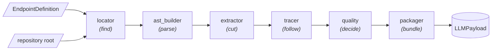

# Core AST

Core AST is the static-analysis engine of the pipeline. Given an API endpoint and
the repository that implements it, it finds the handler in the source code, extracts
the exact function, traces its dependencies, and packages everything into a single,
LLM-ready context bundle — **without ever executing the target code**. It relies on
[tree-sitter](https://tree-sitter.github.io/) for fast, deterministic, multi-language
parsing.

> Its job is to answer one question: *"here is an endpoint and a codebase — what code
should the LLM read to understand this endpoint's behavior?"*

The output feeds the semantic inference layer, which infers business invariants for
property-based fuzzing.



## Development requirements

The package targets Python 3.11+. Installation and verification commands are in
[Development & Testing](../../getting-started/development.md#module-commands).

Seven languages load on demand (Java, C#, Ruby, PHP, Rust, Kotlin, Swift) via
`golden-path` extra. Token counting uses ``tiktoken`` via ``tokens``. Neither
is strictly required — the engine degrades gracefully:  

```bash
pip install -e ".[dev,golden-path,tokens]"
```

## Quick start

``build_endpoint_payload`` is the primary entry point:

```python
from core_ast import build_endpoint_payload
from core_ast.models.locator import EndpointDefinition

endpoint = EndpointDefinition(path="/orders", method="post", operation_id="create_order")
payload = build_endpoint_payload(endpoint, repo_root="/path/to/api/repo")

print(payload.system_context)      # XML-tagged code block for the LLM prompt
print(payload.estimated_tokens)    # approximate size of the bundle
print(payload.is_partial_context)  # True if some context could not be resolved
```

For a whole contract, `analyze_endpoints` shares one parser across endpoints and
isolates each outcome, so one endpoint that cannot be located does not cost you the
rest:

```python
from core_ast import analyze_endpoints

for result in analyze_endpoints(endpoints, repo_root="/path/to/api/repo"):
    if result.ok:
        print(result.analysis.locator.filepath, result.analysis.locator.confidence)
    else:
        print(result.endpoint.path, type(result.error).__name__)
```

## Public API Re-exports

The root core_ast package exports:

* ``analyze_endpoint`` / ``analyze_endpoints``: full pipeline $\rightarrow$
``EndpointAnalysis`` / one ``EndpointAnalysisResult`` per endpoint. Keeps everything
the run learned, not just the payload.
* ``build_endpoint_payload``: the same run narrowed to ``LLMPayload``.
* ``build_llm_payload``: packages pre-extracted context (``ExtractedContext`` +
``TracerResult``).
* ``resolve_handler_name``: the handler's name inside a file already located.
* ``EndpointDefinition``, ``EndpointAnalysis``, ``EndpointAnalysisResult``,
``ProcessedFunction``, ``LLMPayload``: the DTOs.

Typed domain exceptions are exported from ``core_ast.exceptions``.

## High-Level Pipeline Flow

| Stage | Responsibility | Main Output |
|---|---|---|
| **1. Locator** | Find the endpoint handler file | Location result / Metadata |
| **2. AST Builder** | Parse source bytes with tree-sitter | `ASTContext` |
| **3. Extractor** | Byte-slice the exact target function | `ExtractedContext` |
| **4. Import & Tracer** | Resolve imports & follow dependency calls recursively | `TracerResult` |
| **5. Quality** | Measure completion & select context budget mode | Mode & Fallback plan |
| **6. Packager** | Assemble sanitized XML-tagged payload | `LLMPayload` |

*For in-depth stage specs, exceptions, and extensibility, see the [Implementation Reference](reference.md).
For function signatures, examples and exceptions per module, see the [API Reference](api-reference.md).*
