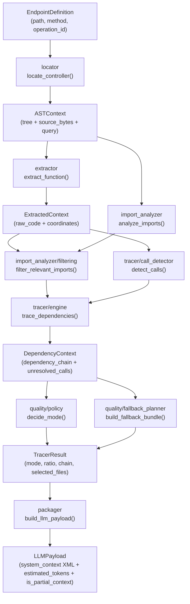

# Reference — core_ast

Design decisions, technology choices, and code reference for the eight `core_ast`
stages: `locator`, `ast_builder`, `extractor`, `import_analyzer`, `resolver`,
`tracer`, `quality`, `packager`.

Recommended entry point for consumers:

- `core_ast.build_endpoint_payload(endpoint, repo_root, parser_manager=None) -> LLMPayload`
  — the typed, XML-tagged context bundle the inference engine consumes.
- `core_ast.build_endpoint_code_bundle(...) -> str` returns the payload's
  `system_context` for string consumers; `core_ast.export_endpoint_bundle(...)`
  is a reexport of the same function.

## Pipeline



- `locator` finds the file that implements the endpoint.
- `ast_builder` parses that file into an `ASTContext`.
- `extractor` cuts the exact source of the target function.
- `import_analyzer` lists the file's imports; `filtering` keeps only the relevant ones.
- `tracer` detects calls, resolves dependencies, and builds the recursive chain.
- `quality` decides whether the trace is good enough or needs a fallback bundle.
- `packager` assembles the final `LLMPayload` (tagged XML + token count + partial-context flag).

`build_endpoint_payload()` orchestrates the whole pipeline; `build_endpoint_code_bundle()`
returns its `system_context` as a plain string.

Each module has one responsibility, a minimal interface, and can be tested in isolation.

---

## Module 1 — `locator`

**Goal.** Translate logical coordinates (`path`, `method`, `operation_id`) from the
OpenAPI contract into a physical file path.

| File | Responsibility |
|---|---|
| `locator/scanner.py` | Filesystem crawling with filters |
| `locator/matcher.py` | Matching heuristics + public API |

### Public API

```python
from core_ast.locator.matcher import locate_controller
from core_ast.models.locator import EndpointDefinition

endpoint = EndpointDefinition(path="/api/users", method="post", operation_id="create_user")
result = locate_controller("/path/to/repo", endpoint)
# result.filepath        -> Path("/path/to/repo/src/routes/users.py")
# result.match_strategy  -> "operation_id"
# result.confidence      -> 1.0
```

`locate_controller` runs a two-step cascade heuristic:

1. **Primary — `operation_id`.** Builds a regex from the language's function keywords
   (`cte/patterns.toml`) and searches for the function signature. `confidence=1.0`.
2. **Secondary — route decorator.** Builds a regex from decorator templates
   (`cte/patterns.toml`) and searches for `@app.post("/path")` or the language
   equivalent. `confidence=0.8`.

`scan_repository(repo_root)` backs both steps: it loads `.gitignore` via `pathspec`,
walks the tree with `Path.rglob`, keeps only supported extensions, and excludes test
paths (`_is_test_path`, patterns in `cte/constants.py`). Encoding errors while reading
`.gitignore` are silenced — the scan continues without that filter.

**Raises:** `ControllerNotFoundError` (nothing matches), `AmbiguousControllerError`
(more than one file matches — includes the candidate list), `RepositoryNotFoundError`
/ `RepositoryNotADirectoryError` (bad `repo_root`, from `scan_repository`).

### Key decisions

- **`pathspec` for `.gitignore`.** Full fidelity with git's format (globstar,
  negation, directory patterns) instead of reimplementing it or relying on the
  narrower `fnmatch`.
- **Plain `regex` for the primary search**, not `tree-sitter`. The heuristic only
  needs one O(n) pass per candidate file; a full parse for every candidate would be
  far more expensive on large repositories, and regex has no external dependency
  beyond the standard library.
- **`tomllib` for `cte/patterns.toml`.** Stdlib since Python 3.11, and TOML reads
  better than JSON for rule configuration — a new language is a data change, not a
  code change.
- **Stateless, deterministic.** No caching or indexing between calls, no global
  state; same input always gives the same result or the same exception. This keeps
  deployment in ephemeral containers (CI/CD) simple.
- **Fails with context, never guesses.** `AmbiguousControllerError` carries the
  candidate list and `ControllerNotFoundError` carries `path`/`method`, leaving the
  disambiguation policy to the caller.

### Trade-offs

| Decision | Advantage | Disadvantage |
|---|---|---|
| Regex for the primary search | O(n) speed | Possible false positives in strings/comments |
| `pathspec` for `.gitignore` | Full fidelity to git's format | Extra external dependency |
| TOML for patterns | Extensible without touching Python | Requires Python ≥ 3.11 |
| Fixed cascade (op_id → decorator) | Predictable, auditable | No custom ordering |
| Raise `AmbiguousControllerError` instead of auto-disambiguating | Clean separation of concerns | Caller must handle the case |

### Invariants

- Never prints or prompts for input; never modifies the analyzed repository.
- Always returns a `LocatorResult` or raises a domain exception from `exceptions.py`.

### Data model

```python
class EndpointDefinition(BaseModel):
    path: str
    method: str
    operation_id: str | None
    parameters: list | None
    request_body: dict | None
    responses: dict | None

class LocatorResult(BaseModel):
    filepath: Path
    match_strategy: str   # "operation_id" | "path_decorator"
    confidence: float     # 1.0 | 0.8
```

### Tests

`tests/test_locator/`: `test_scanner.py` (gitignore loading, test-path detection,
`scan_repository`) and `test_matcher.py` (pattern building, file search,
`locate_controller`). Coverage: `scanner.py` 95% · `matcher.py` 98%.

---

## Module 2 — `ast_builder`

**Goal.** Parse a source file with tree-sitter and return an `ASTContext` (tree,
compiled tag query, and the original bytes) that later stages can walk without
knowing the source language.

| File | Responsibility |
|---|---|
| `ast_builder/engine.py` | Grammar loading, parser/language caching |
| `ast_builder/manager.py` | Public API, `.scm` query loading, `ASTContext` assembly |
| `ast_builder/tags/*.scm` | Per-language tree-sitter queries |

### Public API

```python
from core_ast.ast_builder.manager import ParserManager

manager = ParserManager()
ctx = manager.build_context(Path("src/routes/users.py"))
# ctx.filepath, ctx.language_name, ctx.source_bytes, ctx.tree, ctx.tag_query
```

`build_context(filepath)`:

1. Detects the language by extension → `UnsupportedLanguageError` outside the
   Golden Path.
2. Reads the file as raw bytes (`read_bytes`).
3. Parses with tree-sitter → `tree_sitter.Tree`.
4. Validates the AST root is not `ERROR` → `SyntaxParseError` otherwise.
5. Loads and compiles the `.scm` query → `MissingQueryTemplateError` if the file is
   missing (corrupted install).
6. Returns the consolidated `ASTContext`.

`LanguageEngine` (`engine.py`) exposes `get_language`, `get_parser`, and `parse`,
plus `supported_languages` / `supported_extensions` properties; it caches both
parsers and languages in-process.

### `.scm` tags

Each language query captures four standardized node types, so adding a language only
means writing one `.scm` file:

| Capture | Meaning |
|---|---|
| `@name` | Symbol identifier |
| `@definition.function` | Standalone function |
| `@definition.method` | Method inside a class/impl/struct |
| `@definition.class` | Class, struct, protocol, trait |

### Key decisions

- **tree-sitter.** Incremental, deterministic, multi-language parser with 100+
  compiled grammars — the industry standard for lightweight static analysis (used
  by GitHub, Neovim, Helix, VS Code). One API for every language; the tree is
  immutable and serializable. Its trade-off is an evolving API (v0.21 → v0.23 →
  v0.25 introduced breaking changes in `Query`/`QueryCursor`), which requires
  maintenance on upgrades.
- **Golden Path (11 languages + TSX)** instead of trying to support everything:
  Python, JS/TS, Go, Java, C#, Ruby, PHP, Rust, Kotlin, and Swift cover roughly 95%
  of backend API projects. Lighter distribution and smaller testing surface, at the
  cost of `UnsupportedLanguageError` for anything outside that set (the caller must
  implement its own plain-text fallback).
- **Dynamic grammars for optional languages.** Java, C#, Ruby, PHP, Rust, Kotlin,
  and Swift load on demand via `importlib.import_module` (the `golden-path` extra),
  so installing the package without them stays lightweight — at the cost of a
  runtime error if one is used without being installed.
- **External `.scm` queries** decouple the extraction logic from each grammar's
  details, at the cost of a DSL with a learning curve and no compile-time errors.
- **Strict byte reads.** `read_bytes()` guarantees `source_bytes` is exactly what's
  on disk, with no encoding transformation — the extractor's byte-slicing depends on
  this guarantee.

### Trade-offs

| Decision | Advantage | Disadvantage |
|---|---|---|
| tree-sitter | Multi-language, fast, industry standard | API changes across minor versions |
| Limited Golden Path | Light distribution, manageable tests | Exotic-language repos go unsupported |
| Dynamic grammars | Minimal install footprint | `RuntimeError` if the package is missing |
| External `.scm` | Extensible without touching Python | DSL with little debugging tooling |
| Bytes instead of `str` | Consistent with AST byte offsets | Requires explicit decoding downstream |

### Invariants

- Same input → same `ASTContext` or the same domain exception.
- Root node is never `ERROR` in a returned context.

### Data model

```python
class ASTContext(BaseModel):
    filepath: Path
    source_bytes: bytes
    language_name: str
    tree: tree_sitter.Tree
    tag_query: tree_sitter.Query
```

### Tests

`tests/test_ast_builder/test_parser_manager.py`: Golden Path coverage, supported
properties, caching, parsing, dynamic loading, `MissingQueryTemplateError`,
`SyntaxParseError`, `build_context`. Coverage: `engine.py` 98% · `manager.py` 100%.

---

## Module 3 — `extractor`

**Goal.** Extract the exact source block of a function — including decorators,
indentation, and comments — using only AST coordinates.

| File | Responsibility |
|---|---|
| `extractor/function.py` | AST search + byte-slicing extraction |

### Public API

```python
from core_ast.extractor.function import extract_function

result = extract_function(ctx, "create_user")
# result.function_name -> "create_user"
# result.raw_code      -> "def create_user(name):\n    return name\n"
# result.start_line    -> 3  (0-indexed)
# result.end_line      -> 4
```

Flow: iterate the compiled query's matches (`tree_sitter.QueryCursor(tag_query).matches(root_node)`),
find the one whose `@name` equals `target_identifier`, take its `@definition.*` node
(or `name_node.parent` as a fallback when no `@definition.*` capture exists), climb to
the enclosing `decorated_definition`/`decorator` node if present (`_include_decorators`),
byte-slice `source_bytes[start_byte:end_byte]`, and decode to UTF-8.

**Raises:** `TargetNodeNotFoundError` if the function doesn't exist in the file.

### Key decisions

- **Byte-slicing over AST offsets**, not line-slicing or regex. `source_bytes[start_byte:end_byte]`
  is a mathematical guarantee of an exact substring of the original file — it
  preserves encoding, CRLF, and Unicode, and can't be confused by two functions
  sharing a name. Its only requirement is that `source_bytes` be the exact binary
  read from `ast_builder`.
- **`QueryCursor`** is the correct tree-sitter ≥ 0.23 mechanism for running queries
  (the pre-0.21 `language.query(scm).captures(node)` API changed its return shape).
- **Climb to `decorated_definition`.** In Python and other languages, decorators are
  siblings grouped under a wrapping node, not children of `function_definition` —
  without this step the slice would start at `def`, not `@decorator`.
- **Single public function.** `extract_function(ast_context, target_identifier)` is
  the only public interface; private helpers are unit-testable but not part of the
  module's contract.
- **No regex/string parsing allowed** — the module operates purely on bytes and AST
  nodes, guaranteeing syntactic integrity.

Line-number search (as opposed to name search) is **not implemented**: the
dependency tracer and the locator heuristic both operate by name, and can be added
later as `extract_function_at_line(...)` without breaking the current interface.

### Trade-offs

| Decision | Advantage | Disadvantage |
|---|---|---|
| Byte-slicing | Mathematically exact, preserves encoding | Depends on exact binary `source_bytes` |
| `QueryCursor` | Official tree-sitter ≥ 0.23 API | Incompatible with tree-sitter < 0.21 |
| Climb to decorator parent | Decorators included automatically | Assumes each grammar's node convention |
| Fallback to `name_node.parent` | Tolerant of incomplete `.scm` queries | May return a larger node than expected |
| Single public function | Simple orchestrator interface | Less flexibility for alternate use cases |

### Data model

```python
class ExtractedContext(BaseModel):
    function_name: str
    raw_code: str    # exact code, decorators included
    start_line: int  # 0-indexed
    end_line: int    # 0-indexed
```

### Tests

`tests/test_extractor/test_function_extractor.py`: decorator inclusion, parent
fallback, byte-slicing, decorators, not-found, multi-language. Coverage: `function.py` 100%.

---

## Module 4 — `import_analyzer`

**Goal.** Parse a source file's import statements into a normalized list of
`ImportEntry`, independent of language. The tracer needs this to know which modules
a file imports so it can follow calls into imported functions.

### Strategy pattern

Each language has its own concrete analyzer inheriting from `BaseImportAnalyzer`;
the engine only ever calls `analyze_imports(ast_context)` and never knows which
concrete analyzer ran.

```
BaseImportAnalyzer (ABC)
    analyze(tree, source_bytes) -> list[ImportEntry]   # contract
    _decode(node, source_bytes) -> str                 # shared helper

PythonImportAnalyzer   TypeScriptImportAnalyzer   GoImportAnalyzer
JavaImportAnalyzer      CSharpImportAnalyzer       RubyImportAnalyzer
PhpImportAnalyzer       RustImportAnalyzer         KotlinImportAnalyzer
SwiftImportAnalyzer
```

| File | Responsibility |
|---|---|
| `import_analyzer/base.py` | ABC + shared `_decode` helper |
| `import_analyzer/factory.py` | `get_analyzer(language_name)` — per-language singletons |
| `import_analyzer/__init__.py` | Public `analyze_imports(ast_context)` |
| `import_analyzer/filtering.py` | `filter_relevant_imports(...)` |
| `import_analyzer/analyzers/*.py` | One concrete analyzer per language |

### Public API

```python
from core_ast.import_analyzer import analyze_imports
from core_ast.import_analyzer.factory import get_analyzer

imports = analyze_imports(ast_context)
# [ImportEntry(module_path="services.payment", imported_names=["process_payment"], ...), ...]

get_analyzer("python")  # -> PythonImportAnalyzer singleton
get_analyzer("cobol")   # -> None, never raises
```

### `filter_relevant_imports`

`filter_relevant_imports(ast_context, extracted_context, repo_root)` narrows the
full import list down to the ones actually referenced in the extracted snippet, so
the tracer doesn't try to resolve the controller file's entire import surface (which
previously produced oversized fallback bundles):

1. Calls `analyze_imports(ast_context)` for the full list.
2. Extracts the identifiers used in `extracted_context.raw_code` (a name-level
   heuristic akin to `call_detector`).
3. Returns `(filtered_imports, blocked_external_names)` — imports whose exported
   names are actually used, and the external names that helps
   `engine._filter_traceable_calls` treat as builtins/non-traceable.

It's a textual heuristic: it can miss names used through aliases or dynamic
reflection, in which case the import is dropped early and the tracer marks the call
`unresolved` instead.

### Key decisions

- **Manual tree traversal, not `.scm` queries**, for import parsing. The existing
  `.scm` queries are optimized for `@definition.*` captures; import node shapes
  differ too much between grammars (`import_from_statement` in Python vs.
  `import_declaration` in Go vs. a `call` to `require` in Ruby) for a declarative
  query to stay a net win.
- **`get_analyzer()` returns `None`, `analyze_imports()` returns `[]`**, for
  unsupported languages — no exception. Import analysis degrades gracefully; a
  missing analyzer just means the tracer won't follow imported dependencies for that
  file. The resolver (module 5) is stricter, because there an unresolved import is
  more consequential.
- **Stateless singletons**, one instance per language, to avoid re-instantiation
  overhead across a large repository scan.
- **`frozen=True` on `ImportEntry`** — a file's imports are immutable during
  analysis; it's the shared data contract between `import_analyzer`, `resolver`,
  and `tracer`.

### Trade-offs

| Decision | Advantage | Disadvantage |
|---|---|---|
| Strategy pattern | New language = new file, engine untouched | 10 classes to maintain |
| Manual traversal (no `.scm`) | Full flexibility per grammar | More code per analyzer |
| `frozen=True` on `ImportEntry` | Safe against accidental mutation | Can't be modified post-construction |
| `None`/`[]` for unknown language | Graceful degradation | Silences configuration errors |
| Stateless singletons | No instantiation overhead | Not suited to per-repository state |
| Two-pass filtering (`filter_relevant_imports`) | Shrinks the fallback bundle's blast radius | Extra analysis pass; can drop aliased/dynamic imports |

### Invariants

- `analyze_imports()` always returns `list[ImportEntry]`, never `None`.
- Never raises for an unsupported language; never mutates the AST it receives.
- `ImportEntry.imported_names` is always a list (possibly empty).

### Data model

```python
@dataclass(frozen=True)
class ImportEntry:
    module_path: str       # "services.payment" | "./utils" | "net/http"
    imported_names: list   # ["process_payment", "refund"]
    is_relative: bool = False
    relative_level: int = 0   # dot count: "from .. import x" -> 2
```

### Adding a language

```python
# 1. src/import_analyzer/analyzers/elixir_analyzer.py
class ElixirImportAnalyzer(BaseImportAnalyzer):
    def analyze(self, tree, source_bytes) -> list[ImportEntry]:
        ...  # traversal looking for "alias"/"import" nodes

# 2. Register in factory.py
_ANALYZERS["elixir"] = ElixirImportAnalyzer()
```

No other file changes.

### Tests

`tests/test_import_analyzer/`: `test_analyzers.py` (Python/TypeScript/Go baseline)
and `test_all_analyzers.py` (all 10 languages, factory, public API, `ImportEntry`
model). Target coverage: every analyzer ≥ 80%.

---

## Module 5 — `resolver`

**Goal.** Translate an `ImportEntry` into a physical `Path` on disk. Resolution
varies sharply by language: Python uses `__init__.py`, Go resolves by directory,
Java turns dots into slashes, TypeScript tries multiple extensions.

### Strategy pattern

```
BaseModuleResolver (ABC)
    resolve(import_entry, source_filepath, repo_root) -> Path | None

PythonResolver      TypeScriptResolver    GoResolver
JavaResolver        CSharpResolver        RubyResolver
PhpResolver          RustResolver          KotlinResolver
SwiftResolver
```

The engine only ever talks to `BaseModuleResolver`; `get_resolver(language_name)`
provides the right instance.

### Public API

```python
from core_ast.resolver.factory import get_resolver

get_resolver("python")      # -> PythonResolver singleton
get_resolver("brainfuck")   # -> raises UnresolvableDependencyError
```

`PythonResolver.resolve` dispatches to `_resolve_relative()` when
`import_entry.is_relative`, otherwise `_resolve_absolute()`: converts
`"services.payment"` to `"services/payment"`, tries every search root
(`repo_root`, `repo_root/src`, the source file's directory), and for each root tries
`{module}.py` then `{module}/__init__.py` (returning the package directory).

### Language-specific cases

| Language | Special case | Handling |
|---|---|---|
| Python | Packages with `__init__.py` | Falls back to `pkg/__init__.py` if `pkg.py` is missing |
| Python | Relative imports | Climbs `level - 1` directories from the source file |
| TypeScript/JS | Multiple extensions | Tries `.ts`, `.tsx`, `.js`, `.jsx` in order |
| TypeScript/JS | Index files | Tries `dir/index.ts`, `dir/index.js` as the package facade |
| Go | Directory resolution | Returns the package directory; the engine locates the file |
| Java | Dot notation | `com.example.Service` -> `com/example/Service.java` |
| Rust | Module prefixes | Strips `crate::`, `self::`, `super::` before resolving |
| Rust | `mod.rs` | Tries `module/mod.rs` as an alternative to `module.rs` |
| Ruby | `require_relative` | Marks `is_relative=True`, resolves from the source file's directory |

### Key decisions

- **`resolve()` returns `Path | None`**, not an exception, for "not found on disk" —
  the normal case for external or library imports. `UnresolvableDependencyError` is
  reserved for unrecoverable errors (no resolver registered for the language). The
  engine treats both outcomes by adding the call to `unresolved_calls`.
- **Multiple search roots** (`_get_search_roots`, e.g. `[repo_root, repo_root/"src",
  repo_root/"lib"]`) avoid manual path configuration, at the cost of picking the
  wrong file when duplicates exist across roots.
- **Directory-to-file lookup lives in the engine, not the resolver.** When a
  resolver returns a directory (Go packages, Python packages with `__init__.py`),
  `engine._find_file_in_directory()` finds the concrete file defining the target
  function — this needs `function_name`, which the resolver has no reason to know.
- **`UnresolvableDependencyError` instead of `exit(1)`** for a language without a
  resolver (the original spec called for the latter): more robust in production —
  an unexpected language degrades to `unresolved` instead of killing the process.
  All 12 Golden Path languages already have a resolver, so this only guards against
  future gaps.

### Trade-offs

| Decision | Advantage | Disadvantage |
|---|---|---|
| Strategy pattern | Extensible without touching the engine | 10 classes to maintain |
| `None` for not-found | Graceful degradation | Silently accepts legitimately external imports |
| `UnresolvableDependencyError` vs. `exit(1)` | Doesn't kill the process | Engine must handle the case |
| Stateless singletons | No instantiation overhead | Not suited to per-repository state |
| Multiple search roots | Works with `src/`/`lib/` layouts | May resolve to the wrong file if duplicated |

### Invariants

- `resolve()` never returns a path that doesn't exist on disk.
- Returned paths are always absolute; disk is never modified.
- Never raises for an external or library import (returns `None` instead).

### Tests

`tests/test_resolver/`: `test_resolvers.py` (Python absolute/relative, TS
extensions, Go directories, Java, ABC contract — baseline) and
`test_all_resolvers.py` (all 10 languages, ABC contract, factory). Target coverage:
every resolver ≥ 80%.

---

## Module 6 — `tracer`

**Goal.** Orchestrate the recursive dependency trace. Given an `ExtractedContext`
(the entry function), recursively expand the dependency graph by following every
call to a local or imported function, producing a fully traceable `TracerResult`.

| File | Responsibility |
|---|---|
| `tracer/call_detector.py` | Detects the functions called inside a snippet |
| `tracer/engine.py` | Recursive orchestrator — public `trace_dependencies()` |

### `call_detector.py`

`detect_calls(ast_context, extracted_context, parser_manager) -> list[str]`
re-parses `extracted_context.raw_code` (not the full file) so the traversal only
sees calls inside that function's scope, with no contamination from the surrounding
file, then walks the tree (DFS) collecting `call`/`call_expression` nodes and
extracting each one's `function` field via a dispatch table:

```python
_NODE_EXTRACTORS: dict[str, _NodeExtractor] = {
    "identifier":            _extract_identifier,   # foo()          Python/TS/Go/Java/...
    "field_identifier":      _extract_identifier,   # field call     Go
    "attribute":             _extract_attribute,    # obj.method()   Python
    "member_expression":     _extract_attribute,    # obj.method()   TS/JS
    "selector_expression":   _extract_selector,      # pkg.Func()    Go
    "scoped_identifier":     _extract_scoped,         # mod::func()  Rust
}
```

Adding a new AST node type is one line in that dict (Open/Closed) instead of an
`elif` chain. Manual traversal was chosen over `.scm` queries for the same reason as
`import_analyzer`: there's no standard tree-sitter capture for "call reference"
across the Golden Path grammars.

### `engine.py` — `trace_dependencies`

```python
from core_ast.tracer.engine import trace_dependencies

result = trace_dependencies(
    extracted_context=handler_extracted,
    ast_context=controller_ctx,
    repo_root=Path("."),
    parser_manager=manager,
)
# result.mode              -> "surgical" | "hybrid" | "fallback"
# result.completion_ratio  -> 0.0-1.0
# result.dependency_chain  -> [ExtractedContext, ...]
# result.unresolved_calls  -> ["missing_func", ...]
# result.selected_files    -> [Path, ...]  (hybrid/fallback only)
```

Four phases: `_recursive_trace()` builds a `DependencyContext` (chain +
unresolved calls); `expected = resolved + unresolved` is computed; `decide_mode(...)`
picks the mode, ratio, and reason; `TracerResult` is assembled, calling
`build_fallback_bundle` for hybrid/fallback.

**Cycle prevention** — `visited_nodes: set[str]`, shared by reference across the
whole recursion, keyed by `"{filepath}::{function_name}"` (O(1) check):

```python
sig = f"{filepath}::{func_name}"
if sig in visited_nodes:
    return   # cycle detected, stop
visited_nodes.add(sig)
```

`max_depth=15` is a secondary safeguard for graphs that don't cycle but go
pathologically deep (e.g. 20 levels of wrappers).

**`_filter_traceable_calls`** decides which detected calls are worth tracing:

| Rule | Condition | Action |
|---|---|---|
| 1 | Call is not a language builtin | Trace |
| 2 | Call is in the file's explicit imports | Trace (override) |
| 3 | Call has a local definition in the file | Trace (override) |
| 4 | None of the above | Skip (builtin) |

Rules 2 and 3 guarantee that a locally defined or imported function named `map` or
`sum` is still traced correctly.

**Mode policy** (forced fallback takes priority over the ratio — a 1.0 ratio with an
unresolved `verify_token` call is still `fallback`):

| Mode | Condition | Output |
|---|---|---|
| `surgical` | ratio ≥ 0.67 and no unresolved critical function | `dependency_chain` only |
| `hybrid` | 0.33 ≤ ratio < 0.67 | `dependency_chain` + `selected_files` |
| `fallback` | ratio < 0.33 **or** an unresolved critical function (auth/payment/…) | `selected_files` only |

**Full decoupling.** The engine imports only `BaseModuleResolver` (interface) and
`get_resolver` (factory) — never a concrete resolver; verified in tests by
inspecting source.

### Trade-offs

| Decision | Advantage | Disadvantage |
|---|---|---|
| `set[str]` for `visited_nodes` | O(1) check, shared across the recursion | Signature can collide if two files share a relative path |
| `max_depth=15` | Guards against pathological chains | Cuts off very deep but legitimate wrapper chains |
| Re-parse the snippet for `detect_calls` | Isolated scope, no file contamination | Extra parse per function |
| Dispatch dict in `_extract_name` | Open/Closed, extensible without touching logic | Requires one function per node type |
| `_filter_traceable_calls` | Skips `print`, `len`, etc. | Can drop valid functions if blacklisted and not explicitly imported |
| Forced fallback on critical keywords | Safety: unresolved auth/payment → maximum context | May be aggressive if the name isn't actually critical |

### Invariants

- `trace_dependencies()` always returns a `TracerResult`, never raises to the caller.
- `expected_calls == resolved_calls + len(unresolved_calls)`, always.
- `completion_ratio` is always in `[0.0, 1.0]`.
- `surgical` implies `selected_files == []`; `fallback` implies `dependency_chain == []`.
- `unresolved_calls` is always a list (never `None`).

### Data model

```python
class TracerResult(BaseModel):
    mode: Literal["surgical", "hybrid", "fallback"]
    completion_ratio: float
    expected_calls: int
    resolved_calls: int
    unresolved_calls: list[str] = []
    forced_abort_reason: str | None
    dependency_chain: list[ExtractedContext] = []
    selected_files: list[Path] = []
    truncation_applied: bool = False
```

### Tests

`tests/test_tracer/`: `test_call_detector.py` (Python/TS/Go calls, deduplication —
baseline) and `test_tracer_extended.py` (`detect_calls`, `_is_local_definition`,
`_filter_traceable_calls`, `_find_file_in_directory`, end-to-end
`trace_dependencies`, `TracerResult` model). Target coverage: `call_detector.py` ≥
85% · `engine.py` ≥ 80%.

---

## Module 7 — `quality`

**Goal.** Decide whether the surgical trace was good enough (mode policy) and build
the alternative context bundle when it wasn't.

| File | Responsibility |
|---|---|
| `quality/policy.py` | Pure mode-decision functions |
| `quality/fallback_planner.py` | Bounded fallback file-bundle construction |

### `policy.py`

```python
compute_completion_ratio(expected, resolved) -> float   # min(resolved/expected, 1.0)
detect_forced_abort(unresolved_calls) -> str | None     # scans for critical keywords
decide_mode(expected, resolved, unresolved) -> (mode, ratio, reason)

mode, ratio, reason = decide_mode(10, 7, ["missing_func"])
# mode = "surgical"  (ratio=0.7 >= 0.67, no critical function unresolved)
```

`decide_mode` computes the ratio, checks `detect_forced_abort` first (a critical
keyword — `auth`, `payment`, `verify`, `fraud`, … — forces `fallback` regardless of
ratio), then applies the `TRACER_THRESHOLD_SURGICAL=0.67` /
`TRACER_THRESHOLD_HYBRID=0.33` thresholds from `cte/constants.py`.

These are pure, stateless functions kept in their own module because mode policy is
the part most likely to change (thresholds, critical keywords) — trivial to test and
to tune without side effects.

### `fallback_planner.py`

```python
from core_ast.quality.fallback_planner import build_fallback_bundle

files, truncated = build_fallback_bundle(
    controller_path=Path("app/ctrl.py"),
    imports=imports,
    unresolved_calls=["verify_token"],
    repo_root=Path("."),
)
# files     -> [Path("app/ctrl.py"), Path("app/auth.py"), ...]
# truncated -> True if the budget cap was hit
```

**Selection priority:** 1) the controller file, always first; 2)
`_resolve_import_paths()` — direct local imports; 3)
`_find_candidates_for_unresolved()` — files mentioning the unresolved call names.

**Hard budget** (configurable, defaults in `cte/constants.py`):
`TRACER_MAX_FILES=10`, `TRACER_MAX_TOTAL_LINES=2000`, `TRACER_MAX_LINES_PER_FILE=500`.
The budget exists because the bundle is sent to the LLM, which has a token limit;
`max_lines_per_file` is a logical cap — a 3000-line file counts as 500 toward the
budget but is still included whole.

Supporting helpers: `_is_excluded()` (case-insensitive check against
`TRACER_EXCLUDE_DIR_PATTERNS` — `tests`, `vendor`, `node_modules`, `migrations`, …),
`_shallow_scan()` (bounded `max_depth` scan instead of a full `os.walk()`, so huge
repos don't get fully traversed), and `_resolve_import_paths()` (a lightweight
heuristic — common extensions + `__init__.py`/`index.ts` — that doesn't delegate to
the language resolvers because the planner doesn't know the project's language and
wants to stay fast).

### Trade-offs

| Decision | Advantage | Disadvantage |
|---|---|---|
| Pure functions in `policy.py` | Trivial to test and change | No state → thresholds can't adapt dynamically |
| Keywords in `constants.py` | Extensible without touching policy | Changing keywords requires a redeploy |
| Hard line budget | Controls LLM token cost | May exclude relevant files if the budget is tight |
| Simple heuristic in `_resolve_import_paths` | Fast, no per-language dependency | May fail on deep relative or complex imports |
| `_shallow_scan` with `max_depth` | Avoids scanning huge repos | May miss files in very deeply nested projects |
| Controller always first | Guaranteed context for the LLM | Consumes budget even if the controller is large |

### Invariants

- `build_fallback_bundle()` always includes the controller if it exists on disk.
- `selected_files` has no duplicates.
- `truncation_applied` is `True` iff a file was excluded by the budget.
- No file under `tests/`, `vendor/`, `node_modules/`, or `migrations/` ever appears
  in the bundle.

### Tests

`tests/test_quality/`: `test_policy.py` and `test_fallback_planner.py` (baseline),
`test_quality_extended.py` (edge-case ratios, critical keywords, forced
`decide_mode`, `_is_excluded`, `_count_lines`, `_resolve_import_paths`,
`_shallow_scan`, end-to-end `build_fallback_bundle`). Target coverage: `policy.py` ≥
90% · `fallback_planner.py` ≥ 80%.

---

## Module 8 — `packager`

**Goal.** Turn the analysis output (`ExtractedContext` + `TracerResult`) into the
boundary object the inference engine consumes: a single, XML-tagged,
size-measured, UTF-8-sanitized `LLMPayload`. It's the last static stage and the
hand-off point to the AI side of the pipeline.

| File | Responsibility |
|---|---|
| `packager/xml.py` | Pure XML assembly of `system_context` (`render_system_context`, `SelectedFile`) |
| `packager/tokens.py` | `estimate_tokens` — tiktoken when installed, character heuristic otherwise |
| `packager/sanitization.py` | `sanitize_utf8` — guarantees valid UTF-8 output |
| `packager/facade.py` | `build_llm_payload` — reads fallback files, renders, sanitizes, measures |

### Public API

```python
from core_ast import build_llm_payload

payload = build_llm_payload(extracted, tracer_result)
# payload.system_context     -> "<source_context>...</source_context>"
# payload.estimated_tokens   -> 1234
# payload.is_partial_context -> True if mode != surgical or there are unresolved calls
```

`build_llm_payload` reads each `tracer_result.selected_files` (the module's only
I/O, with read errors degrading to a `SelectedFile(path, error=...)` instead of
raising), delegates to the pure `render_system_context`, sanitizes the result to
valid UTF-8, and computes `estimated_tokens`/`is_partial_context`.

`render_system_context(*, primary, dependencies, files, unresolved_calls)` produces:

```xml
<source_context>
<primary_controller filepath="app/api.py" name="play_song">
<![CDATA[ ...controller code... ]]>
</primary_controller>
<dependencies>
<dependency filepath="app/validate.py" name="validate"><![CDATA[ ... ]]></dependency>
</dependencies>
<selected_files>
<file path="models/user.py"><![CDATA[ ...file content... ]]></file>
<file path="broken.py" error="..."/>
</selected_files>
<missing_context>
<unresolved_call>charge_card</unresolved_call>
</missing_context>
</source_context>
```

Optional blocks (`<dependencies>`, `<selected_files>`, `<missing_context>`) are
omitted when empty.

### Key decisions

- **Pure renderer + thin I/O facade.** `xml.py` is a pure, deterministic function
  (same input → same XML, no side effects); the only I/O — reading
  `selected_files` — lives in `facade.py`, which passes already-read content into
  the renderer.
- **CDATA over entity escaping for code**, so the LLM reads source verbatim instead
  of `<`/`>`/`&` escaped into entities. The one edge case — a literal `]]>` inside
  the code — is split into `]]]]><![CDATA[>`. Attributes use `quoteattr`, free text
  uses `escape`.
- **Optional, graceful token counting.** `estimate_tokens` prefers a cached
  `tiktoken` (`cl100k_base`) encoder for accuracy but falls back to `len // 4` when
  the optional `tokens` extra isn't installed, so the module never hard-depends on it.
- **Token-overflow truncation is out of scope here.** The tracer already bounds
  context size through its surgical/hybrid/fallback policy; the packager only
  measures size and flags partial context.

### Trade-offs

| Decision | Advantage | Disadvantage |
|---|---|---|
| Pure renderer + I/O in facade | Deterministic, isolated unit tests | Facade must read files before rendering |
| CDATA for code | Verbatim, prompt-friendly | Needs the `]]>` split edge case |
| tiktoken optional with heuristic fallback | No hard dependency, always works | Heuristic count is approximate without tiktoken |
| Omit empty XML blocks | Cleaner, smaller payload | Consumers must not assume blocks always exist |

### Invariants

- `build_llm_payload()` always returns an `LLMPayload`; a file read error degrades
  to an `error` attribute instead of raising.
- `system_context` is always valid UTF-8.
- `is_partial_context` is `True` iff there are unresolved calls or the mode is not
  surgical.
- The renderer performs no I/O and is deterministic.

### Data model

```python
class LLMPayload(BaseModel):
    system_context: str
    estimated_tokens: int
    is_partial_context: bool
```

### Tests

`tests/test_packager/`: `test_llm_payload.py` (DTO validation), `test_sanitization.py`
(passthrough, surrogates, empty input), `test_tokens.py` (encoder path, heuristic
fallback, tiktoken present/absent), `test_xml.py` (primary, dependencies, files,
missing_context, escaping, CDATA), `test_facade.py` (3 tracer modes, partial
context, file read error, token size), `test_api_wiring.py` (public surface,
end-to-end payload, bundle delegation). Coverage: `packager/` 100%.

---

## Cross-cutting conventions

- **Domain exceptions only.** Every module raises exclusively from
  `core_ast/exceptions.py` — never a raw `FileNotFoundError`/`NotADirectoryError` —
  so the orchestrator can catch one exception hierarchy and apply policy without
  depending on Python's built-in one.
- **Centralized constants.** All shared constants live in `cte/constants.py`; no
  module defines a constant another module needs, avoiding circular imports and
  making constants easy to mock in tests.
- **Pydantic v2 everywhere for I/O.** Every DTO (`EndpointDefinition`,
  `LocatorResult`, `ASTContext`, `ExtractedContext`, ...) is a Pydantic model, giving
  runtime type validation and free serialization for logging/debugging.
- **Internal vs. public DTOs.** `DependencyContext` (tracer) accumulates data during
  recursion and is never exposed; `TracerResult` is the public contract. Keeping them
  separate means the mutable internal shape never leaks to consumers.
- **`import_analyzer` and `resolver` don't share a factory.** Both implement the
  Strategy pattern but with distinct factories and contracts — deliberately, to
  avoid coupling two independent responsibilities.
- **`_decode` is duplicated on purpose.** The pattern
  `source_bytes[node.start_byte:node.end_byte].decode("utf-8")` appears in
  `extractor`, `import_analyzer`, and `call_detector`. It's a one-line tree-sitter
  primitive, not business logic, so it wasn't extracted into a shared helper;
  `BaseImportAnalyzer._decode()` serves the analyzers and `call_detector` defines
  its own local copy.

### Extension points

| Extension | Where to change it |
|---|---|
| New language | One file in `resolver/strategies/` + one in `import_analyzer/analyzers/` + two factory entries |
| New AST node type for calls | One entry in `_NODE_EXTRACTORS` (`call_detector.py`) |
| New critical keyword | One entry in `TRACER_CRITICAL_KEYWORDS` (`cte/constants.py`) |
| New excluded directory | One entry in `TRACER_EXCLUDE_DIR_PATTERNS` (`cte/constants.py`) |
| Mode thresholds | `TRACER_THRESHOLD_SURGICAL` / `TRACER_THRESHOLD_HYBRID` (`cte/constants.py`) |

### Running tests per module

```bash
# All modules
cd core_ast && python -m pytest tests/ --cov=src -q

# One module at a time
python -m pytest tests/test_locator/ --cov=src/locator --cov-report=term-missing
python -m pytest tests/test_ast_builder/ --cov=src/ast_builder --cov-report=term-missing
python -m pytest tests/test_extractor/ --cov=src/extractor --cov-report=term-missing
python -m pytest tests/test_import_analyzer/ --cov=src/import_analyzer --cov-report=term-missing
python -m pytest tests/test_resolver/ --cov=src/resolver --cov-report=term-missing
python -m pytest tests/test_tracer/ --cov=src/tracer --cov-report=term-missing
python -m pytest tests/test_quality/ --cov=src/quality --cov-report=term-missing

# All dependency-tracing modules together, combined coverage
python -m pytest tests/test_import_analyzer/ tests/test_resolver/ tests/test_tracer/ tests/test_quality/ \
    --cov=src/import_analyzer --cov=src/resolver --cov=src/tracer --cov=src/quality \
    --cov-report=term-missing
```
