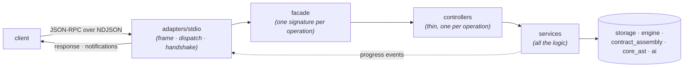

# Core (orchestrator)

The core is the headless heart of Spec Forge. It owns the pipeline —
contract, static analysis, inference, fuzzing, persistence and history — and
exposes it as a **catalog of operations a frontend calls**. It renders nothing
and imports no frontend: a client drives it, the core answers.

> The core is **not** a CLI. The command-line tool that ships to users,
> `specforge-cli`, is a separate repository: a thin JSON-RPC client that speaks
> to the core over stdio and owns all rendering. This module documents the core
> and the protocol that client uses; the client's own user guide lives in its
> repository.

Two surfaces sit on one façade. The **stdio protocol server** (`--serve`) is
the production surface the shipped client drives. The **built-in REPL**
(`specforge`) is the surface the team tests the pipeline with today; it goes
away once the client drives the core through `--serve`. Both descend through
the same façade, so neither can answer differently from the other.

## What a request does

A request enters the transport, is bound to a façade signature, runs through a
controller and its services, and its answer travels back out — long operations
streaming progress events while they run.



## The module map

Each folder answers one question; nothing skips a layer.

| Folder | Answers | Notes |
| --- | --- | --- |
| `adapters/` | how does a message get in? | The only layer that knows a transport exists. `stdio/` carries NDJSON framing, the JSON-RPC envelope, the handshake, the dispatcher, and the server with its worker pool and live-cancellation registry. |
| `facade/` | what can a frontend call? | Signatures only, delegating to controllers — the readable list of the surface, like a routes file. Every module here is a **family**. |
| `controllers/` | what does each operation do? | One thin function per operation; **never calls another controller** — shared work lives in a service both reach. |
| `services/` | how is it done? | All the logic, no rendering. Self-contained subsystems (`fuzz/`, `history/`, `compare/`, `retention/`, `diagnostics/`, `pipeline/`, `contract/`, `analysis/`, `deps/`). The only layer that imports `storage`. |
| `schemas/` | what comes in? | Deliberately inert input objects. |
| `models/` | what goes out? | Response DTOs and the projections that build them. Never input. |
| `errors/` | how does it fail, and how does the protocol say so? | One class per failure, each carrying **both** codes the protocol needs. |
| `domain/` | what does it run against? | The `Session`, the event machinery, endpoint numbering, the live-operation registry, cancellation. |
| `config/`, `utils/` | what is configurable, and the shared leaves | Typed definitions; constants and helpers that import no other layer. |

## The session and the project

The core holds **one active project at a time**, switched in place. A project is
a directory carrying a `specforge.toml` and a `.specforge/` data directory of
its own; every project shares **one central store** (a project has no database
of its own). Opening a project loads its settings, its parsed and numbered
contract, and its store connection; switching replaces all of it.

Two levels of readiness gate the operations. `Precondition.PROJECT` means a
project must be open; `Precondition.CONTRACT` means a contract must also be
loaded (and implies `PROJECT`). Each operation publishes which it needs.

## The operation catalog

`describe` publishes everything a frontend can ask for: **31 operations in
eight families**, each with its parameters and types, whether it emits progress,
whether it can be cancelled, and what it requires open first. The catalog is
**derived from the façade's own signatures and docstrings**, so there is no
second list to fall out of sync — adding an operation is adding a façade
function. The eight families are `analysis`, `catalog`, `config`, `contract`,
`environment`, `execution`, `results` and `session`.

## The busy guard

Changing or closing the active project while operations are still running is
refused with `PROJECT_SWITCH_REJECTED`, which lists what is still alive. The
guard tracks exactly the operations that **use the session**: an operation that
takes no session, or one that itself switches the project (`open_project`,
`close_project`), is never counted against a switch. Every other in-flight
operation registers under the request id that started it, and releases however
it ends.

## Dependency gateways and the doctor

The core boots even when any of its six pipeline libraries is missing —
`storage`, `specforge_engine`, `contract_assembly`, `core_ast`, `ai` and
`specforge_contracts`. Each is imported by **exactly one** module: its gateway
under `services/deps/`. A gateway owns the single answer to *"is this
installed, and if not, why?"* and the symbols the core uses from that library;
whoever needs it asks the gateway and raises its **own** typed error when it is
absent. A library that raises while importing counts as absent, carrying its
exception type as the reason.

`doctor` reads each gateway and tells three states apart: **present**,
**missing** (with the import failure's reason), and **installed but not yet
loaded** — a library added while the process was running, which reads as
blocking as missing and whose only fix is a restart.

## How a run is executed, persisted and reported

`fuzz` (and `run_pipeline`, which composes the four stages) loads and selects
endpoints, optionally asks a contract producer for each one's enriched
contract, and hands everything to the engine. Every saved run persists as a
project → analysis → run hierarchy in one atomic transaction, keeping the
execution trace as its one critical artifact and writing a `report.json` /
`report.html` beside it. The report accounts for **every declared endpoint**,
carries the run's coverage partition and its signal, and names — per endpoint —
why a targeted one drew no requests (the safety guard's hold, or a by-design
skip). See [Run Report](../../user-guide/reports.md) and the engine's
[Execution modes](../specforge-engine/execution-modes.md) for the run itself,
and [Reference](reference.md) for the layer-by-layer design.

## Development requirements

The package targets Python 3.11+. Installation and the test suite are in
[Contributing & Testing](../../developer-guide/contributing.md).

## Quick start

```bash
specforge                      # the interactive REPL (the team's testing surface)
specforge --serve              # serve the protocol until EOF or `shutdown`
specforge --protocol-version   # 0.1.3
```

## Read more

- [Reference](reference.md) — the layers, the catalog derivation, the gateways
  and the doctor in depth.
- [Protocol](protocol/index.md) — the wire the shipped client drives the core
  over: framing, envelopes, events, errors, operations and fixtures.
- [Decision records](adr/index.md) — why the core is shaped this way.
