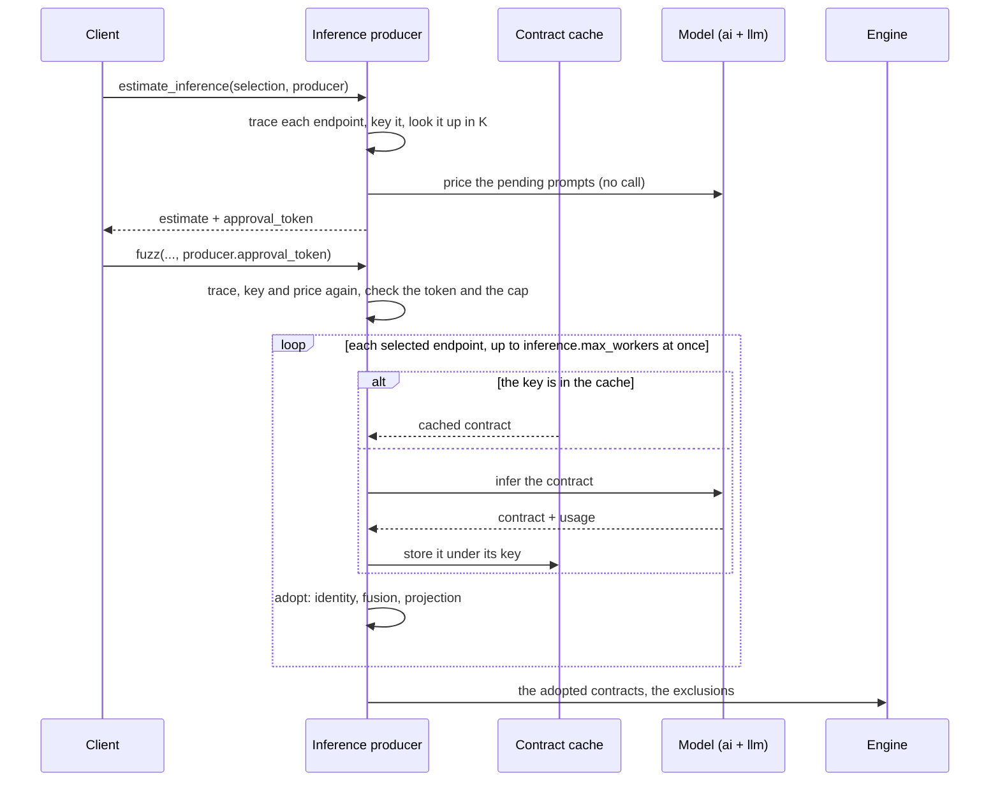

# Core — Inference

The **inference producer** is the contract producer that asks a model for each
selected endpoint's enriched contract, reading the endpoint's own code. A run
selects it with `producer.kind` `inference` on `fuzz` or `run_pipeline`, and
`estimate_inference` prices it before anything is paid for. Every contract it
returns is checked against its endpoint before the engine sees it, so a wrong or
missing contract costs one endpoint its enrichment, never the run.

This page follows one run end to end: what the producer needs, the request it
builds, how a contract is adopted, the cache in front of the model, how spend is
estimated, approved and capped, and how production runs and stops. The fields
on the wire are in [Operations](protocol/operations.md#producer); the options it
reads are in [Configuration](configuration.md).

## The flow

The estimate and the run compute the same plan from the same inputs, which is
what lets a token name exactly the inferences a run would pay for.

## What it needs

| Requirement | Why | Without it |
| --- | --- | --- |
| `lib/semantic_inference` and `lib/llm` installed | They render the prompt and call the model. | `CONTRACT_PRODUCER_FAILED`, naming the import failure |
| `core_ast` installed | It traces each endpoint's handler into its source context. | `CONTRACT_PRODUCER_FAILED` |
| A model chain and its keys | `llm.primary_model` or `LLM_MODEL`, plus a provider key for every model of the chain ([Environment Variables](../../user-guide/environment.md#llm-configuration)). | `CONTRACT_PRODUCER_FAILED` before `started` |
| `producer.source_repo` | The code the handlers are traced in; relative to the project root. | — |
| `storage`, optional | The contract cache lives in the store. | The run is uncached; a store that failed to open is refused `CONTRACT_PRODUCER_FAILED` with the cause after `contract cache:` |

The core reaches the semantic inference package through the `ai` gateway, the
only module that imports it. That gateway loads on first use, once, under a lock:
a session that never needs it never pays for importing the LLM stack (see
[Reference › Dependency gateways](reference.md#dependency-gateways)).

## The request for one endpoint

For each producible endpoint the producer builds one inference request:

| Field | Source |
| --- | --- |
| `system_context` | `core_ast`'s packed source context for the endpoint's handler, traced from `source_repo` |
| `is_partial_context` | `true` when some called code could not be resolved |
| `estimated_tokens` | `core_ast`'s size estimate of that context |
| `method`, `path_url` | The endpoint's identity |
| `openapi_endpoint` | The endpoint's OpenAPI definition |
| `state_hints` | The state-link bundles the endpoint produces and consumes, when it has any |

The run's strategy picks the agent profile: `default` asks the `qa` profile and
`hacker` the `security` one. What the model is then told is in
[Semantic Inference › Inputs](../semantic-inference/index.md#inputs) and
[Prompts](../semantic-inference/prompts.md).

An endpoint whose handler cannot be traced is not inferred: it runs schema-only,
and `estimate_inference` lists it under `untraced` with the reason.

### Bundle names

The bundle names in `state_hints` come from the route topology, never from the
model. Native OpenAPI `links:` come first; where they leave a gap, a heuristic
links a collection's creator (`POST /articles`) to its by-id sibling
(`GET /articles/{slug}`). A bundle is named after every **static segment** of its
creator's path plus the leaf of the captured response field:
`POST /articles/{slug}/comments` capturing `comment.id` produces
`articles_comments_id`. Every endpoint nested under a parent's by-id segment
consumes that parent's bundle at its own path parameter, unless a native link or
a by-id sibling already fills that parameter. A contract's `transitions` and
`access.owner_bundle` may cite only these names.

## Adoption

A produced contract is used only if it fits its endpoint. Three checks run in
order:

1. **Identity.** The contract's `method` and `path_url` must name the endpoint it
   was produced for.
2. **Fusion.** It must fuse onto the endpoint's OpenAPI definition.
3. **Projection.** The fused contract must project into what the engine compiles.

A contract that passes all three replaces the endpoint's definition for the run,
and the run keeps it with its results. A failure leaves an entry in
`producer_exclusions` with its `reason` and a
[`disposition`](protocol/vocabularies.md#producer-exclusion-disposition):

| Failure | `disposition` | What the run does |
| --- | --- | --- |
| Before a validated contract exists: an inference error, an output that failed validation, an untraced endpoint, the cost cap, a cache entry gone since the plan | `schema_only` | Fuzzes the endpoint from its schema alone. |
| A validated contract that fails a check above and declares no risk flag | `schema_only` | The same. |
| A validated contract that fails a check above and **declares a risk flag** | `withheld` | Never fuzzes it as a target; its flag still vetoes its route. |

The boundary is the risk flag: a contract that said the endpoint writes or has
side effects is not ignored because another part of it failed. The run goes on in
every case. The fixture producer is the exception: a hand-written contract the
core cannot use aborts the run with `CONTRACT_PRODUCER_FAILED`, because it is an
explicit request.

## The contract cache

The cache sits in front of the model as a proxy: before an inference is sent, its
key is looked up, and a hit answers with the stored contract at no cost. A miss
goes to the model, and the answer is stored under its key as soon as it arrives,
before adoption. Entries live in the
[`inferred_contracts`](../storage/data-model.md#inferred_contracts) table of the
store, which is global: the same handler in two projects shares its entry.

The key is the SHA-256 digest of a canonical document holding everything that
shapes the prompt:

| Part | Why it is in the key |
| --- | --- |
| Agent profile | A `qa` contract is not a `security` one. |
| `is_partial_context` | The prompt warns the model when context is missing. |
| Kernel version | The installed `specforge-contracts` shapes what a contract may say. |
| Method, path | The endpoint's identity. |
| The endpoint's OpenAPI definition | A spec change changes the prompt. |
| Prompt identity | The [prompt fingerprint](../semantic-inference/prompts.md#the-prompt-fingerprint): templates, vocabulary, response schema, primary model, sections. |
| State hints | The bundle names the contract may cite. |
| System context, normalized | Source paths made relative to the repository root, so the key is the same on any machine that sees the same source. |

An edit to the traced code, the spec, a template, the kernel or the model moves
the key, and the next run infers again. A stored entry the current kernel cannot
parse counts as absent and is replaced.

| Control | Effect |
| --- | --- |
| `producer.refresh` | Skip the cache for this run and replace every entry it infers. |
| A project without a store | No cache: every endpoint goes to the model. |

The run reports what the cache did in `run.contract_cache`, `{hits, misses}`:
how many contracts the cache served and how many the model inferred. On a
19-endpoint API, a second identical run makes no model call (`contract_cache`
19 hits, 0 misses) and produces its 19 contracts from the cache in 0.7–1.2 s.

## Spend: estimate, approval, cap

### The estimate

`estimate_inference` takes the selection a `fuzz` would take and builds the same
plan: it traces every endpoint, keys it, looks it up, and prices the pending
prompts in one batch through the LLM package's estimator, without calling the
model. It builds the same producer a run would, so it needs the same model chain
and keys. Its result is listed in
[What `estimate_inference` answers](protocol/operations.md#estimate-inference);
how the tokens are counted and what `priced: false` means is in
[LLM › Estimating a batch](../llm/reference.md#estimating-a-batch).

### Approval

The estimate's `approval_token` is the SHA-256 of the cache keys of its pending
inferences, sorted. A run passes it as `producer.approval_token`; the run
computes its own plan and compares:

| The run's plan | Answer |
| --- | --- |
| Nothing pending (the cache answers every endpoint) | Runs; no token needed. |
| Pending, `inference.require_approval` `false` | Runs. |
| Pending, no token | `INFERENCE_APPROVAL_REQUIRED`, `data.reason` `missing` |
| Pending, a token for another set of inferences | `INFERENCE_APPROVAL_REQUIRED`, `data.reason` `stale` |

The refusal carries `data.estimate`, the estimate as `estimate_inference` would
return it, so a client can show the price and approve in one step. A token goes
stale whenever the set of pending inferences changes: an edit to the traced
code, the spec, the model or the prompt, another selection, or a cache entry
gained or lost since the estimate. In
`run_pipeline` the refusal fails the `inference` stage with the same code and
`data`.

### The cap

`producer.max_cost_usd`, greater than `0`, caps what one run spends on
inferences. It is predictive: when an inference is admitted, the producer adds
its estimate to what has been spent plus the estimates still held by inferences
in flight, and admits it only if that total stays within the cap. When it does
not fit, admission waits for the inferences in flight to settle, then decides on
the actual spend. Each settled inference replaces its hold with what it really
cost.

- An endpoint the cap refuses runs schema-only, listed in `producer_exclusions`.
- A cap with pending inferences on an unpriced model is refused `INVALID_PARAMS`:
  there is no price to hold it to.
- An inference whose cost is unknown makes the run's spend unknown, and every
  later one is refused under the cap.
- The cap falls on the same endpoints as a one-at-a-time run unless an inference
  in flight pays more than its estimate; then up to `inference.max_workers − 1`
  more inferences may run past it.

### What the run records

`run.inference_cost` carries `estimated` and `actual`, each
`{input_tokens, output_tokens, cost_usd}`: what the pending inferences were
estimated to cost before the run, and what the ones that ran cost, failed
inferences included. `run.inference_cost.actual` is the run's spend; the
`contract_*` events do not add up to it. An unknown cost is `null`, never `0`; a
run the cache answers whole carries real zeros (see
[Run Report › The run's inference](../../user-guide/reports.md#the-runs-inference)).

On a 19-endpoint API, one profile cost USD 0.19–0.34 for all 19 endpoints, and
the actual cost came within about 20 % of the estimate.

## Production

### Parallel, with a leader

Endpoints are admitted in selection order and produced on a pool of
`inference.max_workers` workers. The first inference whose estimate writes the
provider's prompt cache **leads**: it runs alone, and the others start once it
ends, so the shared prompt prefix is written once and read by every later call,
as the estimate priced it.

### Events

Each endpoint's production is reported with
[contract production events](protocol/events.md#contract-production):
`contract_started` in selection order, then `contract_finished` (with its
`source`, `cache`, `model`, `fixture` or `absent`, and, for `model`, the tokens
and cost) or `contract_failed` (with its `reason` and `disposition`) as each one
ends. Pair them by `endpoint`. A `contract_failed` with `disposition` `aborted`
means the operation fails.

### Cancellation

A `$/cancelRequest` during production starts no new inference. Those already
sent finish, are paid for and are written to the cache; then the operation ends.
No run exists yet: `fuzz` answers `cancelled` with no `run`, and `run_pipeline`
marks its `inference` stage `stopped`. The next run with the same inputs is
served those contracts by the cache at no cost.

### Timing

`run.production_duration_ms` is how long producing the run's contracts took,
tracing and pricing included; `duration_ms` is the engine run alone. It is
`null` without a producer and for a replay.

## The `fuzz` seam

Production is the first half of the [fuzz seam](reference.md#the-fuzz-seam): it
turns the selection into one contract or one exclusion per endpoint, and the
engine compiles and runs what it produced. A run's options are checked and its
plan resolved before anything is paid for, so a request that contradicts itself
is refused before the first inference.

## Where to change what

| To | Change |
| --- | --- |
| Change what the cache key covers | `services/fuzz/producers/cache/key.py` |
| Change how a contract is adopted | `services/fuzz/adoption.py` |
| Change when a failure withholds instead of dropping | `ProducerExclusion.from_failure` in `services/fuzz/models.py` |
| Change how the approval token is computed | `services/fuzz/producers/cost/approval.py` |
| Change how the cap holds and settles | `services/fuzz/producers/cost/budget.py` |
| Change how production is scheduled | `services/fuzz/production_loop.py` |
| Change how bundles are named | `services/fuzz/state_link.py` |
| Change the parallelism a run uses | the `inference.max_workers` option ([Configuration](configuration.md)) |
