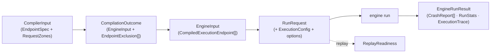

# Data flow

Data crosses the engine as frozen DTOs at the boundaries (pydantic,
`extra="forbid"`) and frozen value objects inside (`@dataclass(frozen=True)`).
This page follows those types top to bottom — from the orchestrator's
`CompilerInput` to the `EngineRunResult` — and states the invariant each one
carries. Every type named here lives in `models/`.

## The vocabulary enums

Every closed set of names travels as a `StrEnum` member, never a bare string.
The kernel owns the vocabularies shared with the rest of the pipeline; the
engine owns the ones that are its own.

| Enum | Owner | Members (`.value`) |
|---|---|---|
| `Zone` | kernel | `path` · `query` · `header` · `body` |
| `Criticality` | kernel | `low` · `medium` · `high` · `critical` (declaration order is the rank) |
| `Sensitivity` | kernel | `public` · `internal` · `pii` · `financial` · `auth` |
| `AttackProfile` | kernel | `injection` · `ssrf_filesystem` · `auth_bypass` · `input_validation` · `deserialization` · `information_disclosure` · `resource_abuse` · `business_logic` · `headers_cookie` · `parser_compatibility` · `path_traversal` · `xss` · `sql_injection` |
| `ExecutionMode` | `models/execution_mode.py` | `stateless` · `stateful` · `replay` · `performance` · `resilience` |
| `StrategyMode` | `models/strategy_mode.py` | `Default` · `Hacker` (capitalized: the wire spelling the LLM emits) |
| `Phase` | `models/phase.py` | `valid` · `boundary` · `invalid` · `attack` · `transition` |
| `SchemaType` | `models/schema.py` | `string` · `integer` · `number` · `boolean` · `array` · `object` · `null` |
| `SchemaKeyword` | `models/schema.py` | the 22 JSON Schema keywords the engine reads, by wire spelling: `type` · `enum` · `const` · `nullable` · `required` · `default` · `properties` · `items` · `format` · `pattern` · `multipleOf` · `minimum` · `maximum` · `exclusiveMinimum` · `exclusiveMaximum` · `minLength` · `maxLength` · `minItems` · `maxItems` · `minProperties` · `maxProperties` · `allowExtraFields` |
| `SchemaFormat` | `models/schema.py` | `email` · `uuid` · `date` · `date-time` · `uri` · `ipv4` · `hostname` · `byte` |

The engine-side outcome vocabularies follow the same rule:

| Enum | Members (`.value`) |
|---|---|
| `ErrorCategory` | `success` · `client_error` · `server_error` · `contract_violation` · `timeout` · `availability` · `unsendable_request` |
| `InvariantViolation` | `not_a_server_error` · `status_code_conformance` · `response_schema_conformance` · `content_type_conformance` · `state_transition` · `latency_sla` · `resilience_degradation` |
| `TruncationReason` | `infrastructure_abort` · `deadline_exceeded` · `target_down` · `state_link_abort` · `generation_exhausted` |
| `FidelityLevel` | `exact` · `reduced` |

### Enums serialize as their wire value

Every vocabulary enum is `enum.StrEnum`, never `class X(str, Enum)`: `str()` of
a `StrEnum` member is its `.value` (`"valid"`), whereas `str()` of the mixin
form is its qualified name (`"Phase.VALID"`). `Phase`, `Zone` and
`ErrorCategory` travel as keys in `phase_split`, `examples_per_phase`,
`by_phase` and `by_category`, so this is what keeps an enum-keyed map
serializing to the same JSON as a string-keyed one. A parametrised test pins
the property for every vocabulary ([Testing](testing.md)).

## Boundary DTOs

The types that cross a stage line, all validated with `extra="forbid"`:

| DTO | Direction | Notes |
|---|---|---|
| `CompilerInput` | in | endpoints plus a single global `strategy_mode` (never per-endpoint) |
| `EndpointSpec` | in | one endpoint; its four request zones are a `RequestZones` value object |
| `BaseStrategyContract` / `HackerStrategyContract` | in | per-value generation knobs (hacker is a pydantic subclass, dispatched by type) |
| `ResponseContract`, `StateLinkContract` (+ `StateProduction` / `StateConsumption`) | in | expected responses, stateful links |
| `EndpointRisk`, `EndpointAttack` | in | kernel semantic DTOs, re-exported through `models/contracts`, never duplicated |
| `EndpointBudgetContract` | in | adaptive example budget; engine-only, no kernel twin |
| `CompilationOutcome` | out | Result object: `EngineInput` plus a tuple of `EndpointExclusion` |
| `EngineInput` | out → in | `CompiledExecutionEndpoint[]`; the engine consumes this alone |
| `RunRequest` | in | one run's inputs: `engine_input` + `ExecutionConfig` + mode `options` |
| `EngineRunResult` | out | crash reports, `RunStats`, `ExecutionTrace`, optional `ReplayFidelity` |
| `CrashReport`, `RunStats`, `EndpointStats`, `LatencyStats` | out | serialized to columns by `core/` — field names are stable |
| `ExecutionTrace`, `TracedRequest`, `TruncationRecord` | out | the replayable record |
| `ReplayReadiness` | out | outcome of the pre-replay readiness check |



## The compiler input: `EndpointSpec` and `RequestZones`

`EndpointSpec` is endpoint identity (`method`, `path_url`, optional `base_url`)
plus everything needed to shape and judge its requests: the four request
zones, `content_types`, and the optional endpoint-level controls — `risk`,
`budget`, `attack`, `responses` (keyed by status-code string), `state_link`
and `semantic_properties`. The controls are independently optional and stay
flat on the spec ([ADR-009](adr/models.md#adr-009)).

The four zones are a `RequestZones` value object: a frozen pydantic model with
one field per `Zone` (`path`, `query`, `header`, `body`), each a `ParamMap`
(`dict[str, HackerStrategyContract | BaseStrategyContract]`) defaulting to
empty. Its `by_zone()` iterator yields the non-empty zones in `path, query,
header, body` order as `(Zone, ParamMap)` pairs, so callers iterate a
`Zone`-keyed structure instead of four loose fields. The same `Zone`-keyed
shape reappears on the engine side, so one concept lives on both sides of the
compile ([ADR-008](adr/models.md#adr-008)).

The two kernel DTOs an endpoint may carry:

| DTO | Fields |
|---|---|
| `EndpointRisk` | `risk_score` (0–100, default 50), `criticality`, `sensitivity`, `auth_surface`, `write_operation`, `external_side_effects` |
| `EndpointAttack` | `attack_profiles`, `focus_fields`, `sensitive_fields`, `aggressiveness` (0–10), `mutation_depth` (0–10), `field_hints` keyed by zone-qualified field path |

`EndpointBudgetContract` is the engine's own: `max_examples` (default
`DEFAULT_MAX_EXAMPLES`), an optional `phase_split` (`dict[Phase, float]`,
fractions ≥ 0 summing to at most 1), `max_combinations_per_case`, and an
optional `deadline_ms`.

## Strategy contracts

`BaseStrategyContract` is the per-value generation contract every strategy
shares; it uses `populate_by_name=True` and camelCase aliases so a JSON Schema
fragment validates directly (`type`, `exclusiveMinimum`, `minLength`, …).
`HackerStrategyContract` is a pydantic subclass that adds `attack_profiles` and
the nine `include_*` payload-variant toggles; the compiler dispatches on it by
type, not by a mode flag. Its `properties` and `items` are re-typed so nested
values keep the hacker knobs ([ADR-010](adr/models.md#adr-010)).

Two invariants are enforced in the model itself, so the compiler never sees a
contract that breaks them:

- **Dialect normalization** (`normalize_type_array`, a `mode="before"`
  validator at every nesting level): a JSON Schema `type` array collapses to
  one scalar `type` plus an explicit `nullable`. An empty array (`type: []`)
  raises `StrategyCompilationError`; a union of more than one concrete type
  raises (the compiler models one type per value); a null-only array becomes
  `type: null`; a null member alongside one concrete type sets
  `nullable: true`, outranking a contradictory `nullable: false`.
- **Mistyped bounds** (`mode="after"`): a string `minimum` / `maximum` is
  legal only as an ISO `date` / `date-time` range on a string contract;
  anything else raises, so a stray string bound never reaches strategy
  compilation.

The allowed-field matrix `ALLOWED_FIELDS_BY_TYPE` lists, per `SchemaType`, the
`SchemaKeyword`s the policy layer accepts. `ALLOWED_FIELDS_BY_TYPE_HACKER`
extends each entry with `HACKER_EXTRA_FIELDS`, derived from the model aliases
(`wire_names(HackerStrategyContract) - wire_names(BaseStrategyContract)`) so a
new hacker field extends the allow-list on its own. The hacker table's value
type is `frozenset[SchemaKeyword | str]` because those extra names are the
hacker contract's own snake_case wire names, not JSON Schema keywords; the
base table is a plain `frozenset[SchemaKeyword]`
([ADR-012](adr/models.md#adr-012)).

## Responses and state links

`ResponseContract` declares the expected `content_type` and `body_schema` for
a status code. `resolve_response_contract` resolves a status to its contract
by precedence — exact key (`"404"`) → status-class key (`"4xx"`, case-folded)
→ `"default"` — and never raises, returning `None` when nothing matches.

A stateless run tests each endpoint in isolation with synthetic data. A
stateful run chains requests: it captures real values from a response into
named *bundles* and injects them into later requests, so a flow like `POST →
GET → DELETE → GET` runs against the same resource. `StateLinkContract` is the
declarative mapping that drives this:

- `StateProduction` captures `response_field` (a dotted path) into `bundle` on
  success; `on_status=None` means any 2xx.
- `StateConsumption` injects a bundled value into `target_zone` /
  `target_field`, optionally `invalidates`-ing the bundle so a deleted
  resource cannot be operated on again.
- `TransitionInvariant` (kernel) asserts that a follow-up request
  (`follow_up_method`, `follow_up_path`, with the bundled value injected into
  `target_field`) returns one of `expected_statuses`; `echoed_fields` names
  request fields the follow-up must reflect, and `trigger_statuses` restricts
  which triggering statuses arm it (never a 5xx: a server error is the defect
  itself).

Each list defaults independently to empty, so an endpoint may only produce,
only consume, or both. The whole contract is optional and additive: an
endpoint without one is fuzzed statelessly.

## The compiler outcome and the compiled input

`CompilationOutcome` is a frozen Result object: the `EngineInput` plus one
`EndpointExclusion` (`method`, `path_url`, `reason`) per endpoint that failed
to compile.

`EngineInput` carries `CompiledExecutionEndpoint`s. Each pairs endpoint
identity with its `CompiledEndpointStrategies` (one `CompiledRequestPart` per
non-empty zone — `path_parameters`, `query_parameters`, `header_parameters`,
`body` — each holding the per-`Phase` `SearchStrategy`s, plus the
`generation_plan` and `content_types`) and the contract DTOs the engine still
needs (`risk`, `attack`, `budget`, `responses`, `state_link`). Its
`endpoint_id` is `format_endpoint_id(method, path_url)` —
`"{METHOD}:{path_url}"`, method uppercased — the stable key that groups every
result, stat and trace row. `CompiledRequestPart` raises
`StrategyCompilationError` in `__post_init__` if it is built with no per-phase
strategies: an empty zone is a bug, not a silent no-op.

`GenerationPlan` is the per-endpoint budget the compiler hands the engine — a
frozen value object with exactly four fields: `estimated_combinations`,
`allowed_combinations`, `max_examples`, `examples_per_phase` (a
`Mapping[Phase, int]`). Because it is frozen, performance mode scales it
through `GenerationPlan.scaled(factor)`, which multiplies `examples_per_phase`
and returns `self` when `factor == 1`
([ADR-011](adr/models.md#adr-011)).

## Execution runtime

`ExecutionConfig` holds the runtime controls (frozen): `base_url` is required
— without it the engine cannot build absolute requests, and failing at
construction is clearer than reporting synthetic availability errors later.
The rest have defaults: `timeout_s`, `max_concurrency` (also the exploration
batch size), `max_retries`, `headers`, `backoff_base`, and `identities`. A
`mode="after"` validator rejects duplicate identity labels, because a label
keys findings, reports and replays.

`Identity` is a `label` plus credential `headers`. It comes from the user's
execution config, never from the contract producer, so it carries no contract
fields. `headers={}` models an anonymous identity — no credentials at all,
still worth a label so a 2xx from it is as accountable as any other.

`RequestBlueprint` is the immutable request built from a compiled endpoint and
a payload: method, URL, headers, query, JSON body, `phase`, `endpoint_id`,
the `config_header_names` (whose values are credentials and are never
recorded), the `identity_label`, and an `unsendable_reason` when the request
must not be sent. `generated_headers` is the subset the fuzzer produced.

`ExecutionResult` is the canonical record of one request
([Architecture](architecture.md#executionresult-is-the-canonical-record-of-a-request)).
`category` maps `error=None` to `ErrorCategory.SUCCESS`; `was_sent` is false
only for `UNSENDABLE_REQUEST`. `INFRA_CATEGORIES` is deliberately wider than
`TARGET_FAILURE_CATEGORIES`: a request that could not be sent says nothing
about the API — neither that it misbehaved nor that it is down — so it is
recorded in stats but never counted as evidence the target is failing, and
never becomes a finding.

## Per-mode options

Mode-specific settings travel in `RunRequest.options` (a `BaseModel | None`),
so the runner signature stays stable across modes instead of growing a
parameter per mode. `None` means the mode's defaults.

| Options | Fields |
|---|---|
| `StatelessOptions` | `include_repeated_requests` (validated, not yet wired to generation) |
| `StatefulOptions` | `max_examples` and `step_count` bound the breadth and length of each generated sequence; `max_distinct_bugs` controls the loop-until-dry depth (`1`, the default, runs one pass and reports the first defect; higher values keep re-running, suppressing each found defect, at a proportional cost in requests) |
| `PerformanceOptions` | `latency_sla_ms` (the SLA the oracle enforces) and `load_factor`, a multiplier applied to each phase's example budget to sustain load |
| `ReplayOptions` | `trace` to re-send and `preserve_timing` (wait between requests to match the recorded schedule) |

`StatefulOptions` is persisted by the orchestrator as part of a run's recipe,
so its field names are stable.

## Replay

Before replaying, the readiness check returns a `ReplayReadiness` value object
with three tuples — `missing_identities`, `missing_credentials`,
`host_mismatches` — and an `is_ready` property that is true only when all
three are empty ([ADR-022](adr/engine.md#adr-022)). After a replay,
`ReplayFidelity` reports the run-level verdict: a `FidelityLevel` (`exact` /
`reduced`) and the list of `ResponseDivergence`s (a request whose observed
status differed from the recorded one; its `violated` flag says whether the
recorded request was itself a finding).

## The trace

`ExecutionTrace` is the ordered record of the exploration requests one run
actually sent — the recipe for reproducing it. Shrinking requests are absent:
their conclusion is the crash report. Each `TracedRequest` is an observed fact,
so no field has a default; credentials are omitted rather than redacted (only
the config header *names* are recorded), `omitted_url_userinfo` flags a
stripped `user:pass@`, and `sent_at_ms` is excluded from anything hashed.
`TruncationRecord` records where and why a run, or one endpoint, was cut short:
a `TruncationReason`, the `endpoint_id`, the `requests_sent` before the cut and
an optional `detail`.

## Results, findings and their counters

Inside the engine, an exploration pass produces `RawFinding`s (a finding needs
at least one `InvariantViolation`; `primary_violation` is the first the oracles
reported). Findings are grouped by `FindingSignature` (endpoint, phase,
invariant, status, identity label, body fingerprint) into `FindingGroup`s, then
shrunk into `CrashReport`s. A `CrashReport` carries the `minimal_payload` keyed
by zone, the `invariant_violated`, `sanitized_headers`, the `identity_label`,
the `status_code` and `response_body`, an optional `stack_trace`, the
`transition_sequence` for stateful findings, and `represented_findings` — how
many raw findings it stands for, adjusted through `standing_for`.

`RunStats` is the aggregated counter set of one run. Its three maps are
`by_endpoint` (keyed by `endpoint_id`), `by_phase` (`Phase`-keyed) and
`by_category` (`ErrorCategory`-keyed); the enum-keyed ones accept a wire string
and dump back to the same string. Each counter has one meaning and one
producer:

| Counter | Meaning |
|---|---|
| `findings_raw` | violations observed during exploration, before shrinking |
| `findings_confirmed` | shrink attempts that reproduced and became a crash report |
| `findings_unique` | distinct defects after collapsing reports with the same minimal reproducer and identity (`== len(crash_reports)`, never above `findings_confirmed`) |
| `findings_flaky` | attempted during shrinking and did not reproduce |
| `findings_collapsed` | not shrunk because a faithful representative of their signature stands for them |
| `findings_unverified` | never attempted: the run was cut before shrinking, or no candidate could be produced |
| `requests_shrink` | requests the shrinking phase put on the wire; not part of `total_requests` |

`EndpointStats` mirrors the per-endpoint subset (`requests`,
`examples_planned`, `findings_raw`, `crash_reports`) plus a `LatencyStats`
whose fields all default to zero, so `LatencyStats()` is a valid "no samples"
value — an endpoint can carry a confirmed crash report with no surviving
requests to time.

The lifecycle mechanics — one producer per counter, the flaky count measured in
the shrinker rather than derived by subtraction — are the engine's finding
pipeline ([Engine internals](engine-internals.md#the-finding-pipeline),
[ADR-018](adr/engine.md#adr-018)).

## Failures, not `None`

Expected alternative results are Result objects (`CompilationOutcome`,
`ReplayReadiness`); genuine failures are typed domain exceptions rooted at
`CustomSchemathesisError` (`exceptions.py`), so no builtin `ValueError` /
`RuntimeError` crosses a package boundary
([ADR-001](adr/foundations.md#adr-001)):

```text
CustomSchemathesisError
├── PolicyError                      # boundary validation failed
├── StrategyCompilationError         # a contract cannot become a strategy
│   └── EndpointCompilationError     # …for a specific endpoint (carries endpoint_id + the reason)
└── EngineError                      # an execution invariant was violated
    └── StatefulLinkError            # a state link could not be honored (carries partial_exploration)
```

## Runtime value objects

The value objects a strategy draws and the engine passes internally (the zoned
payload, the exploration cut, oracle verdicts, budget shares, the schema view,
the chaos requests) never cross the public boundary; `CrashReport.minimal_payload`
and `transition_sequence` are their flat `dict` / `list` projections at the
edge. Each is documented next to the layer that owns it in
[Engine internals](engine-internals.md).
