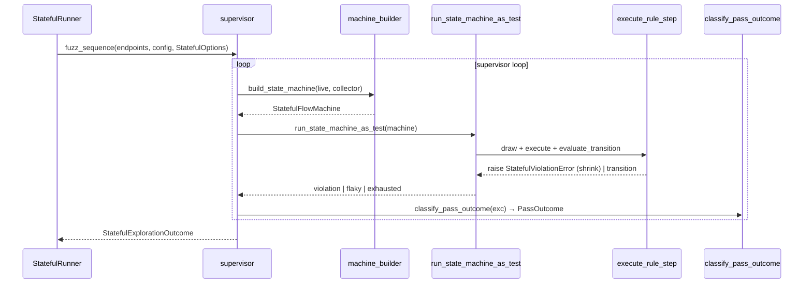
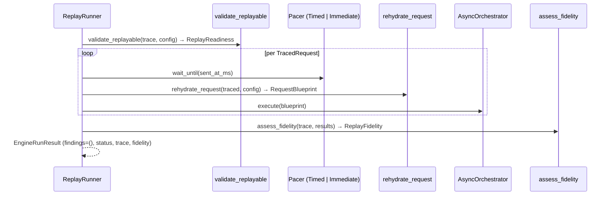
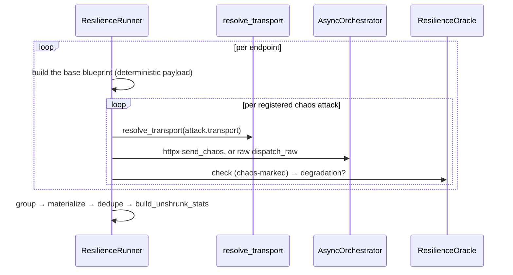
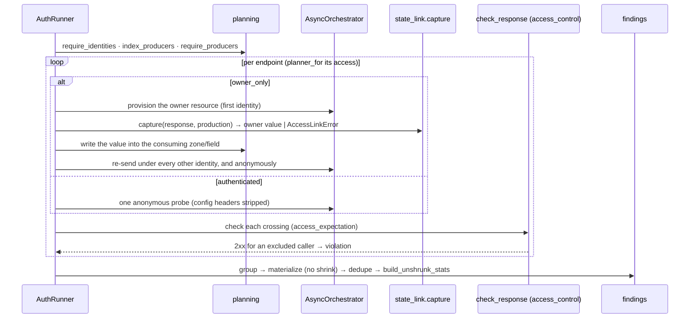

# Execution modes

`run(engine_input, config, mode, options=None)` selects a runner object from a
registry by `ExecutionMode` — never a branch, never a boolean
([ADR-013](adr/api.md#adr-013)). Each runner satisfies the `ExecutionRunner`
Protocol (`mode`, `options_type`, `run`). There are six built-in runners,
registered explicitly by `register_builtin_runners`.

Stateless and performance share one loop template (`explore_endpoints`, a
higher-order function taking an `EndpointLoopSpec` value object that bundles the
three steps that vary — `fuzz_one`, `resolve` and `build_stats`
([ADR-043](adr/engine.md#adr-043))). Stateful (a supervisor that builds a fresh
state machine for every pass), replay (trace-driven), resilience (a fixed
chaos battery per endpoint) and auth (a per-endpoint provision-and-cross) each
have a genuinely different shape and write their own loop.

Before any runner starts, endpoints are ordered by risk (`order_by_risk`, on
`risk_score` then `Criticality` rank, most-risky-first and stable), so the most
critical endpoints are explored first and survive a deadline or target-down cut.
An endpoint with no risk metadata sorts as the neutral default, so a schema-only
run keeps its original order.

## Options per mode

| Mode | Options DTO | Fields |
|---|---|---|
| `STATELESS` | `StatelessOptions` | `include_repeated_requests` |
| `STATEFUL` | `StatefulOptions` | `max_examples`, `step_count`, `max_distinct_bugs` |
| `REPLAY` | `ReplayOptions` | `trace`, `preserve_timing` |
| `PERFORMANCE` | `PerformanceOptions` | `latency_sla_ms`, `load_factor` |
| `RESILIENCE` | none | the built-in chaos battery |
| `AUTH` | none | the declared `identities` and each endpoint's `access` policy |

What each field means is in [Data flow](data-flow.md#per-mode-options).
`ExecutionConfig` and `Identity` are global runtime (base URL, credentials,
identities, concurrency), not per-mode options. `resolve_runner(mode)` and
`resolve_options(runner, options)` sit beside the registry: the first looks up
the runner for the mode (raising `EngineError` for an unknown one), the second
validates the caller's options against the runner's `options_type` and supplies
that mode's defaults when `None` is passed, so no runner repeats the check
([ADR-021](adr/engine.md#adr-021)).

## Stateless (default)

Fuzz each endpoint independently across generation phases; shrink each
confirmed failure to a minimal reproducer by its signature.

```mermaid
sequenceDiagram
    participant R as run
    participant SR as StatelessRunner
    participant Loop as runners.loop
    participant F as StatelessFuzzer
    participant Orch as AsyncOrchestrator
    participant Or as oracles.evaluate
    participant Fnd as findings

    R->>R: order_by_risk(endpoints)
    R->>SR: run(request, orchestrator)
    SR->>Loop: explore_endpoints(endpoints, EndpointLoopSpec(...))
    loop per endpoint
        Loop->>F: fuzz(endpoint, config)
        loop per pass, @given → batch
            F->>Orch: execute(batch) concurrently
            F->>Or: check → OracleVerdict
            F->>F: fold → RawFinding, or stop with a Cut
        end
    end
    Loop->>Fnd: resolve = shrink_groups → dedupe → build_stats (flaky counted by the shrinker)
    SR-->>R: EngineRunResult
```

A pass stops early with a `Cut` when the abort counters trip: too many
infrastructure failures (`MAX_INFRA_FAILURES`), or `MAX_CONSECUTIVE_SERVER_ERRORS`
consecutive 5xx on one endpoint, after which a liveness probe (one of
`SAFE_PROBE_METHODS`) decides between a defective endpoint and a target that is
down (`TruncationReason.TARGET_DOWN`).

## Stateful

Drive sequences of linked operations as a dynamically built
`RuleBasedStateMachine`; shrink the **sequence** on a new violation.



A stateful run that reaches `max_distinct_bugs` stops; each found defect is
suppressed before the next pass. A flaky pass outcome becomes a flaky finding,
counted in `findings_flaky` by occurrence and folded away when a confirmed report
already covers its signature ([ADR-047](adr/engine.md#adr-047)). When a state
link cannot be honored the run raises `StatefulLinkError` carrying the partial
exploration.

## Replay

Re-send a recorded trace verbatim. `validate_replayable` reports readiness
first; during the replay only server errors are checked (no contracts are
evaluated), and the verdict is a `ReplayFidelity`.



`preserve_timing=True` selects the timed pacer, which waits until each
request's recorded `sent_at_ms`; `False` selects the immediate pacer.

## Performance

Fuzz under a scaled load with the latency-SLA oracle active. The
`GenerationPlan` is scaled with `.scaled(load_factor)`; findings are
materialized without shrinking.

```mermaid
sequenceDiagram
    participant PR as PerformanceRunner
    participant Loop as runners.loop
    participant F as StatelessFuzzer (latency_sla_ms)
    participant Or as LatencySlaOracle
    participant Fnd as findings

    PR->>PR: plan.scaled(load_factor)
    PR->>Loop: explore_endpoints(scaled, EndpointLoopSpec(resolve=materialize))
    Loop->>F: fuzz under load
    F->>Or: check → SLA breach
    Loop->>Fnd: group → materialize (no shrink) → dedupe → build_unshrunk_stats
```

## Resilience

Send deliberately broken requests against each endpoint and watch for
degradation: a chaos request that returns a 5xx, or one the peer accepts and
then crashes mid-response, instead of degrading gracefully, is a
`RESILIENCE_DEGRADATION` finding.



The chaos battery is fixed data, registered from three groups that all fire on
every endpoint:

- **httpx-borne anomalies** — a slow, partial body; an oversized body; a deeply
  nested JSON body; and a body whose declared content type contradicts its
  bytes. These ride the httpx transport, which the run's one orchestrator client
  can express.
- **Framing-level anomalies** — malformed chunked encoding, a lied
  `Content-Length`, duplicate `Host` and `Content-Type` lines, an oversized
  header, a connection cut off mid-request, and a key duplicated in both the
  query string and the JSON body. httpx corrects these by design, so they travel
  over a raw socket instead (see below).
- **Repeated requests** — the same request sent several times in a row, probing
  for a rate limit or a duplicate-submission fault.

Each attack names the transport key that delivers it (`resolve_transport`) and a
builder that shapes it from the base blueprint; the runner never branches on the
attack. A `ChaosTransport` has two built-in implementations chosen by that key —
`httpx`, which routes through the orchestrator's client, and `raw`, which writes
the request byte for byte on a bare socket. Both share the orchestrator's one
concurrency slot, so the raw path takes a slot through `dispatch_raw` exactly as
the httpx path does through `send_chaos`.

The `ResilienceOracle` is the sole judge of a chaos response — a 5xx **or** a
connection the peer accepted and dropped mid-response is a degradation; a
timeout or any 4xx (429 included) degraded gracefully — because `check_response`
runs with `is_chaos=True`, which the ordinary server-error oracle stands down
for. The connection-cut-off attack half-closes the socket and reads the server's
actual reaction, so the verdict is the server's, not an artefact of the client
closing.

## Auth

Cross the declared identities against each endpoint's access policy and watch
for a 2xx a caller should not have obtained — the BOLA/IDOR and broken-
authentication class. The runner reads the `access` section the producer
declared; an endpoint with no `access`, or a `public` one, is never sent.

The run **fails fast before any request** on two conditions: no identity is
declared (`EngineError`), or an `owner_only` endpoint names a bundle no endpoint
in the run produces (`AccessLinkError`). The owner is always the first declared
identity (`config.identities[0]`).



Each endpoint is crossed with **one deterministic valid request** — the simplest
example of the VALID strategy, drawn once and reused. What the runner does with
it depends on the policy:

| Policy | What the runner sends |
|---|---|
| `authenticated` | one anonymous probe, with the config credential headers stripped so it is truly anonymous |
| `owner_only` | provision the owner's resource under the **first** declared identity, capture the bundle value from the response, write it into the endpoint's consuming zone/field, then re-send under every **other** identity and once anonymously |

A crossing is a finding when the `access_control` oracle sees a success for a
caller the policy excludes: another identity or an anonymous request on an
`owner_only` resource, or an anonymous request on an `authenticated` endpoint.
The finding names the caller (`identity_label`) and the policy it broke as the
rule. With a single declared identity the cross is owner-versus-anonymous only;
roles (admin, cross-tenant) are out of scope until the vocabulary grows.

Provisioning is where an `owner_only` run can abort: if producing the owner
resource returns a status that captures nothing, or a 2xx whose declared field
is null, the producer broke its own contract and the runner raises
`AccessLinkError` naming the endpoint and the bundle rather than crossing a
resource it never established. Findings are **materialized without shrinking** —
a cross-identity read is already its own minimal reproducer.
