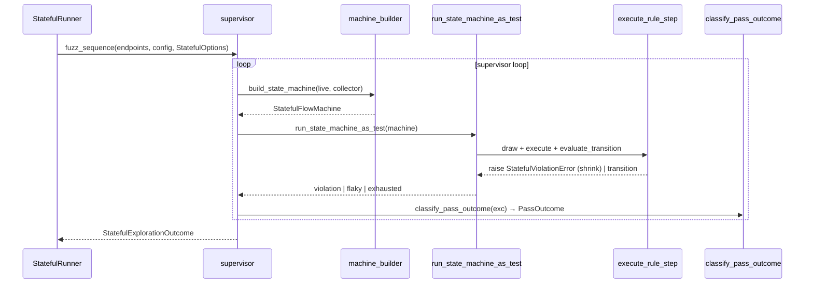
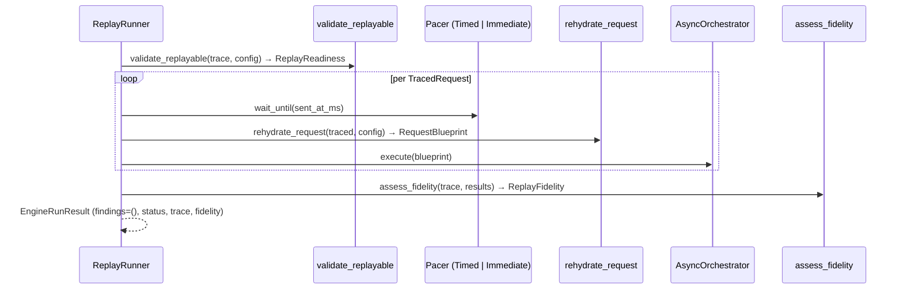
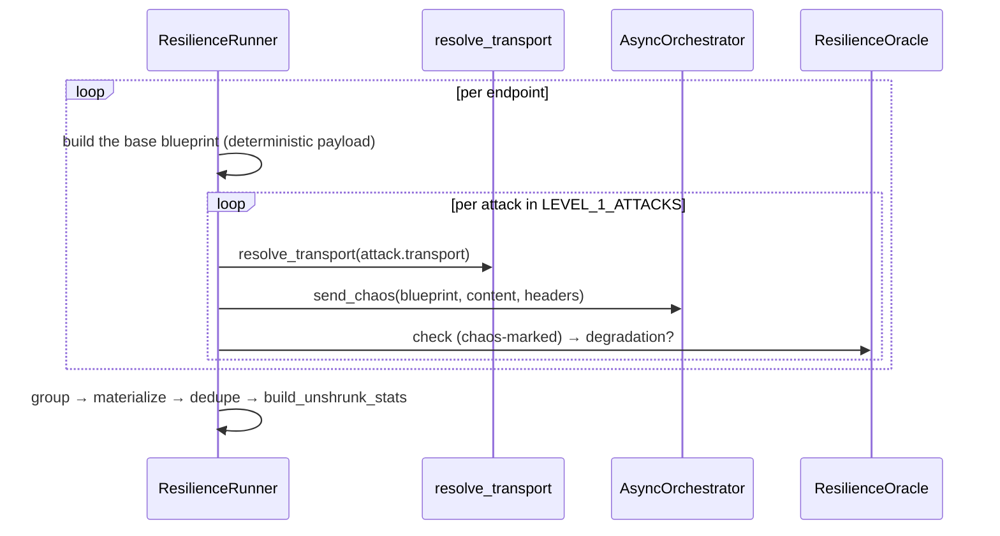

# Execution modes

`run(engine_input, config, mode, options=None)` selects a runner object from a
registry by `ExecutionMode` — never a branch, never a boolean
([ADR-013](adr/api.md#adr-013)). Each runner satisfies the `ExecutionRunner`
Protocol (`mode`, `options_type`, `run`). There are five built-in runners,
registered explicitly by `register_builtin_runners`.

Stateless and performance share one loop template (`explore_endpoints`, a
higher-order function taking an `EndpointLoopSpec` value object that bundles the
three steps that vary — `fuzz_one`, `resolve` and `build_stats`
([ADR-043](adr/engine.md#adr-043))). Stateful (a supervisor that builds a fresh
state machine for every pass), replay (trace-driven) and resilience (a fixed
chaos battery per endpoint) each have a genuinely different shape and write
their own loop.

Before any runner starts, endpoints are ordered by risk (`order_by_risk`, on
`risk_score` then `Criticality` rank, most-risky-first and stable), so the most
critical endpoints are explored first and survive a deadline or target-down cut.
An endpoint with no risk metadata sorts as the neutral default, so a schema-only
run keeps its original order.

## Options per mode

| Mode | Options DTO | Fields |
|---|---|---|
| `STATELESS` | `StatelessOptions` | `include_repeated_requests` |
| `STATEFUL` | `StatefulOptions` | `max_examples`, `step_count`, `max_distinct_bugs` |
| `REPLAY` | `ReplayOptions` | `trace`, `preserve_timing` |
| `PERFORMANCE` | `PerformanceOptions` | `latency_sla_ms`, `load_factor` |
| `RESILIENCE` | none | the built-in `LEVEL_1_ATTACKS` table |

What each field means is in [Data flow](data-flow.md#per-mode-options).
`ExecutionConfig` and `Identity` are global runtime (base URL, credentials,
identities, concurrency), not per-mode options. `resolve_runner(mode)` and
`resolve_options(runner, options)` sit beside the registry: the first looks up
the runner for the mode (raising `EngineError` for an unknown one), the second
validates the caller's options against the runner's `options_type` and supplies
that mode's defaults when `None` is passed, so no runner repeats the check
([ADR-021](adr/engine.md#adr-021)).

## Stateless (default)

Fuzz each endpoint independently across generation phases; shrink each
confirmed failure to a minimal reproducer by its signature.

```mermaid
sequenceDiagram
    participant R as run
    participant SR as StatelessRunner
    participant Loop as runners.loop
    participant F as StatelessFuzzer
    participant Orch as AsyncOrchestrator
    participant Or as oracles.evaluate
    participant Fnd as findings

    R->>R: order_by_risk(endpoints)
    R->>SR: run(request, orchestrator)
    SR->>Loop: explore_endpoints(endpoints, EndpointLoopSpec(...))
    loop per endpoint
        Loop->>F: fuzz(endpoint, config)
        loop per pass, @given → batch
            F->>Orch: execute(batch) concurrently
            F->>Or: check → OracleVerdict
            F->>F: fold → RawFinding, or stop with a Cut
        end
    end
    Loop->>Fnd: resolve = shrink_groups → dedupe → build_stats (flaky counted by the shrinker)
    SR-->>R: EngineRunResult
```

A pass stops early with a `Cut` when the abort counters trip: too many
infrastructure failures (`MAX_INFRA_FAILURES`), or `MAX_CONSECUTIVE_SERVER_ERRORS`
consecutive 5xx on one endpoint, after which a liveness probe (one of
`SAFE_PROBE_METHODS`) decides between a defective endpoint and a target that is
down (`TruncationReason.TARGET_DOWN`).

## Stateful

Drive sequences of linked operations as a dynamically built
`RuleBasedStateMachine`; shrink the **sequence** on a new violation.



A stateful run that reaches `max_distinct_bugs` stops; each found defect is
suppressed before the next pass. A flaky pass outcome is discarded, so
`findings_flaky` is always `0` for a stateful run
([ADR-019](adr/engine.md#adr-019)). When a state link cannot be honored the run
raises `StatefulLinkError` carrying the partial exploration.

## Replay

Re-send a recorded trace verbatim. `validate_replayable` reports readiness
first; during the replay only server errors are checked (no contracts are
evaluated), and the verdict is a `ReplayFidelity`.



`preserve_timing=True` selects the timed pacer, which waits until each
request's recorded `sent_at_ms`; `False` selects the immediate pacer.

## Performance

Fuzz under a scaled load with the latency-SLA oracle active. The
`GenerationPlan` is scaled with `.scaled(load_factor)`; findings are
materialized without shrinking.

```mermaid
sequenceDiagram
    participant PR as PerformanceRunner
    participant Loop as runners.loop
    participant F as StatelessFuzzer (latency_sla_ms)
    participant Or as LatencySlaOracle
    participant Fnd as findings

    PR->>PR: plan.scaled(load_factor)
    PR->>Loop: explore_endpoints(scaled, EndpointLoopSpec(resolve=materialize))
    Loop->>F: fuzz under load
    F->>Or: check → SLA breach
    Loop->>Fnd: group → materialize (no shrink) → dedupe → build_unshrunk_stats
```

## Resilience

Send chaos-shaped requests (oversized, slow-partial, deeply nested, wrong
content type) through a `ChaosTransport` and watch for degradation: a
deliberately broken request that returns a 5xx instead of a clean rejection is
a `RESILIENCE_DEGRADATION` finding.



The chaos battery is fixed data (`LEVEL_1_ATTACKS`): a slow, partial body; an
oversized body; a deeply nested JSON body; and a body whose declared
content type contradicts its bytes. Each attack names the transport key that
delivers it (`resolve_transport`) and a builder that shapes it from the base
blueprint. The `ResilienceOracle` is the sole judge of a chaos response — a 5xx
is a degradation, anything else degraded gracefully — because `check_response`
runs with `is_chaos=True`, which the ordinary server-error oracle stands down
for.
