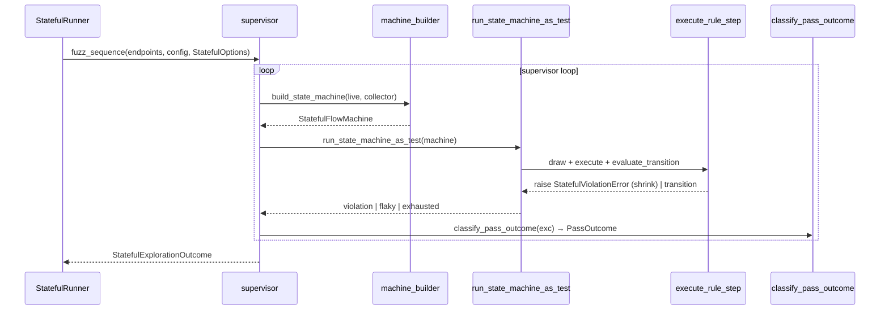
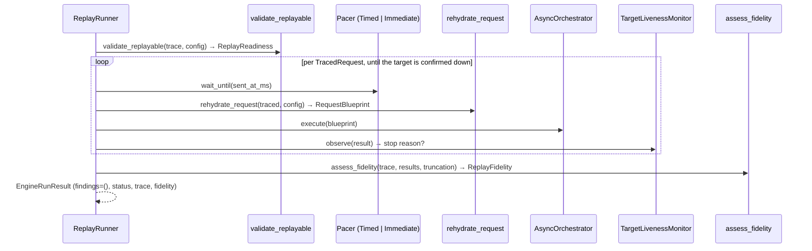
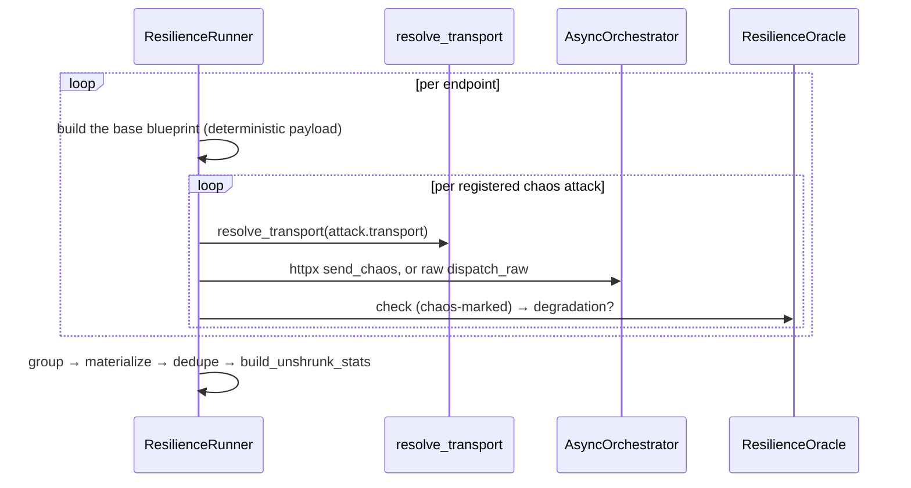
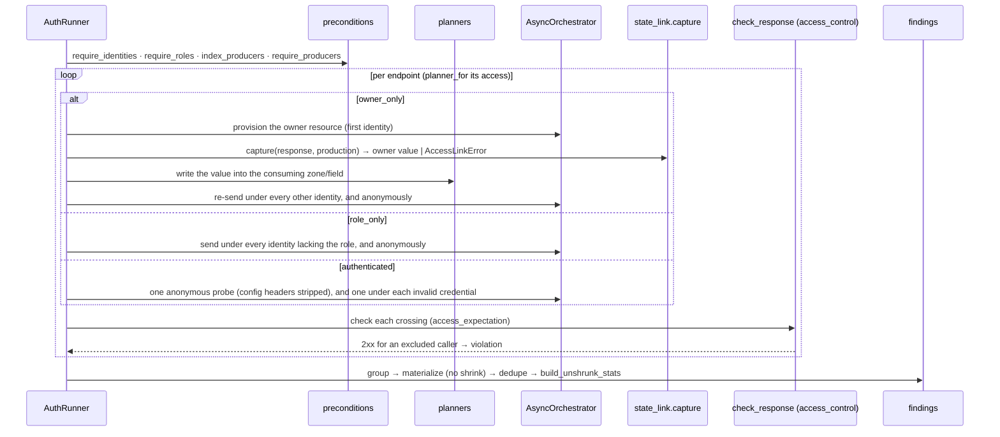

# Execution modes

`run(engine_input, config, mode, options=None, cancellation=..., observer=...)`
selects a runner object from a registry by `ExecutionMode` — never a branch, never
a boolean ([ADR-013](adr/api.md#adr-013)). Each runner satisfies the
`ExecutionRunner` Protocol (`mode`, `options_type`, `run`). There are six built-in
runners, registered explicitly by `register_builtin_runners`. The optional
`cancellation` and `observer` signals — how a caller stops a run and watches it —
are covered on their own page ([Progress and cancellation](progress-and-cancellation.md)).

Stateless and performance share one loop template (`explore_endpoints`, a
higher-order function taking an `EndpointLoopSpec` value object that bundles the
three steps that vary — `fuzz_one`, `resolve` and `build_stats`
([ADR-043](adr/engine.md#adr-043))). Stateful (a supervisor that builds a fresh
state machine for every pass), replay (trace-driven), resilience (a fixed
chaos battery per endpoint) and auth (a per-endpoint provision-and-cross) each
have a genuinely different shape and write their own loop.

Before any runner starts, endpoints are ordered by risk (`order_by_risk`, on
`risk_score` then `Criticality` rank, most-risky-first and stable), so the most
critical endpoints are explored first and survive a deadline or target-down cut.
An endpoint with no risk metadata sorts as the neutral default, so a schema-only
run keeps its original order.

## Options per mode

| Mode | Options DTO | Fields |
|---|---|---|
| `STATELESS` | `StatelessOptions` | `include_repeated_requests` |
| `STATEFUL` | `StatefulOptions` | `max_examples`, `step_count`, `max_distinct_bugs` |
| `REPLAY` | `ReplayOptions` | `trace`, `preserve_timing` |
| `PERFORMANCE` | `PerformanceOptions` | `latency_sla_ms`, `load_factor`, `concurrency_ladder` |
| `RESILIENCE` | none | the built-in chaos battery |
| `AUTH` | none | the declared `identities` and each endpoint's `access` policy |

What each field means is in [Data flow](data-flow.md#per-mode-options).
`ExecutionConfig` and `Identity` are global runtime (base URL, credentials,
identities, concurrency), not per-mode options. `resolve_runner(mode)` and
`resolve_options(runner, options)` sit beside the registry: the first looks up
the runner for the mode (raising `EngineError` for an unknown one), the second
validates the caller's options against the runner's `options_type` and supplies
that mode's defaults when `None` is passed, so no runner repeats the check
([ADR-021](adr/engine.md#adr-021)).

## Cancelling a run

Every mode polls the run's `cancellation` token at its own natural boundaries and
stops cooperatively — a unit already on the wire finishes, the next never starts:

| Mode | Where it checks | On cancel |
|---|---|---|
| Stateless | between endpoints, between passes and drawn examples, before each shrink send | the endpoint stops at the boundary; findings not yet confirmed are left unverified |
| Performance | between endpoints and between ladder steps (plus the stateless points above) | the ladder ends at its completed steps |
| Stateful | between supervisor passes | reports already confirmed are kept |
| Replay | before each replayed request | the trace stops at the requests sent so far |
| Resilience, Auth | between endpoints | the next endpoint is not attacked/crossed |

A cancelled run adds a fifth terminal status beside `completed`, `truncated` and
`aborted`: `RunStatus.CANCELLED`, carried by a `TruncationRecord` with reason
`cancelled`. It says the caller asked to stop and makes no claim about the API. A
cancellation outranks a soft budget or deadline cut but not a confirmed dead
target. The full behaviour, the events a run emits, and how a listener maps them to
the wire are on [Progress and cancellation](progress-and-cancellation.md).

## Stateless (default)

Fuzz each endpoint independently across generation phases; shrink each
confirmed failure to a minimal reproducer by its signature.

```mermaid
sequenceDiagram
    participant R as run
    participant SR as StatelessRunner
    participant Loop as runners.loop
    participant F as StatelessFuzzer
    participant Orch as AsyncOrchestrator
    participant Or as oracles.evaluate
    participant Fnd as findings

    R->>R: order_by_risk(endpoints)
    R->>SR: run(request, orchestrator)
    SR->>Loop: explore_endpoints(endpoints, EndpointLoopSpec(...))
    loop per endpoint
        Loop->>F: fuzz(endpoint, config)
        loop per pass, @given → batch
            F->>Orch: execute(batch) concurrently
            F->>Or: check → OracleVerdict
            F->>F: fold → RawFinding, or stop with a Cut
        end
    end
    Loop->>Fnd: resolve = shrink_groups → dedupe → build_stats (flaky counted by the shrinker)
    SR-->>R: EngineRunResult
```

A pass stops early with a `Cut` when the abort counters trip: too many
infrastructure failures (`MAX_INFRA_FAILURES`), or `MAX_CONSECUTIVE_SERVER_ERRORS`
consecutive 5xx on one endpoint, after which a liveness probe (one of
`SAFE_PROBE_METHODS`) decides between a defective endpoint and a target that is
down (`TruncationReason.TARGET_DOWN`).

## Stateful

Drive sequences of linked operations as a dynamically built
`RuleBasedStateMachine`; shrink the **sequence** on a new violation.



A stateful run that reaches `max_distinct_bugs` stops; each found defect is
suppressed before the next pass. A flaky pass outcome becomes a flaky finding,
counted in `findings_flaky` by occurrence and folded away when a confirmed report
already covers its signature ([ADR-047](adr/engine.md#adr-047)). When a state
link cannot be honored the run raises `StatefulLinkError` carrying the partial
exploration.

## Replay

Re-send a recorded trace in order, at its recorded pace, until the target goes
down. `validate_replayable` reports readiness first; during the replay only
server errors are checked (no contracts are evaluated), and the verdict is a
`ReplayFidelity`.



`preserve_timing=True` selects the timed pacer, which waits until each
request's recorded `sent_at_ms`; `False` selects the immediate pacer.

### Stopping on a dead target

A replay no longer always ends `completed`. A `TargetLivenessMonitor` watches the
stream of results as they come back. A streak of target failures
(`timeout` or `availability`) reaching `MAX_INFRA_FAILURES` (5) trips a single
liveness probe — a `HEAD` to the base URL:

- if the target is dead, the replay stops re-sending and ends `aborted` with the
  truncation reason `target_down`;
- if it answers, the run ends `truncated` with `infrastructure_abort` and stops
  as well.

A request that was never sent is no evidence about the target — it neither
advances the streak nor clears it — and an isolated failure never cuts. When a
replay stops early, the trace it produced is a **prefix** of the recorded one, and
the truncation record travels in that trace. `assess_fidelity` compares only the
prefix, so the fidelity level (`exact` or `reduced`) describes that prefix alone.
Every recorded defect beyond the prefix was never re-sent, so the CLI rules it
`inconclusive` — absence of evidence, like a request that got no response. The
JSON report schema is unchanged: run status and truncation already flow through
it.

## Performance

Fuzz under a scaled load with the latency-SLA oracle active. The
`GenerationPlan` is scaled with `.scaled(load_factor)`; findings are
materialized without shrinking.

```mermaid
sequenceDiagram
    participant PR as PerformanceRunner
    participant Loop as runners.loop
    participant F as StatelessFuzzer (latency_sla_ms)
    participant Or as LatencySlaOracle
    participant Fnd as findings

    PR->>PR: plan.scaled(load_factor)
    PR->>Loop: explore_endpoints(scaled, EndpointLoopSpec(resolve=materialize))
    Loop->>F: fuzz under load
    F->>Or: check → SLA breach
    Loop->>Fnd: group → materialize (no shrink) → dedupe → build_unshrunk_stats
```

### The concurrency ladder

A `PerformanceOptions.concurrency_ladder` turns the mode from *"is every response
under the SLA?"* into *"does latency grow as the load grows?"*. It is a small
frozen value object — a strictly increasing tuple of `steps` and a `tolerance`
ratio (default `0.5`) — validated on construction: fewer than two steps, a
non-increasing progression, or a step below `1` is rejected before any run
starts.

A **step** is one concurrency level. For each endpoint the runner replays only
its `valid` phase, once per step, with exactly that step's number of requests in
flight — the step's concurrency temporarily caps the run's shared connection
pool, so a step of `8` sends eight at a time and no more. The step's example
budget is a stable floor (at least `MIN_STEP_SAMPLES` sent samples, so the p95 is
meaningful) rounded up to whole batches, and split evenly across the run's valid
identities so every identity's share is a whole number of batches. The order the
ladder walks is baseline-first.

The **first step is the baseline**: its p95 latency is the reference every later
step is judged against. A later step is **degraded** when its p95 exceeds the
baseline p95 by more than the tolerance — with the default `0.5`, a step whose p95
is more than 1.5× the baseline's. The baseline never degrades against itself, and
a step that sent nothing (or a baseline that did) is never called degraded.

Each degraded step becomes one `LATENCY_DEGRADATION` finding. It is **anchored on
a real request**: the sent request whose latency sits at the step's nearest-rank
p95, so the finding points at an actual exchange rather than a computed number.
Its reproducer is the synthetic payload `{"concurrency_step": N}` naming the step.
Degraded steps that answered with the same response signature fold into one
report that names the rest through `represented_findings` — the profile already
records each step, so the report does not repeat them. The rule the finding cites
is intrinsic: *"a clean response's latency must not grow with concurrency beyond
the run's tolerance."*

If a step is **truncated** (a deadline or a dead target cuts it), the endpoint's
ladder ends there: the completed steps still form its profile, the unmeasured
ones are simply absent.

### The load profile

Whatever the ladder measures lands on the endpoint's stats as `load_profile`: a
tuple of `LoadStepStats`, one per completed step, each carrying the step's
`concurrency`, its full `LatencyStats` distribution and its `degraded` verdict.
This is where the per-step latencies live; the finding only points into it.

### Preconditions and the no-ladder guarantee

Two conditions are checked **before the first request** and fail typed with a
`ConcurrencyLadderError`: a step above the run's `max_concurrency` (it could never
run at that level), and an endpoint that funds no `valid` examples (the ladder
would have no baseline to measure — the error names the endpoint).

Leaving `concurrency_ladder` unset is the default, and the mode then behaves
exactly as it always has: the flat load run above, an empty `load_profile`, and no
degradation findings.

## Resilience

Send deliberately broken requests against each endpoint and watch for
degradation: a chaos request that returns a 5xx, or one the peer accepts and
then crashes mid-response, instead of degrading gracefully, is a
`RESILIENCE_DEGRADATION` finding.



The chaos battery is fixed data, registered from three groups that all fire on
every endpoint:

- **httpx-borne anomalies** — a slow, partial body; an oversized body; a deeply
  nested JSON body; and a body whose declared content type contradicts its
  bytes. These ride the httpx transport, which the run's one orchestrator client
  can express.
- **Framing-level anomalies** — malformed chunked encoding, a lied
  `Content-Length`, duplicate `Host` and `Content-Type` lines, an oversized
  header, a connection cut off mid-request, and a key duplicated in both the
  query string and the JSON body. httpx corrects these by design, so they travel
  over a raw socket instead (see below).
- **Repeated requests** — the same request sent several times in a row, probing
  for a rate limit or a duplicate-submission fault.

Each attack names the transport key that delivers it (`resolve_transport`) and a
builder that shapes it from the base blueprint; the runner never branches on the
attack. A `ChaosTransport` has two built-in implementations chosen by that key —
`httpx`, which routes through the orchestrator's client, and `raw`, which writes
the request byte for byte on a bare socket. Both share the orchestrator's one
concurrency slot, so the raw path takes a slot through `dispatch_raw` exactly as
the httpx path does through `send_chaos`.

The `ResilienceOracle` is the sole judge of a chaos response — a 5xx **or** a
connection the peer accepted and dropped mid-response is a degradation; a
timeout or any 4xx (429 included) degraded gracefully — because `check_response`
runs with `is_chaos=True`, which the ordinary server-error oracle stands down
for. The connection-cut-off attack half-closes the socket and reads the server's
actual reaction, so the verdict is the server's, not an artefact of the client
closing.

A half-close is a TCP operation that TLS cannot express. Over an `https://` base
URL the raw transport therefore decides **statically** — before it takes a
concurrency slot or opens a socket — that the mid-request-close attack is not
applicable, and returns an `unsendable_request` result with the detail *"mid-request
close is not applicable over TLS: the transport cannot half-close"* (the same
shape it uses for an unsupported scheme). No finding is produced and the request
is counted as infrastructure in the endpoint's stats. Over `http://` the attack
runs exactly as before.

## Auth

Cross the declared identities against each endpoint's access policy and watch
for a 2xx a caller should not have obtained — the BOLA/IDOR, broken-function-level
(BFLA) and broken-authentication classes. The runner reads the `access` section
the producer declared; an endpoint with no `access`, or a `public` one, is never
sent.

The run **fails fast before any request** on three conditions, checked in this
order: no **valid** identity is declared (`AccessIdentityError`); a `role_only`
endpoint requires a role no valid identity holds (`AccessRoleError`, naming the
endpoint, the required role and the roles the run did declare); or an `owner_only`
endpoint names a bundle no endpoint in the run produces (`AccessLinkError`). For
an `owner_only` endpoint the owner is always the first valid identity
(`config.valid_identities[0]`); a `role_only` endpoint privileges every valid
identity whose `role` equals its `required_role`, wherever it sits in the list.

An identity declared with `credential = "invalid"` (see
[the CLI reference](../../user-guide/cli-reference.md#commands)) carries a token
the target must reject — expired, revoked or garbage. Only the auth mode sends
requests under it, and only under the `authenticated` policy is it treated as a
distinct probe. Everywhere else — owner selection, role holders, the
stateless/performance budget split, stateful identity rotation — only the valid
identities take part, read from `config.valid_identities`. A run with only invalid
identities has no valid pool and stops with `AccessIdentityError`.

The package `engine/runners/auth/` is split by the question each module answers:
`plan.py` holds what a plan is (`Crossing`, `Provisioning`, `PlanContext`) and the
request builders; `planners.py` holds one planner per policy behind
`planner_for`; `preconditions.py` holds the checks that must pass before the first
request; and `runner.py` is the only module that sends.



Each endpoint is crossed with **one deterministic valid request** — the simplest
example of the VALID strategy, drawn once and reused. What the runner does with
it depends on the policy:

| Policy | What the runner sends |
|---|---|
| `authenticated` | one anonymous probe, with the config credential headers stripped so it is truly anonymous, plus one probe under **each** invalid identity's credential |
| `owner_only` | provision the owner's resource under the **first** valid identity, capture the bundle value from the response, write it into the endpoint's consuming zone/field, then re-send under every **other** valid identity and once anonymously. Invalid identities cross as ordinary non-privileged callers |
| `role_only` | provision nothing; send under every valid identity whose `role` is **not** the `required_role` (an identity with no role included) and once anonymously. Holders of the role are never sent; when every identity holds it, only the anonymous request goes out. Invalid identities cross as ordinary role-less callers |

A crossing is a finding when the `access_control` oracle sees a success for a
caller the policy excludes: another identity or an anonymous request on an
`owner_only` resource, an identity without the required role or an anonymous
request on a `role_only` endpoint, or — on an `authenticated` endpoint — an
anonymous request **or** a request under an invalid credential. A 2xx under an
invalid identity is reported under the same `authenticated` rule, naming that
identity; two invalid identities that both succeed produce two findings. The
finding names the caller (`identity_label`) and the policy it broke as the rule;
the credential is redacted like any other. With a single valid identity the
`owner_only` cross is owner-versus-anonymous only. Roles compare as exact strings
— no hierarchy, no case folding — and cross-tenant isolation is not expressible.

The `role_only` precondition exists because the comparison is exact: an identity
file that spells the role `Admin` against a `required_role` of `admin` declares no
holder, so without the check the runner would cross the real administrator and
report its legitimate 2xx as a bypass of a correctly guarded endpoint. Declaring
an identity with exactly the required role fixes the run
([ADR-053](adr/engine.md#adr-053)).

Provisioning is where an `owner_only` run can abort: if producing the owner
resource returns a status that captures nothing, or a 2xx whose declared field
is null, the producer broke its own contract and the runner raises
`AccessLinkError` naming the endpoint and the bundle rather than crossing a
resource it never established. Findings are **materialized without shrinking** —
a cross-identity read is already its own minimal reproducer.
