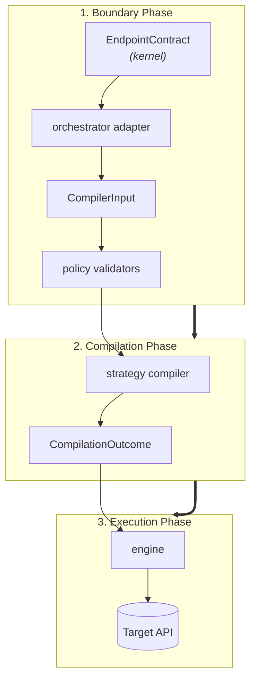

# Custom Schemathesis

Custom Schemathesis is Spec Forge's deterministic validation engine. It converts
LLM-enriched endpoint contracts into controlled Hypothesis strategies and executes
them asynchronously against the target API.

## What it adds over generic schema fuzzing

1. **Type-scoped contracts:** a producer can fill only fields allowed for each
   type, and the policy layer rejects anything else before compilation.
2. **Bounded generation:** the parameter space is estimated and divided into
   `valid`, `boundary`, `invalid` and, in hacker mode, `attack` phases.
3. **Risk-aware effort:** endpoint risk and generation budget are independent,
   explicit controls.

## Pipeline

The engine never touches the LLM's output. The producer — the LLM, or a fixture
— emits the shared kernel's `EndpointContract`; the orchestrator's adapter
translates it into a `CompilerInput`; the engine's `policy` layer validates that
input against the strategy mode's profile; `compile_strategies` compiles it and
`run` executes it. The transition and semantic-property vocabulary
(`TransitionInvariant`, `ZoneLocation`, `SemanticProperty`) is not the engine's
own: it is imported from `specforge_contracts`, so the same objects travel from
the producer to the engine untranslated.

`compile_strategies` compiles the batch endpoint by endpoint: a contract that
fails to translate does not abort the run, it becomes an `EndpointExclusion`
(the endpoint's identity plus why) and the rest keeps compiling.
`CompilationOutcome` carries both `engine_input` — what did compile, handed to
`run` — and `exclusions`, so whoever orchestrates decides what to do with what
didn't.

## Read next

- [Architecture](architecture.md): layer boundaries, models, compiler and engine.
- [Stateful fuzzing](stateful-fuzzing.md): response-to-request state links and
  transition invariants.
- [Replay](replay.md): reproducibility by record and replay — re-sending a trace,
  fidelity by response divergence, and forward-only pacing.
- [Strategy compiler internals](strategy-compiler-internals.md): the file-by-file
  map of how a contract field becomes a Hypothesis strategy, including the
  attack-payload builders.
- [Reference](reference.md): exhaustive component, API and design detail.
