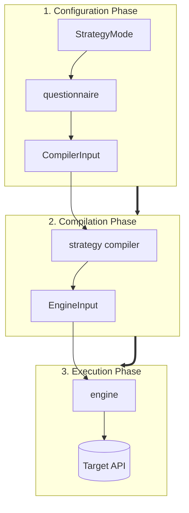

# Custom Schemathesis

Custom Schemathesis is Spec Forge's deterministic validation engine. It converts
LLM-enriched endpoint contracts into controlled Hypothesis strategies and executes
them asynchronously against the target API.

## What it adds over generic schema fuzzing

1. **Type-scoped contracts:** an LLM can fill only fields allowed for each type.
2. **Bounded generation:** the parameter space is estimated and divided into
   `valid`, `boundary`, `invalid` and, in hacker mode, `attack` phases.
3. **Risk-aware effort:** endpoint risk and generation budget are independent,
   explicit controls.

## Pipeline

## Read next

- [Architecture](architecture.md): layer boundaries, models, compiler and engine.
- [Stateful fuzzing](stateful-fuzzing.md): response-to-request state links and
  transition invariants.
- [Replay](replay.md): reproducibility by record and replay — re-sending a trace,
  fidelity by response divergence, and forward-only pacing.
- [Strategy compiler internals](strategy-compiler-internals.md): the file-by-file
  map of how a contract field becomes a Hypothesis strategy, including the
  attack-payload builders.
- [Complete reference](reference.md): exhaustive component, API and design detail.
