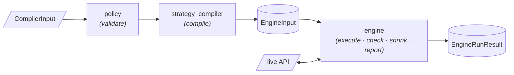

# Custom Schemathesis

Custom Schemathesis is the fuzzing engine of the pipeline. Given a validated
description of an API's endpoints — the request zones and the per-value
generation contract of each field, the risk and attack hints, the expected
responses and the links between operations — it compiles that description into
Hypothesis `SearchStrategy`s and drives property-based HTTP runs against the
live API. It reports crashes, contract violations, latency-SLA breaches and
resilience degradations as typed, deduplicated findings, and records every
request it sent so a run can be reproduced.

> Its job is to answer one question: *"given everything we know about this
endpoint, what input makes it misbehave — and what is the smallest such input?"*

It is the last stage of the pipeline: `contract_engine` supplies the endpoints,
`core_ast` and `semantic_inference` enrich them with business rules, risk and
attack hints, and `core/` hands the result to this engine and persists what
comes back.



## Development requirements

The package targets Python 3.11+. Installation and verification commands are in
[Development & Testing](../../developer-guide/contributing.md#test-a-compose-module).
It depends on Hypothesis for generation, an async HTTP client for execution,
pydantic for the boundary DTOs, and the shared kernel
[`specforge_contracts`](../contracts/index.md) for the vocabularies it shares
with the rest of the pipeline.

## Quick start

`compile_strategies` and `run` are the two entry points:

```python
from custom_schemathesis import (
    BaseStrategyContract, CompilerInput, EndpointSpec, RequestZones,
    ExecutionConfig, ExecutionMode, StrategyMode,
    StatelessOptions, ReplayOptions,
    compile_strategies, run,
)

spec = EndpointSpec(
    method="GET",
    path_url="/notes/{id}",
    zones=RequestZones(path={"id": BaseStrategyContract(type="integer", minimum=1)}),
)

# 1. Compile the validated contract into an executable engine input.
outcome = compile_strategies(CompilerInput(endpoints=[spec], strategy_mode=StrategyMode.DEFAULT))
for excluded in outcome.exclusions:
    print(excluded.method, excluded.path_url, excluded.reason)

# 2. Run against the live API in one of the five modes, tuned by that mode's options.
config = ExecutionConfig(base_url="http://localhost:8000")
result = run(
    outcome.engine_input,
    config,
    mode=ExecutionMode.STATELESS,
    options=StatelessOptions(),
)

for report in result.crash_reports:
    print(report.method, report.endpoint, report.invariant_violated, report.minimal_payload)
print(result.stats.total_requests, result.stats.findings_unique)

# 3. Reproduce that run: re-send its recorded trace verbatim.
replay = run(
    outcome.engine_input,
    config,
    mode=ExecutionMode.REPLAY,
    options=ReplayOptions(trace=result.trace),
)
print(replay.fidelity.level, len(replay.fidelity.divergences))
```

`compile_strategies` returns a `CompilationOutcome`: the `EngineInput` plus one
`EndpointExclusion` per endpoint that could not be compiled — a rejected
endpoint is reported, never silently dropped. `run` returns an
`EngineRunResult`: the crash reports, the `RunStats`, the `ExecutionTrace` that
reproduces the run, and a `ReplayFidelity` when the run was itself a replay.

## The three stages

| Stage | Question it answers | Output |
|---|---|---|
| **1. policy** | Is this compiler input well-formed for the chosen strategy mode? | the same input, or a `PolicyError` |
| **2. strategy_compiler** | What values can each field take, per generation phase? | `CompilationOutcome` |
| **3. engine** | Which of those values breaks the API, and what is the smallest one? | `EngineRunResult` |

The policy stage does no HTTP and no LLM calls; the compiler does no HTTP and
never re-validates; the engine consumes `EngineInput` alone and never sees a
`StrategyMode`. Data flows one way through typed DTOs, so each stage is
testable in isolation. See [Architecture](architecture.md).

## The public facade

Everything you import comes from the top-level `custom_schemathesis` package;
internal module paths are an implementation detail. The surface is the two
entry points, the input DTOs the orchestrator builds, the output DTOs it
consumes, the per-mode `*Options`, the five enums a consumer touches, and the
trace helpers. The full list is in the [API reference](api-reference.md).

`compile_strategies` is named so that it does not hide the builtin `compile`.
`run` takes a strict `ExecutionMode` — the mode selects a runner object from a
registry, never a branch.

## The five execution modes

| Mode | What it does |
|---|---|
| `STATELESS` | fuzz each endpoint independently; shrink each failure to a minimal reproducer |
| `STATEFUL` | drive sequences of linked operations as a state machine; shrink the sequence |
| `REPLAY` | re-send a recorded trace verbatim and report how faithfully the API behaved |
| `PERFORMANCE` | fuzz under a scaled load with a latency-SLA oracle active |
| `RESILIENCE` | send chaos-shaped requests (oversized, slow, malformed) and watch for degradation |

Each mode's sequence and the options it accepts are in
[Execution modes](execution-modes.md).

## Reproducibility

The engine is the one intentionally non-deterministic part of the pipeline.
Reproduction is by **record and replay**, not by seed: a run records the
ordered trace of the requests it actually sent, and `REPLAY` mode re-sends that
trace byte for byte — nothing is generated anew, nothing is shrunk.
`validate_replayable`
reports whether a recorded trace has everything it needs (identities,
credentials, a matching host) before you replay it.

## The rule behind the design

> **Report what was measured, never what was inferred.**

Every counter in `RunStats` has exactly one producer. A flaky finding is one
whose shrink attempt did not reproduce — counted where that was observed, not
derived by subtraction. A request that never reached the wire says nothing
about the API, so it is recorded in the stats and never becomes a finding. The
decisions this rule produced are in the [decision records](adr/index.md).

## Where to read next

| If you want to | Read |
|---|---|
| Understand the layers and the package map | [Architecture](architecture.md) |
| Follow a DTO from input to output | [Data flow](data-flow.md) |
| See how contracts become strategies | [Strategy compiler](strategy-compiler.md) |
| See how a request is sent, checked and reported | [Engine internals](engine-internals.md) |
| Pick a mode and its options | [Execution modes](execution-modes.md) |
| Add a runner, a profile, a phase, an oracle or a transport | [Extension guide](extension-guide.md) |
| Call a function, or know what it raises | [API reference](api-reference.md) |
| Know *why* something is the way it is | [Decision records](adr/index.md) |
| Run or extend the suites | [Testing](testing.md) |
