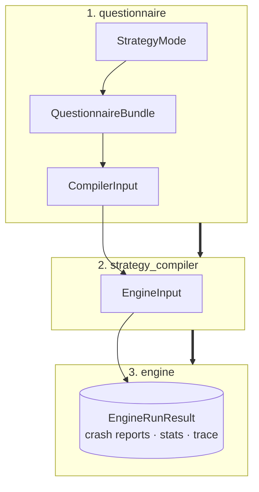
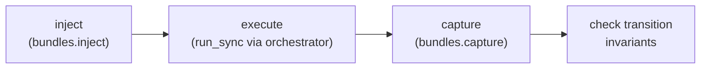

# Custom Schemathesis reference

This reference records the public boundaries and implementation decisions of the
fuzzing engine. Start with the [overview](index.md) for the short version.

## Data flow



The four layers have deliberately separate responsibilities:

| Layer | Owns | Does not do |
|---|---|---|
| `models` | Typed contracts, budgets, inputs and results. | I/O or compilation. |
| `questionnaire` | LLM template and validation. | Generate strategies or send requests. |
| `strategy_compiler` | Contract → Hypothesis strategy translation. | Reinterpret validated policy. |
| `engine` | Request execution and reporting. | Know contract types or strategy mode. |

### Public entry point (`main.py`)

A minimal facade wires the three layers together and adds no logic of its own —
callers only ever need these four functions:

```python
build_questionnaire(mode)          -> QuestionnaireBundle
resolve_questionnaire(bundle)      -> ResolvedQuestionnaire
compile_strategies(compiler_input) -> EngineInput
run(engine_input, config, *, mode=None, options=None) -> EngineRunResult
```

`mode` defaults to `ExecutionMode.STATELESS`; `options` carries that mode's settings.
The former `stateful` / `stateful_config` pair still works for one version and emits a
`DeprecationWarning`.

## Models and Questionnaire

### Strategy Contracts & Models
* **`BaseStrategyContract`**: Closed standard contract enforcing JSON Schema constraints, `nullable`, and `extra="forbid"`.
* **`HackerStrategyContract`**: Extends `BaseStrategyContract` with offensive security controls:
  * `attack_profiles`, focus/sensitive fields, aggressiveness, mutation depth, invalid-input ratio.
  * Encoded, null, unicode, and control-character variants.
  * *Note:* Never stores a payload directly; compilation determines concrete values dynamically.
* **`ALLOWED_FIELDS_BY_TYPE` (and Hacker Variant)**: Immutable type-to-field lookup tables acting as the single source of truth for parameters the LLM is permitted to configure.
* **`EndpointRiskContract` & `EndpointBudgetContract`**: Decoupled, independent contracts—risk prioritization and sample spend allocation address separate operational concerns.
* **`EndpointInfo`**: Encapsulates endpoint identity alongside dedicated contracts for all HTTP zones: path, query, header, and body.

### Pipeline Input Containers
* **`CompilerInput`**: Global `StrategyMode` paired with the target endpoint list.
* **`EngineInput`**: Contains compiled endpoints along with global execution configurations.

### Strategy Mode Profiles (`models/strategy_profile.py`)

A `StrategyModeProfile` holds everything one strategy mode decides, so no consumer
branches on the mode:

| Field | Decides |
| :--- | :--- |
| `phase_split` | Which phases compile (its keys **are** the phase list) and how examples divide between them. |
| `allowed_fields_by_type` | Which contract fields are legal per JSON Schema type. |
| `contract_type` + `allow_contract_subclasses` | Which contract type the mode accepts. |
| `questionnaire_rules` | Derived from the allowed fields — not a second copy. |

`allow_contract_subclasses` makes the asymmetry between modes explicit: `DEFAULT` sets it
`False` so a Hacker contract is rejected, `HACKER` sets it `True`. Register a mode with
`register_profile(...)` and read it back with `profile_for(mode)`; an unregistered mode
raises `PolicyError` listing the registered ones.

### Lifecycle Modules
* **`questionnaire.builder`**: Takes the mode's rules from its profile and emits an empty `QuestionnaireBundle`.
* **`questionnaire.resolver`**: 
  * Validates the completed response.
  * Coerces optional risk and budget models.
  * Verifies data types and allowed fields.
  * Emits the final `CompilerInput`.
* **`policy.py`**: Independently validates correctness and estimates the overall parameter space before capping and allocating the generation budget. The per-phase split is delegated to the shared `budget.allocate_examples` leaf: a `phase_split` is read as **relative proportions** (normalized by its own sum, so a split that does not add up to 1.0 still consumes the whole budget) and distributed by the **largest-remainder** method with ties broken by phase name — so the result is independent of key order and always sums to the endpoint budget.
* **`budget.allocate_examples`**: The single pure unit both the questionnaire policy and the engine share, so the two layers split a budget identically. At execution the **generation plan is authoritative**: a phase the plan did not fund runs zero examples, so a narrow budget runs exactly the phases it funds; only a plan-less endpoint falls back to its budget split, where a phase the split cannot cover is an error rather than a silent minimum of one.

---

## Strategy Compiler

### Compilation Pipeline
The entry point `compile(CompilerInput) -> EngineInput` processes each HTTP zone independently:
* **Path Parameters**: Always marked as required.
* **Phases**: Taken from `profile_for(strategy_mode).phases` — `DEFAULT` yields `valid`, `boundary`, `invalid`; `HACKER` adds `attack`. The compiler never branches on the mode itself.
* **Output Hierarchy**: `CompiledRequestPart` objects are grouped into `CompiledEndpointStrategies`, which assemble into `CompiledExecutionEndpoint`.

### Dispatch Registry & Extensibility
Contract types map to specialized compilers via a dispatch protocol:

```python
class ContractCompiler(Protocol):
    def compile_contract(self, contract: BaseStrategyContract, phase: str) -> SearchStrategy: ...
```

* **Default Mapping**: ``BaseStrategyContract`` maps to ``DefaultContractCompiler``.
* **Hacker Mapping**: ``HackerStrategyContract`` maps to ``HackerContractCompiler``.
* **Error Handling**: An unregistered contract type raises ``StrategyCompilationError``.
* **Extension Pattern**: Implement **ContractCompiler** and register it:

```python
register_compiler(MyContractType, MyCompiler())
```

### Compiler Implementations

* ``*DefaultContractCompiler``:
   * Native generation for constants, enums, scalar, object, and array strategies, boundary values, and intentionally invalid inputs.
   Unsupported JSON Schema constructs (``anyOf``, `oneOf`, ``$ref``, or custom formats) delegate to ``hypothesis_jsonschema.from_schema``.

* ``HackerContractCompiler``:
   * Resolves every phase through the generation phase registry — an identical body to ``DefaultContractCompiler``; it exists only as the contract-type identity the ``schema_compiler`` registry dispatches on for ``HackerStrategyContract``.
   * ``valid`` / ``boundary`` / ``invalid`` are inherited from ``BaseStrategyContract`` via the registry's MRO walk; ``attack`` is registered directly against ``HackerStrategyContract`` and constructs profile-based strings, numeric extremes, mixed boolean logic, and recursive array/object mutations.

For the file-by-file map of `default/` and `hacker/` — every builder
function, the boundary/attack value tables, and the format-pattern regexes —
see [Strategy compiler internals](strategy-compiler-internals.md).

---

## Engine Architecture

### Execution Entry Point

```python
engine.run(engine_input, config, *, mode=None, options=None) -> EngineRunResult
```

The entry point resolves, orchestrates and delegates — nothing else. It looks up the
`ExecutionRunner` registered for `mode`, checks `options` against the `options_type` that
runner declares, opens one orchestrator for the whole run and hands it over.

An unknown mode raises `EngineError` listing the registered ones. It never falls back to
a default: silently running something other than what the caller asked for is worse than
failing. Wrong-typed options fail the same way, before the HTTP client is opened.

### Execution Runners (`engine/runners/`)

A runner encapsulates one complete execution procedure — its fuzzer, its phases and its
statistics builder — and receives the orchestrator **already open**, so the core keeps
ownership of the HTTP client's lifetime.

| Mode | Runner | Options | Procedure |
| :--- | :--- | :--- | :--- |
| `stateless` | `StatelessRunner` | — | Explore per endpoint, then shrink each finding. |
| `stateful` | `StatefulRunner` | `StatefulConfig` | Chain endpoints; the state machine minimizes as it goes. |

```python
register_runner(MyRunner())   # mode, options_type, run(request, orchestrator)
```

### `protocols.py`

Two structural `Protocol`s (extension by shape, not inheritance) define the
engine's two execution strategies:

* **`FuzzStrategy`** — stateless, per-endpoint testing. Exposes `name`,
  `fuzz(endpoint, config) -> ExplorationOutcome` (raw results, raw findings,
  and the truncation record if the pass was cut short) and
  `shrink(finding, config) -> CrashReport | None`.
* **`StatefulFuzzStrategy`** — stateful testing over the whole endpoint set.
  Exposes `name` and
  `fuzz_sequence(endpoints, config) -> (list[ExecutionResult], list[CrashReport])`.

`run(..., stateful=...)` picks between the two; nothing else in the engine
branches on strategy type.

Registering the runner rather than the fuzz strategy is deliberate: a replay generates
nothing and a load run has no contract to compile, so what varies between modes is the
whole procedure, not just the generator. Registry keys are the mode's string value, since
a `StrEnum` is closed and keying by the member would make the extensibility claim
untestable.

### Network Orchestration (`AsyncOrchestrator`)

Serves as the system's sole network boundary. It manages:
* A single shared `httpx.AsyncClient`.
* A concurrency semaphore limiting parallel requests.
* Exponential-backoff retries for transient infrastructure failures (`429`, `502`, `503`, and connection timeouts).
* **Policy**: Client errors (4xx) are logged as findings. Server errors (5xx) are treated as potential defects and are **never** retried away.
* **Timing metadata**: every result is stamped with `sent_at_ms` (offset from
  the run's start) and `in_flight` (requests in flight at dispatch),
  captured before the `await` so a retried request keeps the timestamp of
  the attempt that actually went out. `in_flight` is always `1` today since
  execution is sequential — it starts telling the truth once endpoints run
  in parallel.

### `core/error_classifier.py`

Maps responses and transport exceptions to `ErrorCategory`:

| Case | Result |
|---|---|
| `classify_response`, 5xx | `server_error` |
| `classify_response`, 4xx | `client_error` |
| `classify_response`, 2xx/3xx | `None` |
| `classify_exception`, connect / protocol / connect-timeout | `availability` |
| `classify_exception`, other timeouts | `timeout` |

`contract_violation` is never produced by the classifier — the fuzzer assigns
it when `ResponseValidator` finds an invariant violation on an otherwise
successful (2xx/3xx) response.

### Async Bridge (`hypothesis_bridge.py`)

Hypothesis drives generation through a **synchronous** callback, but every request
is async `httpx`. Calling `asyncio.run()` once per generated example exhausts file
descriptors under load, so the bridge instead:

* Starts a single event loop on a daemon thread, alive for the whole process.
* Runs each coroutine on it via `run_coroutine_threadsafe` and blocks for the result.

Both `AsyncHttpFuzzer` and `StatefulFuzzer` share this one loop — no strategy ever
creates its own.

### Core Engine Components

| Component | Role |
| :--- | :--- |
| **`ContextInjector`** | Builds an immutable request blueprint from assembled zone payloads, and records which header names came from the run config. |
| **`ErrorClassifier`** | Categorizes HTTP responses and transport-level failures. |
| **`ResponseValidator`** | Enforces declared response formats and state transition invariants. |
| **`hypothesis_settings`** | Single source of the Hypothesis settings each strategy runs with. |
| **`AsyncHttpFuzzer`** | Default stateless execution strategy. |
| **`StatefulFuzzer`** | Executes linked, multi-endpoint request sequences. |
| **`build_trace`** | Projects the exploration results into the execution trace. |
| **`dedupe_crash_reports`** | Collapses duplicate findings for identical defects. |

### Hypothesis settings (`core/hypothesis_settings.py`)

Every strategy has its own parameters — example budget, phases, sequence length — but
they share one run-level policy, stated once here rather than re-typed at each call
site: `exploration_settings(n)`, `shrink_settings()` and `stateful_settings(config)`.

`deadline=None` everywhere, because a real HTTP round trip would trip it without any
defect being present.

**No example database (`database=None`) — a decision, not a forgotten default.**
Hypothesis otherwise persists failing examples under `.hypothesis/` in the working
directory and replays them into later runs. That is unacceptable here for two reasons:

* the directory belongs to the working directory rather than to the API under test, so
  every target fuzzed from the same folder shares one pool of examples;
* it breaks the premise of record-and-replay. A run is reproduced by re-sending the
  trace of what it actually sent, so a replayed example from an older run — against a
  different revision, possibly a different API — would put a value in the trace that
  *this* run never generated.

Without a database a run is a function of its input and nothing else. An ephemeral
per-run database was considered and rejected: the reuse it preserves is worth little
(each run starts cold anyway) and it adds state that then has to be cleaned up.

Only shrinking and stateful ever replayed old examples — exploration declares
`phases=[Phase.explicit, Phase.generate]`, which excludes `Phase.reuse` — but all three
wrote to the shared database.

### Execution trace (`engine/trace/`)

A run does not reproduce by regenerating the same data; it reproduces by **re-sending
what it sent**. `EngineRunResult.trace` is that record: the ordered list of requests
that actually went out, with their concrete values.

`build_trace` is a **pure projection** over the `ExecutionResult` list exploration
already collected. That is what makes "no shrinking requests" true by construction
rather than by a flag: shrinking runs off the findings list, in a different branch of
the algorithm, and never reaches the results. Recording inside the orchestrator was
rejected — everything passes through it, so it would have to know which stage of the
algorithm it is in, which the "classifies results, never interprets" rule forbids.

Each recorded request carries what is needed to re-emit it, plus **the status code this
run observed**. That status is useless for sending the request again, and it is the only
thing that lets a later replay tell whether the context those requests land in is still
the same.

**Credentials are omitted, not redacted.** A trace with the token blanked out cannot be
replayed — the real value is missing — so the two obvious outcomes are both bad: either
the replay fails, or someone "fixes" it by storing the secret in the clear. The trace
therefore records only the headers the fuzzer generated, plus the **names** of the
config-sourced ones, never their values; a replay re-injects them from whatever config
is in force. The trace becomes shareable, replaying against staging instead of
production is a config change rather than a file edit, and rotating a credential does
not invalidate history. A generated header that overrides a config one of the same name
counts as generated: its value is test data.

`canonical_json` serializes with sorted keys and compact separators; `content_hash` is a
SHA-256 over that form **excluding `sent_at_ms`**, since send moments are pacing rather
than content. Serialization deliberately uses Python's JSON encoder instead of
Pydantic's: Pydantic maps `NaN` and `Infinity` to `null`, so a replay would send `null`
where the run sent a special float — losing exactly the exotic values most likely to
have broken the API. The output is what `json.load` accepts, not strict RFC 8259.

A run that was cut short says so through `TruncationRecord` (reason, endpoint, and how
many requests that endpoint managed to send). Without that mark, a partial trace replays
as though it were complete and any before/after comparison drawn from it is wrong.

**Stateful limitation:** the state machine minimizes by re-running shorter sequences, and
those re-runs go through the same collector. In stateful mode the trace therefore also
holds the attempts made while shrinking; the clean split is only possible on the
stateless path.

### Two-Phase Testing Pipeline

* **Explore Phase**: Executes tests and records all failures without raising exceptions, allowing test generation to continue uninterrupted. If transport failures pile up to `MAX_INFRA_FAILURES` in a row, that endpoint aborts and the run moves on to the next one — a dead endpoint never stalls the whole run. The abort is recorded in the trace as a truncation, so a partial run is never mistaken for a complete one. Exploration returns an `ExplorationOutcome` (results, raw findings, and the truncation when there was one).
* **Shrink Phase**: Each raw finding is sequentially minimized using `hypothesis.find`.
  * Findings that fail to reproduce during shrinking are discarded as flaky.
  * Sequential execution avoids shared-state pollution, side effects, and rate-limit interference.

### Validation, Redaction & Deduplication

* **`ResponseValidator` Checks**: Verifies no-server-error (5xx), declared status code matching, content-type headers, response schema adherence, and valid state transitions. Transport failures are never categorized as contract violations.
* **Secret Redaction**: Sensitive headers (`Authorization`, `Cookie`, `X-Api-Key`) are scrubbed from **crash reports** before persistence. The execution trace uses a different mechanism — it *omits* config-sourced headers by origin, keeping their names and never their values, because a redacted trace could not be replayed. Do not merge the two: one is redaction against a fixed list, the other is omission by origin.
* **Report Deduplication**: Two reports are considered identical if they share the same endpoint, method, phase, invariant, status, and canonical minimal payload. Only one instance is stored to prevent CLI/stat skew, while total defect counts are preserved in aggregate counters.


### Stateful Fuzzing

* **`StateLinkContract`**: Optional contract specifying:
  * `StateProduction`: A response value to capture.
  * `StateConsumption`: Target location to inject the saved value in subsequent calls.
  * A transition invariant to validate between steps.
* **Stateless Fallback**: Endpoints without `StateLinkContract` retain standard stateless behavior.
* **Execution**: State links are passed via `CompiledExecutionEndpoint` and consumed exclusively by `StatefulFuzzer`. Stateful findings can output the complete multi-request sequence required to reproduce cross-endpoint bugs.
* **Who fills the contract today**: a fixture/spec, not inference — the module is
  agnostic about the producer. `semantic_inference` filling it via LLM is future
  work, tracked separately.

#### Fine print on production/consumption

| Field | Behavior |
|---|---|
| `StateConsumption.invalidates` | `True` **removes** the value from its bundle on consumption (via `hypothesis.stateful.consumes`), so a deleted resource can't be reused. Default `False`: the value stays reusable (e.g. the same `id` serves both `GET` and `DELETE`). |
| `TransitionInvariant.echoed_fields` | Beyond the status code, asserts the follow-up probe's body **reflects** the fields sent in the triggering request (e.g. after `PUT {price: 10}`, `GET` must return `price == 10`). Empty ⇒ status-only check. |

#### The state machine (`state_machine.py`)

`build_state_machine(...)` assembles a Hypothesis `RuleBasedStateMachine` at
runtime:



* One Hypothesis `Bundle` per declared bundle name.
* One `@rule()` per endpoint, running the pipeline above.
* `@precondition()` blocks consuming a bundle no endpoint has produced yet —
  preserves logical request ordering.
* The first broken invariant makes the rule **raise** `StatefulViolationError`, so
  Hypothesis shrinks the **sequence of operations** to a minimal reproducer —
  unlike the stateless fuzzer, which collects findings and shrinks the *payload*.

`transitions.py` builds the follow-up probe by reusing `ContextInjector`, delegates
the 5xx check to the existing `ResponseValidator`, and adds the expected-status and
`echoed_fields` comparisons (`InvariantViolation.STATE_TRANSITION`).

#### Multiple bugs per run (loop-until-dry, opt-in)

A rule stops at its first failure, so by default `fuzz_sequence` does **one pass**
— report the first defect, stay cheap. Raising `StatefulConfig.max_distinct_bugs`
turns on a loop:

1. Each pass reports one defect and records its signature
   `(method, path, invariant)` in a `suppressed` set.
2. Rules keep checking already-seen signatures but don't re-raise on them, so the
   next pass can surface a *different* defect.
3. The loop stops when a pass finds nothing new, or the configured cap is hit.

Every defect keeps its own independent shrinking.

```python
run(engine_input, config)                                # stateless (default)
run(engine_input, config, mode=ExecutionMode.STATEFUL)   # stateful, one pass
run(engine_input, config, mode=ExecutionMode.STATEFUL,   # stateful, exhaustive
    options=StatefulConfig(max_distinct_bugs=10))
```

The `stateful` / `stateful_config` pair still works for one version with a
`DeprecationWarning`. Combining it with `mode` or `options` raises `EngineError` instead
of resolving by precedence: a caller passing both has two different runs in mind, and
silently picking one would hide the mistake.

`StatefulConfig` fields: `max_distinct_bugs` (default `1`), `max_examples`
(sequences per pass), `step_count` (max steps per sequence). Findings reuse
`CrashReport` with its optional `transition_sequence` field (the steps leading to
the failure) rather than a second report type.

---

## Operational Constants & System Invariants

### Configuration (`src/constants.py`)
Centralizes operational defaults including maximum example counts, phase splits (`DEFAULT`: `valid` 60% / `boundary` 25% / `invalid` 15%; `HACKER` adds `attack` 5%, taken from `invalid`), retry backoff parameters, infrastructure-failure caps, shrink budgets, and stateful-fuzzer defaults (`DEFAULT_STATEFUL_MAX_EXAMPLES`, `DEFAULT_STATEFUL_STEP_COUNT`).

> **Testing Guideline:** Disable Hypothesis deadlines in your own integration tests, where real network latency would otherwise cause non-deterministic failures. The engine's own strategies already do this through `core/hypothesis_settings.py`.

### Domain Exceptions (`src/exceptions.py`)

| Exception | Raised when |
|---|---|
| `PolicyError` | A contract, rule or field breaks a questionnaire constraint. |
| `StrategyCompilationError` | A contract has no registered compiler to translate it into a Hypothesis strategy. |
| `EngineError` | An execution-time invariant of the engine is violated (e.g. a missing path param). |
| `StatefulLinkError` | A state link can't be honored during stateful fuzzing. Subclass of `EngineError`. |

### Architectural Invariants
When modifying this module, the following core invariants must be maintained:

1. **Single Validation Crossing**: Validated data crosses each system boundary exactly once.
2. **Registry Extensibility**: The strategy compiler remains extensible via its registration interface.
3. **Shared HTTP Transport**: All outbound HTTP requests execute through a single shared client.
4. **Resilient Runs**: Infrastructure and network failures must not abort an active test run.
5. **Zero Secret Leakage**: Sensitive credentials and auth tokens must never be persisted in crash reports, execution traces, or logs. Crash reports redact them against a fixed header list; traces omit config-sourced headers by origin so that they stay replayable. Any new persisted artifact must state which of the two it uses.
6. **Reproducibility Comes From Recording**: There is no seed in this module and there will not be one. A run is reproduced by re-sending its recorded trace, never by regenerating the same data — which with real HTTP in the loop would need a pinned Hypothesis version and would break on the next upgrade. The example database is disabled for the same reason.
7. **The Trace Is a Projection**: It is derived from the results exploration collected, never recorded at the transport layer, so shrinking traffic stays out by construction rather than by a flag.
8. **`strategy_mode` Is Global**: it lives once on `CompilerInput`, never per-endpoint. Never re-derive or repeat it lower in the pipeline.
9. **`extra="forbid"` Everywhere**: every Pydantic model in this module rejects unexpected fields. An unexpected LLM-supplied field must fail loudly, never be silently dropped.
10. **Hypothesis Settings, One Source**: every strategy's `settings(...)` come from `core/hypothesis_settings.py`. A new strategy asks that module for its constructor instead of restating the run-level policy at its own call site.
11. **One Persistent Event Loop**: `hypothesis_bridge` never creates a loop per generated example. The stateful fuzzer reuses the same loop from inside its (synchronous) `RuleBasedStateMachine`.
12. **`StateLinkContract` Is Optional and Additive**: `state_link is None` means the stateless flow is untouched. The stateful fuzzer never infers links by heuristic — it only reads what the contract declares.
