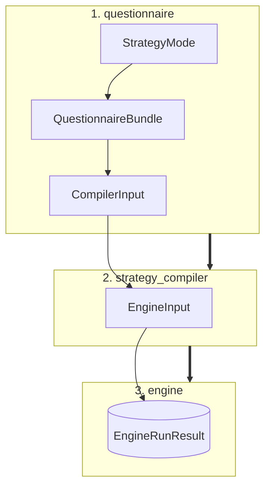
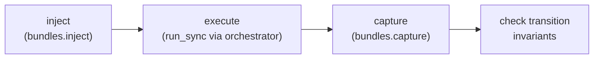

# Custom Schemathesis reference

This reference records the public boundaries and implementation decisions of the
fuzzing engine. Start with the [overview](index.md) for the short version.

## Data flow



The four layers have deliberately separate responsibilities:

| Layer | Owns | Does not do |
|---|---|---|
| `models` | Typed contracts, budgets, inputs and results. | I/O or compilation. |
| `questionnaire` | LLM template and validation. | Generate strategies or send requests. |
| `strategy_compiler` | Contract → Hypothesis strategy translation. | Reinterpret validated policy. |
| `engine` | Request execution and reporting. | Know contract types or strategy mode. |

### Public entry point (`main.py`)

A minimal facade wires the three layers together and adds no logic of its own —
callers only ever need these four functions:

```python
build_questionnaire(mode)          -> QuestionnaireBundle
resolve_questionnaire(bundle)      -> ResolvedQuestionnaire
compile_strategies(compiler_input) -> EngineInput
run(engine_input, config, *, stateful=False) -> EngineRunResult
```

## Models and Questionnaire

### Strategy Contracts & Models
* **`BaseStrategyContract`**: Closed standard contract enforcing JSON Schema constraints, `nullable`, and `extra="forbid"`.
* **`HackerStrategyContract`**: Extends `BaseStrategyContract` with offensive security controls:
  * `attack_profiles`, focus/sensitive fields, aggressiveness, mutation depth, invalid-input ratio.
  * Encoded, null, unicode, and control-character variants.
  * *Note:* Never stores a payload directly; compilation determines concrete values dynamically.
* **`ALLOWED_FIELDS_BY_TYPE` (and Hacker Variant)**: Immutable type-to-field lookup tables acting as the single source of truth for parameters the LLM is permitted to configure.
* **`EndpointRiskContract` & `EndpointBudgetContract`**: Decoupled, independent contracts—risk prioritization and sample spend allocation address separate operational concerns.
* **`EndpointInfo`**: Encapsulates endpoint identity alongside dedicated contracts for all HTTP zones: path, query, header, and body.

### Pipeline Input Containers
* **`CompilerInput`**: Global `StrategyMode` paired with the target endpoint list.
* **`EngineInput`**: Contains compiled endpoints along with global execution configurations.

### Lifecycle Modules
* **`questionnaire.builder`**: Selects validation/generation rules based on mode and emits an empty `QuestionnaireBundle`.
* **`questionnaire.resolver`**: 
  * Validates the completed response.
  * Coerces optional risk and budget models.
  * Verifies data types and allowed fields.
  * Emits the final `CompilerInput`.
* **`policy.py`**: Independently validates correctness and estimates the overall parameter space before capping and allocating the generation budget.

---

## Strategy Compiler

### Compilation Pipeline
The entry point `compile(CompilerInput) -> EngineInput` processes each HTTP zone independently:
* **Path Parameters**: Always marked as required.
* **`DEFAULT` Mode**: Generates `valid`, `boundary`, and `invalid` test phases.
* **`HACKER` Mode**: Includes all default phases plus an added `attack` phase.
* **Output Hierarchy**: `CompiledRequestPart` objects are grouped into `CompiledEndpointStrategies`, which assemble into `CompiledExecutionEndpoint`.

### Dispatch Registry & Extensibility
Contract types map to specialized compilers via a dispatch protocol:

```python
class ContractCompiler(Protocol):
    def compile_contract(self, contract: BaseStrategyContract, phase: str) -> SearchStrategy: ...
```

* **Default Mapping**: ``BaseStrategyContract`` maps to ``DefaultContractCompiler``.
* **Hacker Mapping**: ``HackerStrategyContract`` maps to ``HackerContractCompiler``.
* **Error Handling**: An unregistered contract type raises ``StrategyCompilationError``.
* **Extension Pattern**: Implement **ContractCompiler** and register it:

```python
register_compiler(MyContractType, MyCompiler())
```

### Compiler Implementations

* ``*DefaultContractCompiler``:
   * Native generation for constants, enums, scalar, object, and array strategies, boundary values, and intentionally invalid inputs.
   Unsupported JSON Schema constructs (``anyOf``, `oneOf`, ``$ref``, or custom formats) delegate to ``hypothesis_jsonschema.from_schema``.

* ``HackerContractCompiler``:
   * Delegates all non-attack phases (``valid``, ``boundary``, ``invalid``) directly to DefaultContractCompiler.
   * The ``attack`` phase constructs profile-based strings, numeric extremes, mixed boolean logic, and recursive array/object mutations.

---

## Engine Architecture

### Execution Entry Point

```python
engine.run(engine_input, config, *, stateful=False) -> EngineRunResult
```

### Network Orchestration (`AsyncOrchestrator`)

Serves as the system's sole network boundary. It manages:
* A single shared `httpx.AsyncClient`.
* A concurrency semaphore limiting parallel requests.
* Exponential-backoff retries for transient infrastructure failures (`429`, `502`, `503`, and connection timeouts).
* **Policy**: Client errors (4xx) are logged as findings. Server errors (5xx) are treated as potential defects and are **never** retried away.

### Async Bridge (`hypothesis_bridge.py`)

Hypothesis drives generation through a **synchronous** callback, but every request
is async `httpx`. Calling `asyncio.run()` once per generated example exhausts file
descriptors under load, so the bridge instead:

* Starts a single event loop on a daemon thread, alive for the whole process.
* Runs each coroutine on it via `run_coroutine_threadsafe` and blocks for the result.

Both `AsyncHttpFuzzer` and `StatefulFuzzer` share this one loop — no strategy ever
creates its own.

### Core Engine Components

| Component | Role |
| :--- | :--- |
| **`ContextInjector`** | Builds an immutable request blueprint from assembled zone payloads. |
| **`ErrorClassifier`** | Categorizes HTTP responses and transport-level failures. |
| **`ResponseValidator`** | Enforces declared response formats and state transition invariants. |
| **`AsyncHttpFuzzer`** | Default stateless execution strategy. |
| **`StatefulFuzzer`** | Executes linked, multi-endpoint request sequences. |
| **`dedupe_crash_reports`** | Collapses duplicate findings for identical defects. |

### Two-Phase Testing Pipeline

* **Explore Phase**: Executes tests and records all failures without raising exceptions, allowing test generation to continue uninterrupted. If transport failures pile up to `MAX_INFRA_FAILURES` in a row, that endpoint aborts and the run moves on to the next one — a dead endpoint never stalls the whole run.
* **Shrink Phase**: Each raw finding is sequentially minimized using `hypothesis.find`.
  * Findings that fail to reproduce during shrinking are discarded as flaky.
  * Sequential execution avoids shared-state pollution, side effects, and rate-limit interference.

### Validation, Redaction & Deduplication

* **`ResponseValidator` Checks**: Verifies no-server-error (5xx), declared status code matching, content-type headers, response schema adherence, and valid state transitions. Transport failures are never categorized as contract violations.
* **Secret Redaction**: Sensitive headers (`Authorization`, `Cookie`, `X-Api-Key`) are scrubbed before persistence.
* **Report Deduplication**: Two reports are considered identical if they share the same endpoint, method, phase, invariant, status, and canonical minimal payload. Only one instance is stored to prevent CLI/stat skew, while total defect counts are preserved in aggregate counters.


### Stateful Fuzzing

* **`StateLinkContract`**: Optional contract specifying:
  * `StateProduction`: A response value to capture.
  * `StateConsumption`: Target location to inject the saved value in subsequent calls.
  * A transition invariant to validate between steps.
* **Stateless Fallback**: Endpoints without `StateLinkContract` retain standard stateless behavior.
* **Execution**: State links are passed via `CompiledExecutionEndpoint` and consumed exclusively by `StatefulFuzzer`. Stateful findings can output the complete multi-request sequence required to reproduce cross-endpoint bugs.
* **Who fills the contract today**: a fixture/spec, not inference — the module is
  agnostic about the producer. `semantic_inference` filling it via LLM is future
  work, tracked separately.

#### Fine print on production/consumption

| Field | Behavior |
|---|---|
| `StateConsumption.invalidates` | `True` **removes** the value from its bundle on consumption (via `hypothesis.stateful.consumes`), so a deleted resource can't be reused. Default `False`: the value stays reusable (e.g. the same `id` serves both `GET` and `DELETE`). |
| `TransitionInvariant.echoed_fields` | Beyond the status code, asserts the follow-up probe's body **reflects** the fields sent in the triggering request (e.g. after `PUT {price: 10}`, `GET` must return `price == 10`). Empty ⇒ status-only check. |

#### The state machine (`state_machine.py`)

`build_state_machine(...)` assembles a Hypothesis `RuleBasedStateMachine` at
runtime:



* One Hypothesis `Bundle` per declared bundle name.
* One `@rule()` per endpoint, running the pipeline above.
* `@precondition()` blocks consuming a bundle no endpoint has produced yet —
  preserves logical request ordering.
* The first broken invariant makes the rule **raise** `StatefulViolationError`, so
  Hypothesis shrinks the **sequence of operations** to a minimal reproducer —
  unlike the stateless fuzzer, which collects findings and shrinks the *payload*.

`transitions.py` builds the follow-up probe by reusing `ContextInjector`, delegates
the 5xx check to the existing `ResponseValidator`, and adds the expected-status and
`echoed_fields` comparisons (`InvariantViolation.STATE_TRANSITION`).

#### Multiple bugs per run (loop-until-dry, opt-in)

A rule stops at its first failure, so by default `fuzz_sequence` does **one pass**
— report the first defect, stay cheap. Raising `StatefulConfig.max_distinct_bugs`
turns on a loop:

1. Each pass reports one defect and records its signature
   `(method, path, invariant)` in a `suppressed` set.
2. Rules keep checking already-seen signatures but don't re-raise on them, so the
   next pass can surface a *different* defect.
3. The loop stops when a pass finds nothing new, or the configured cap is hit.

Every defect keeps its own independent shrinking.

```python
run(engine_input, config)                  # stateless — unchanged prior behavior
run(engine_input, config, stateful=True)   # stateful, one pass (default)
run(engine_input, config, stateful=True,   # stateful, exhaustive
    stateful_config=StatefulConfig(max_distinct_bugs=10))
```

`StatefulConfig` fields: `max_distinct_bugs` (default `1`), `max_examples`
(sequences per pass), `step_count` (max steps per sequence). Findings reuse
`CrashReport` with its optional `transition_sequence` field (the steps leading to
the failure) rather than a second report type.

---

## Operational Constants & System Invariants

### Configuration (`src/constants.py`)
Centralizes operational defaults including maximum example counts, phase splits, retry backoff parameters, infrastructure-failure caps, and shrink budgets.

> **Testing Guideline:** Disable Hypothesis deadlines during integration tests where real network latency could cause non-deterministic failures.

### Domain Exceptions (`src/exceptions.py`)

| Exception | Raised when |
|---|---|
| `PolicyError` | A contract, rule or field breaks a questionnaire constraint. |
| `StrategyCompilationError` | A contract has no registered compiler to translate it into a Hypothesis strategy. |
| `EngineError` | An execution-time invariant of the engine is violated (e.g. a missing path param). |
| `StatefulLinkError` | A state link can't be honored during stateful fuzzing. Subclass of `EngineError`. |

### Architectural Invariants
When modifying this module, the following core invariants must be maintained:

1. **Single Validation Crossing**: Validated data crosses each system boundary exactly once.
2. **Registry Extensibility**: The strategy compiler remains extensible via its registration interface.
3. **Shared HTTP Transport**: All outbound HTTP requests execute through a single shared client.
4. **Resilient Runs**: Infrastructure and network failures must not abort an active test run.
5. **Zero Secret Leakage**: Sensitive credentials and auth tokens must never be persisted in crash reports or logs.
