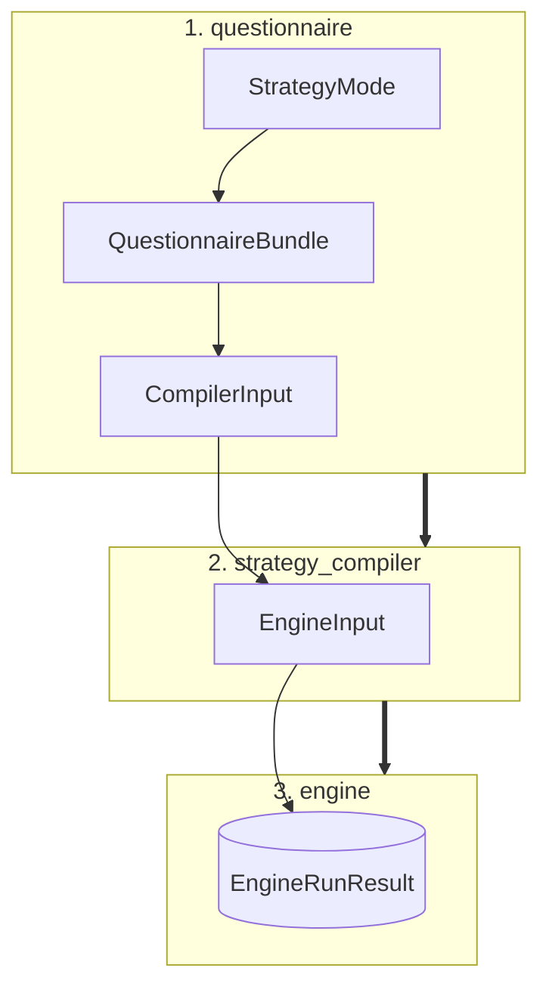

# Custom Schemathesis reference

This reference records the public boundaries and implementation decisions of the
fuzzing engine. Start with the [overview](index.md) for the short version.

## Data flow



The four layers have deliberately separate responsibilities:

| Layer | Owns | Does not do |
|---|---|---|
| `models` | Typed contracts, budgets, inputs and results. | I/O or compilation. |
| `questionnaire` | LLM template and validation. | Generate strategies or send requests. |
| `strategy_compiler` | Contract → Hypothesis strategy translation. | Reinterpret validated policy. |
| `engine` | Request execution and reporting. | Know contract types or strategy mode. |

## Models and Questionnaire

### Strategy Contracts & Models
* **`BaseStrategyContract`**: Closed standard contract enforcing JSON Schema constraints, `nullable`, and `extra="forbid"`.
* **`HackerStrategyContract`**: Extends `BaseStrategyContract` with offensive security controls:
  * `attack_profiles`, focus/sensitive fields, aggressiveness, mutation depth, invalid-input ratio.
  * Encoded, null, unicode, and control-character variants.
  * *Note:* Never stores a payload directly; compilation determines concrete values dynamically.
* **`ALLOWED_FIELDS_BY_TYPE` (and Hacker Variant)**: Immutable type-to-field lookup tables acting as the single source of truth for parameters the LLM is permitted to configure.
* **`EndpointRiskContract` & `EndpointBudgetContract`**: Decoupled, independent contracts—risk prioritization and sample spend allocation address separate operational concerns.
* **`EndpointInfo`**: Encapsulates endpoint identity alongside dedicated contracts for all HTTP zones: path, query, header, and body.

### Pipeline Input Containers
* **`CompilerInput`**: Global `StrategyMode` paired with the target endpoint list.
* **`EngineInput`**: Contains compiled endpoints along with global execution configurations.

### Lifecycle Modules
* **`questionnaire.builder`**: Selects validation/generation rules based on mode and emits an empty `QuestionnaireBundle`.
* **`questionnaire.resolver`**: 
  * Validates the completed response.
  * Coerces optional risk and budget models.
  * Verifies data types and allowed fields.
  * Emits the final `CompilerInput`.
* **`policy.py`**: Independently validates correctness and estimates the overall parameter space before capping and allocating the generation budget.

---

## Strategy Compiler

### Compilation Pipeline
The entry point `compile(CompilerInput) -> EngineInput` processes each HTTP zone independently:
* **Path Parameters**: Always marked as required.
* **`DEFAULT` Mode**: Generates `valid`, `boundary`, and `invalid` test phases.
* **`HACKER` Mode**: Includes all default phases plus an added `attack` phase.
* **Output Hierarchy**: `CompiledRequestPart` objects are grouped into `CompiledEndpointStrategies`, which assemble into `CompiledExecutionEndpoint`.

### Dispatch Registry & Extensibility
Contract types map to specialized compilers via a dispatch protocol:

```python
class ContractCompiler(Protocol):
    def compile_contract(self, contract: BaseStrategyContract, phase: str) -> SearchStrategy: ...
```

* **Default Mapping**: ``BaseStrategyContract`` maps to ``DefaultContractCompiler``.
* **Hacker Mapping**: ``HackerStrategyContract`` maps to ``HackerContractCompiler``.
* **Error Handling**: An unregistered contract type raises ``StrategyCompilationError``.
* **Extension Pattern**: Implement **ContractCompiler** and register it:

```python
register_compiler(MyContractType, MyCompiler())
```

### Compiler Implementations

* ``*DefaultContractCompiler``:
   * Native generation for constants, enums, scalar, object, and array strategies, boundary values, and intentionally invalid inputs.
   Unsupported JSON Schema constructs (``anyOf``, `oneOf`, ``$ref``, or custom formats) delegate to ``hypothesis_jsonschema.from_schema``.

* ``HackerContractCompiler``:
   * Delegates all non-attack phases (``valid``, ``boundary``, ``invalid``) directly to DefaultContractCompiler.
   * The ``attack`` phase constructs profile-based strings, numeric extremes, mixed boolean logic, and recursive array/object mutations.

---

## Engine Architecture

### Execution Entry Point

```python
engine.run(engine_input, config, *, stateful=False) -> EngineRunResult
```

### Network Orchestration (`AsyncOrchestrator`)

Serves as the system's sole network boundary. It manages:
* A single shared `httpx.AsyncClient`.
* A concurrency semaphore limiting parallel requests.
* Exponential-backoff retries for transient infrastructure failures (`429`, `502`, `503`, and connection timeouts).
* **Policy**: Client errors (4xx) are logged as findings. Server errors (5xx) are treated as potential defects and are **never** retried away.

### Core Engine Components

| Component | Role |
| :--- | :--- |
| **`ContextInjector`** | Builds an immutable request blueprint from assembled zone payloads. |
| **`ErrorClassifier`** | Categorizes HTTP responses and transport-level failures. |
| **`ResponseValidator`** | Enforces declared response formats and state transition invariants. |
| **`AsyncHttpFuzzer`** | Default stateless execution strategy. |
| **`StatefulFuzzer`** | Executes linked, multi-endpoint request sequences. |
| **`dedupe_crash_reports`** | Collapses duplicate findings for identical defects. |

### Two-Phase Testing Pipeline

* **Explore Phase**: Executes tests and records all failures without raising exceptions, allowing test generation to continue uninterrupted.
* **Shrink Phase**: Each raw finding is sequentially minimized using `hypothesis.find`.
  * Findings that fail to reproduce during shrinking are discarded as flaky.
  * Sequential execution avoids shared-state pollution, side effects, and rate-limit interference.

### Validation, Redaction & Deduplication

* **`ResponseValidator` Checks**: Verifies no-server-error (5xx), declared status code matching, content-type headers, response schema adherence, and valid state transitions. Transport failures are never categorized as contract violations.
* **Secret Redaction**: Sensitive headers (`Authorization`, `Cookie`, `X-Api-Key`) are scrubbed before persistence.
* **Report Deduplication**: Two reports are considered identical if they share the same endpoint, method, phase, invariant, status, and canonical minimal payload. Only one instance is stored to prevent CLI/stat skew, while total defect counts are preserved in aggregate counters.


### Stateful Fuzzing

* **`StateLinkContract`**: Optional contract specifying:
  * `StateProduction`: A response value to capture.
  * `StateConsumption`: Target location to inject the saved value in subsequent calls.
  * A transition invariant to validate between steps.
* **Stateless Fallback**: Endpoints without `StateLinkContract` retain standard stateless behavior.
* **Execution**: State links are passed via `CompiledExecutionEndpoint` and consumed exclusively by `StatefulFuzzer`. Stateful findings can output the complete multi-request sequence required to reproduce cross-endpoint bugs.

---

## Operational Constants & System Invariants

### Configuration (`src/constants.py`)
Centralizes operational defaults including maximum example counts, phase splits, retry backoff parameters, infrastructure-failure caps, and shrink budgets. All engine exceptions derive from `EngineError`.

> **Testing Guideline:** Disable Hypothesis deadlines during integration tests where real network latency could cause non-deterministic failures.

### Architectural Invariants
When modifying this module, the following core invariants must be maintained:
1. **Single Validation Crossing**: Validated data crosses each system boundary exactly once.
2. **Registry Extensibility**: The strategy compiler remains extensible via its registration interface.
3. **Shared HTTP Transport**: All outbound HTTP requests execute through a single shared client.
4. **Resilient Runs**: Infrastructure and network failures must not abort an active test run.
5. **Zero Secret Leakage**: Sensitive credentials and auth tokens must never be persisted in crash reports or logs.
