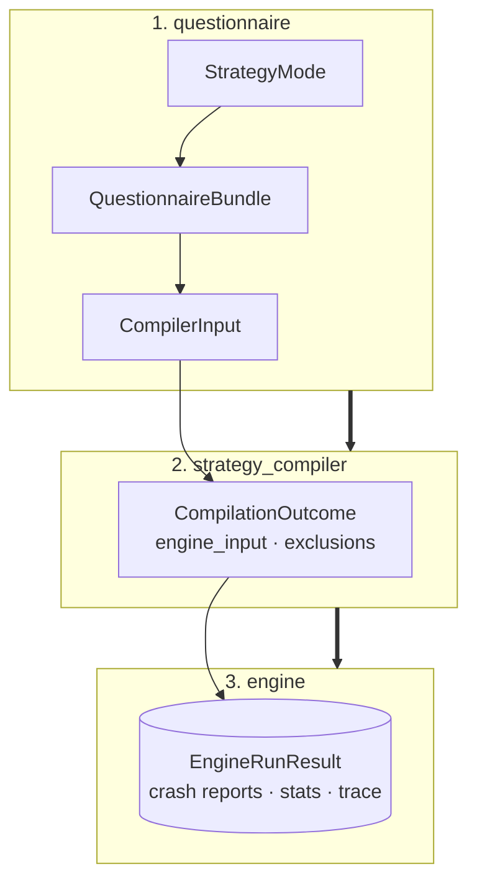
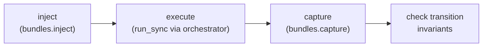

# Custom Schemathesis — Reference

This reference records the public boundaries and implementation decisions of the
fuzzing engine. Start with the [overview](index.md) for the short version.

## Data flow



The four layers have deliberately separate responsibilities:

| Layer | Owns | Does not do |
|---|---|---|
| `models` | Typed contracts, budgets, inputs and results. | I/O or compilation. |
| `questionnaire` | LLM template and validation. | Generate strategies or send requests. |
| `strategy_compiler` | Contract → Hypothesis strategy translation. | Reinterpret validated policy. |
| `engine` | Request execution and reporting. | Know contract types or strategy mode. |

### Public entry point (`main.py`)

A minimal facade wires the three layers together and adds no logic of its own —
callers only ever need these four functions:

```python
build_questionnaire(mode)          -> QuestionnaireBundle
resolve_questionnaire(bundle)      -> ResolvedQuestionnaire
compile_strategies(compiler_input) -> CompilationOutcome
run(outcome.engine_input, config, *, mode=None, options=None) -> EngineRunResult
```

`mode` defaults to `ExecutionMode.STATELESS`; `options` carries that mode's settings.
The former `stateful` / `stateful_config` pair still works for one version and emits a
`DeprecationWarning`.

## Models and Questionnaire

### Strategy Contracts & Models
* **`BaseStrategyContract`**: Closed standard contract enforcing JSON Schema constraints, `nullable`, and `extra="forbid"`.
* **`HackerStrategyContract`**: Extends `BaseStrategyContract` with **per-value** offensive knobs only:
  * `attack_profiles` (payload-family selection) and the `include_*` toggles (encoded, null, large, empty, unicode, control-character, nested-object, ... variants).
  * *Note:* Never stores a payload directly; compilation determines concrete values dynamically.
* **`EndpointAttackContract`**: **Endpoint-scoped** attack configuration — `attack_profiles`, `focus_fields`, `sensitive_fields`, `aggressiveness`, `mutation_depth` — describing the whole endpoint rather than a single value. Held by `EndpointInfo.attack`.
* **`ALLOWED_FIELDS_BY_TYPE` (and Hacker variant)**: Immutable type-to-field lookup tables acting as the single source of truth for parameters the LLM is permitted to configure. The hacker variant is **derived** from the model's own per-value fields, so a new per-value knob extends it automatically and endpoint/request-scoped knobs can never leak in.
* **`EndpointRiskContract` & `EndpointBudgetContract`**: Decoupled, independent contracts—risk prioritization (pure scoring metadata) and sample-spend allocation (`phase_split`, the single source of truth for the phase budget) address separate operational concerns.
* **`EndpointInfo`**: Encapsulates endpoint identity alongside dedicated contracts for all HTTP zones: path, query, header, and body.

### Pipeline Input Containers
* **`CompilerInput`**: Global `StrategyMode` paired with the target endpoint list.
* **`EngineInput`**: Contains compiled endpoints along with global execution configurations.
* **`CompilationOutcome`**: What `compile()` actually returns — `engine_input` (the
  endpoints that compiled) plus `exclusions` (one `EndpointExclusion` per endpoint that
  didn't). See *Compilation Pipeline* below.
* **`EndpointExclusion`**: A rejected endpoint's identity (`method`, `path_url`) and the
  compiler's `reason` for it, as a string — never an exception instance, so the DTO stays
  serializable.

### Strategy Mode Profiles (`models/strategy_profile.py`)

A `StrategyModeProfile` holds everything one strategy mode decides, so no consumer
branches on the mode:

| Field | Decides |
| :--- | :--- |
| `phase_split` | Which phases compile (its keys **are** the phase list) and how examples divide between them. |
| `allowed_fields_by_type` | Which contract fields are legal per JSON Schema type. |
| `contract_type` + `allow_contract_subclasses` | Which contract type the mode accepts. |
| `questionnaire_rules` | Derived from the allowed fields — not a second copy. |

`allow_contract_subclasses` makes the asymmetry between modes explicit: `DEFAULT` sets it
`False` so a Hacker contract is rejected, `HACKER` sets it `True`. Register a mode with
`register_profile(...)` and read it back with `profile_for(mode)`; an unregistered mode
raises `PolicyError` listing the registered ones.

### Lifecycle Modules
* **`questionnaire.builder`**: Takes the mode's rules from its profile and emits an empty `QuestionnaireBundle`.
* **`questionnaire.resolver`**: 
  * Validates the completed response.
  * Coerces optional risk and budget models.
  * Verifies data types and allowed fields.
  * Emits the final `CompilerInput`.
* **`policy.py`**: Independently validates correctness and estimates the overall parameter space before capping and allocating the generation budget. The per-phase split is delegated to the shared `budget.allocate_examples` leaf: a `phase_split` is read as **relative proportions** (normalized by its own sum, so a split that does not add up to 1.0 still consumes the whole budget) and distributed by the **largest-remainder** method with ties broken by phase name — so the result is independent of key order and always sums to the endpoint budget.
* **`budget.allocate_examples`**: The single pure unit both the questionnaire policy and the engine share, so the two layers split a budget identically. At execution the **generation plan is authoritative**: a phase the plan did not fund runs zero examples, so a narrow budget runs exactly the phases it funds; only a plan-less endpoint falls back to its budget split, where a phase the split cannot cover is an error rather than a silent minimum of one.

---

## Strategy Compiler

### Compilation Pipeline
The entry point `compile(CompilerInput) -> CompilationOutcome` compiles the batch endpoint
by endpoint, and processes each endpoint's HTTP zones independently:
* **Path Parameters**: Always marked as required. A generated value the request
  injector would render as an unsendable segment (`""`, `"."`, `".."` — the three RFC
  3986 normalization silently strips, re-routing the request) is filtered out of the
  path-zone strategy, so the compiler never hands the engine an example it cannot
  faithfully send.
* **Phases**: Taken from `profile_for(strategy_mode).phases` — `DEFAULT` yields `valid`, `boundary`, `invalid`; `HACKER` adds `attack`. The compiler never branches on the mode itself.
* **Output Hierarchy**: `CompiledRequestPart` objects are grouped into `CompiledEndpointStrategies`, which assemble into `CompiledExecutionEndpoint`.
* **Partial compilation**: a rejection while compiling one endpoint —
  `EndpointCompilationError`, raised internally for an unresolvable path template or a
  contract with no registered phase — does not abort the batch. `compile()` catches it,
  reifies it into an `EndpointExclusion` and moves on to the next endpoint.
  `EndpointCompilationError` itself never crosses the public facade: it is an
  implementation detail of this catch, not an exported exception. A batch that excludes
  every endpoint still returns a `CompilationOutcome` with an empty `engine_input` —
  deciding that there is nothing left to fuzz is the caller's call, not the compiler's.

### Dispatch Registry & Extensibility
There is one compilation dispatch: the generation phase registry. `compile_contract` is its facade:

```python
def compile_contract(contract: BaseStrategyContract, phase: str) -> SearchStrategy:
    return resolve_phase(contract, phase).build(contract)
```

* **Resolution**: `resolve_phase(contract, phase)` looks up `(type(contract), phase)`, then walks the contract's MRO, returning the first registered `GenerationPhase`.
* **Default Mapping**: ``valid`` / ``boundary`` / ``invalid`` are registered against ``BaseStrategyContract``.
* **Hacker Mapping**: ``attack`` is registered against ``HackerStrategyContract``; the other three are inherited from the base via the MRO walk.
* **Error Handling**: An unknown phase for a contract raises ``StrategyCompilationError``, listing the phases reachable for that contract.
* **Extension Pattern**: Register a phase for your contract type — no new compiler layer:

```python
register_phase(GenerationPhase(name="my_phase", contract_type=MyContractType, build=my_builder))
```

### Phase Builders

* **Default phases** (`valid` / `boundary` / `invalid`):
   * Native generation for constants, enums, scalar, object, and array strategies, boundary values, and intentionally invalid inputs.
   Unsupported JSON Schema constructs (``anyOf``, `oneOf`, ``$ref``, or custom formats) delegate to ``hypothesis_jsonschema.from_schema``.

* **Attack phase** (`build_hacker_attack`, registered against ``HackerStrategyContract``):
   * Constructs profile-based strings, numeric extremes, mixed boolean logic, and recursive array/object mutations.

For the file-by-file map of `default/` and `hacker/` — every builder
function, the boundary/attack value tables, and the format-pattern regexes —
see [Strategy compiler internals](strategy-compiler-internals.md).

---

## Engine Architecture

### Execution Entry Point

```python
engine.run(engine_input, config, *, mode=None, options=None) -> EngineRunResult
```

The entry point resolves, orchestrates and delegates — nothing else. It looks up the
`ExecutionRunner` registered for `mode`, checks `options` against the `options_type` that
runner declares, opens one orchestrator for the whole run and hands it over.

An unknown mode raises `EngineError` listing the registered ones. It never falls back to
a default: silently running something other than what the caller asked for is worse than
failing. Wrong-typed options fail the same way, before the HTTP client is opened.

### Execution Runners (`engine/runners/`)

A runner encapsulates one complete execution procedure — its fuzzer, its phases and its
statistics builder — and receives the orchestrator **already open**, so the core keeps
ownership of the HTTP client's lifetime.

| Mode | Runner | Options | Procedure |
| :--- | :--- | :--- | :--- |
| `stateless` | `StatelessRunner` | — | Explore per endpoint, group the findings by symptom, then shrink one representative per group. |
| `stateful` | `StatefulRunner` | `StatefulConfig` | Chain endpoints; the state machine minimizes as it goes. |

```python
register_runner(MyRunner())   # mode, options_type, run(request, orchestrator)
```

### `protocols.py`

Two structural `Protocol`s (extension by shape, not inheritance) define the
engine's two execution strategies:

* **`FuzzStrategy`** — stateless, per-endpoint testing. Exposes `name`,
  `fuzz(endpoint, config) -> ExplorationOutcome` (raw results, raw findings,
  and the truncation record if the pass was cut short) and
  `shrink(finding, config) -> CrashReport | None`.
* **`StatefulFuzzStrategy`** — stateful testing over the whole endpoint set.
  Exposes `name` and
  `fuzz_sequence(endpoints, config, stateful_config) -> StatefulExplorationOutcome`
  (results, already-minimized crash reports, and the truncation record when a
  circuit breaker opened).

`run(..., mode=...)` picks the runner and the runner its strategy; nothing else in the
engine branches on strategy type.

Registering the runner rather than the fuzz strategy is deliberate: a replay generates
nothing and a load run has no contract to compile, so what varies between modes is the
whole procedure, not just the generator. Registry keys are the mode's string value, since
a `StrEnum` is closed and keying by the member would make the extensibility claim
untestable.

### Network Orchestration (`AsyncOrchestrator`)

Serves as the system's sole network boundary. It manages:
* A single shared `httpx.AsyncClient`.
* A concurrency semaphore limiting parallel requests.
* Exponential-backoff retries for transient infrastructure failures (`429`, `502`, `503`, and connection timeouts).
* **Policy**: Client errors (4xx) are logged as findings. Server errors (5xx) are treated as potential defects and are **never** retried away.
* **Timing metadata**: every result is stamped with `sent_at_ms` (offset from
  the run's start) and `in_flight` (requests in flight at dispatch),
  captured before the `await` so a retried request keeps the timestamp of
  the attempt that actually went out. `in_flight` is always `1` today since
  execution is sequential — it starts telling the truth once endpoints run
  in parallel.

### `core/error_classifier.py`

Maps responses and transport exceptions to `ErrorCategory`:

| Case | Result |
|---|---|
| `classify_response`, 5xx | `server_error` |
| `classify_response`, 4xx | `client_error` |
| `classify_response`, 2xx/3xx | `None` |
| `classify_exception`, connect / protocol / connect-timeout | `availability` |
| `classify_exception`, other timeouts | `timeout` |

`contract_violation` is never produced by the classifier — the fuzzer assigns
it when `ResponseValidator` finds an invariant violation on an otherwise
successful (2xx/3xx) response.

### Async Bridge (`hypothesis_bridge.py`)

Hypothesis drives generation through a **synchronous** callback, but every request
is async `httpx`. Calling `asyncio.run()` once per generated example exhausts file
descriptors under load, so the bridge instead:

* Starts a single event loop on a daemon thread, alive for the whole process.
* Runs each coroutine on it via `run_coroutine_threadsafe` and blocks for the result.

Both `AsyncHttpFuzzer` and `StatefulFuzzer` share this one loop — no strategy ever
creates its own.

### Core Engine Components

| Component | Role |
| :--- | :--- |
| **`ContextInjector`** | Builds an immutable request blueprint from assembled zone payloads, and records which header names came from the run config. |
| **`ErrorClassifier`** | Categorizes HTTP responses and transport-level failures. |
| **`identities.py`** | Pure: `share_budget` splits a stateless phase's example budget evenly across the declared identities; `identity_strategy` draws one for a stateful sequence. |
| **`ResponseValidator`** | A thin facade that composes registered **response oracles** (see below) to decide which invariant a response violated. |
| **`hypothesis_settings`** | Single source of the Hypothesis settings each strategy runs with. |
| **`AsyncHttpFuzzer`** | Default stateless execution strategy. |
| **`StatefulFuzzer`** | Executes linked, multi-endpoint request sequences. |
| **`build_trace`** | Projects the exploration results into the execution trace. |
| **`dedupe_crash_reports`** | Collapses duplicate findings for identical defects. |

### Hypothesis settings (`core/hypothesis_settings.py`)

Every strategy has its own parameters — example budget, phases, sequence length — but
they share one run-level policy, stated once here rather than re-typed at each call
site: `exploration_settings(n)`, `shrink_settings()` and `stateful_settings(config)`.

`deadline=None` everywhere, because a real HTTP round trip would trip it without any
defect being present.

`stateful_settings` also takes `reserved_steps`, added on top of `stateful_step_count`
so the machine's own setup rules never take a step from the user's declared budget.
With identities declared, the `@initialize` rule that draws one costs a step — Hypothesis
counts it like any other — so `setup_step_count` (`state_machine.py`) reserves exactly
one for it; with none declared it reserves zero and `stateful_step_count` is unchanged.

**No example database (`database=None`) — a decision, not a forgotten default.**
Hypothesis otherwise persists failing examples under `.hypothesis/` in the working
directory and replays them into later runs. That is unacceptable here for two reasons:

* the directory belongs to the working directory rather than to the API under test, so
  every target fuzzed from the same folder shares one pool of examples;
* it breaks the premise of record-and-replay. A run is reproduced by re-sending the
  trace of what it actually sent, so a replayed example from an older run — against a
  different revision, possibly a different API — would put a value in the trace that
  *this* run never generated.

Without a database a run is a function of its input and nothing else. An ephemeral
per-run database was considered and rejected: the reuse it preserves is worth little
(each run starts cold anyway) and it adds state that then has to be cleaned up.

Only shrinking and stateful ever replayed old examples — exploration declares
`phases=[Phase.explicit, Phase.generate]`, which excludes `Phase.reuse` — but all three
wrote to the shared database.

### Execution trace (`engine/trace/`)

A run does not reproduce by regenerating the same data; it reproduces by **re-sending
what it sent**. `EngineRunResult.trace` is that record: the ordered list of requests
that actually went out, with their concrete values.

`build_trace` is a **pure projection** over the `ExecutionResult` list exploration
already collected. That is what makes "no shrinking requests" true by construction
rather than by a flag: shrinking runs off the findings list, in a different branch of
the algorithm, and never reaches the results. Recording inside the orchestrator was
rejected — everything passes through it, so it would have to know which stage of the
algorithm it is in, which the "classifies results, never interprets" rule forbids.

Each recorded request carries what is needed to re-emit it, plus **the status code this
run observed**. That status is useless for sending the request again, and it is the only
thing that lets a later replay tell whether the context those requests land in is still
the same.

**Credentials are omitted, not redacted.** A trace with the token blanked out cannot be
replayed — the real value is missing — so the two obvious outcomes are both bad: either
the replay fails, or someone "fixes" it by storing the secret in the clear. The trace
therefore records only the headers the fuzzer generated, plus the **names** of the
config-sourced ones, never their values; a replay re-injects them from whatever config
is in force. The trace becomes shareable, replaying against staging instead of
production is a config change rather than a file edit, and rotating a credential does
not invalidate history. A generated header that overrides a config one of the same name
counts as generated: its value is test data.

The same rule applies to a URL's `user:pass@` userinfo: `TracedRequest.url` is recorded
with it stripped, and `omitted_url_userinfo` flags that it was present, so a request
that carried no userinfo at all stays distinguishable from one that had it removed.
`engine/trace/url_userinfo.py` (`split_userinfo` / `inject_userinfo`) is the one place
that parses or rebuilds it, shared by the recorder and by rehydration, which re-injects
it from `ExecutionConfig.base_url` and refuses — an `EngineError` — when the live
`base_url` carries no userinfo or targets a different host than the one recorded.

`canonical_json` serializes with sorted keys and compact separators; `content_hash` is a
SHA-256 over that form **excluding `sent_at_ms`**, since send moments are pacing rather
than content. Serialization deliberately uses Python's JSON encoder instead of
Pydantic's: Pydantic maps `NaN` and `Infinity` to `null`, so a replay would send `null`
where the run sent a special float — losing exactly the exotic values most likely to
have broken the API. The output is what `json.load` accepts, not strict RFC 8259.

A run that was cut short says so through `TruncationRecord` (reason, endpoint, and how
many requests that endpoint managed to send). Without that mark, a partial trace replays
as though it were complete and any before/after comparison drawn from it is wrong.
`requests_sent` counts what reached the wire, so a request the client refused to send is
excluded — the same predicate the trace itself uses to decide what to record.

The reasons split by what the operator should do about them. `deadline_exceeded` is a
run meeting its own budget: widen it. `infrastructure_abort` is one endpoint that stopped
answering while the run went on without it — endpoint-local, so the run is truncated,
not lost. `generation_exhausted` is the same kind of endpoint-local cut, for a different
cause: one or more of the endpoint's phases hit `Unsatisfiable` or a stalled
`FailedHealthCheck` before producing a single candidate to send — the strategy itself
could not generate, not the target refusing to answer. `target_down` and
`state_link_abort` are a fault that stopped the run: the
target itself is gone (a liveness probe confirmed it in stateless mode; every rule
endpoint the stateful run reached had its circuit breaker open), or a state link could
not be honored. Only `state_link_abort` carries a `detail` — the engine's own message
naming the field or zone that could not be honored, which is the only actionable part;
`generation_exhausted` names its exhausted phases the same way.

**A hard cut outranks an exhausted one.** Within one endpoint's exploration, an
`infrastructure_abort`, `deadline_exceeded` or `target_down` recorded while a phase was
still running claims the truncation slot outright — a phase that legitimately never got
a single candidate loses to a cut that actually happened. `generation_exhausted` is only
recorded when no hard cut fired and at least one phase was skipped for lack of a
candidate.

**Stateful limitation:** the state machine minimizes by re-running shorter sequences, and
those re-runs go through the same collector. In stateful mode the trace therefore also
holds the attempts made while shrinking; the clean split is only possible on the
stateless path.

### Two-Phase Testing Pipeline

* **Explore Phase**: Executes tests and records all failures without raising exceptions, allowing test generation to continue uninterrupted. If transport failures pile up to `MAX_INFRA_FAILURES` in a row, that endpoint aborts and the run moves on to the next one — a dead endpoint never stalls the whole run. The abort is recorded in the trace as a truncation, so a partial run is never mistaken for a complete one. Exploration returns an `ExplorationOutcome` (results, raw findings, and the truncation when there was one).
  * **Liveness probe**: after `MAX_CONSECUTIVE_SERVER_ERRORS` 5xx in a row on one endpoint, the fuzzer re-sends the last **safe** request it saw answered cleanly anywhere in the run — this endpoint's or another's — restricted to `SAFE_PROBE_METHODS = {GET, HEAD, OPTIONS}`, never a write, which would create a second resource outside the budget. Any HTTP answer, a 500 included, proves the process is up; only a transport failure declares it `TARGET_DOWN`, which cuts the run before shrinking. No safe baseline seen yet means no probe at all, and confirming one endpoint's liveness stops it from being probed again for the rest of that pass (`liveness_confirmed`) — one extra request per endpoint, at most.
  * **Identities**: with `ExecutionConfig.identities` declared, each phase's example budget is split evenly across them (`engine/core/identities.py::share_budget`; the remainder goes to the first identities, and one the budget cannot reach gets no share); with none declared, a single anonymous pass runs exactly as before. `RawFinding.identity` records which one produced a given finding, and shrinking re-executes under that same identity rather than re-drawing.
  * **Examples planned**: exploration builds one pass per `(phase, identity)`, and the sum of every pass's share — regardless of whether the phase went on to be skipped by `generation_exhausted` — is `ExplorationOutcome.examples_planned`, exposed per endpoint as `EndpointStats.examples_planned` (`0` in modes that don't measure it, stateful and replay). The gap against `requests` is unspent budget the truncation record explains.
* **Shrink Phase**: Raw findings are first **grouped by signature** — endpoint, phase, violated invariant, status code, the identity label the request was sent under, and the *shape* of the response body (keys and their types, digit runs masked; never the values) — by the pure `engine/core/finding_grouper.py`, so the same symptom found under two identities groups, and later reports, separately. One representative per group is then minimized with `hypothesis.find` by `engine/core/shrink_coordinator.py` (pure, with `shrink` injected): a flaky (`None`) or divergent (another status) first representative promotes a second member, never a third (`MAX_REPRESENTATIVES_PER_SIGNATURE = 2`). A systematic failure — every example of an endpoint answering the same 500, every request to an authenticated endpoint answering 401 — therefore costs one shrink search, not one per example.
  * The search accepts a candidate only when it reproduces the finding's own violation **and status**, so minimization cannot drift to a different symptom. The report is built from one more request; a report whose status still diverges is kept as evidence but stands only for itself.
  * A single shrink attempt now distinguishes two outcomes the fuzzer used to collapse into one `None`: `ShrinkAttempt(report=None, attempted=False)` when `hypothesis.find` raised `Unsatisfiable` — no candidate was ever produced to try — versus `attempted=True` for a search that ran and either found nothing (`NoSuchExample`) or lost to `FlakyFailure`, both genuinely flaky. Findings that fail to reproduce during shrinking are discarded as flaky. Group members never attempted, because a representative of their signature already was, are counted in `RunStats.findings_collapsed`; findings never attempted at all — the run was cut before shrinking started (`TARGET_DOWN`), or the strategy itself could produce no candidate for the search (`attempted=False`) — are counted in `RunStats.findings_unverified` instead: the run never got the chance to try them, which is a different fact from trying and failing. The requests the phase put on the wire land in `RunStats.requests_shrink` — measured on `AsyncOrchestrator.wire_requests`, the engine's one transport counter, so the number is comparable with the target's access log. `findings_raw == findings_confirmed + findings_flaky + findings_collapsed + findings_unverified` holds by construction, and `findings_confirmed` counts representatives that reproduced.
  * `CrashReport.represented_findings` says how many raw findings a report stands for: itself, its unshrunk group mates and the duplicates deduplication absorbed. A group whose two representatives both diverged leaves its members counted as collapsed with no report claiming them. A stateful crash always represents 1: that mode minimizes as it goes and has no separate shrink phase.
  * Sequential execution avoids shared-state pollution, side effects, and rate-limit interference.

### Validation, Redaction & Deduplication

* **Response oracles (`engine/core/oracles/`)**: Response validation is the module's fifth extension registry. An **oracle** is a registered unit — `name`, `order`, and a `check(context) -> OracleVerdict` — and `ResponseValidator` is now a thin facade that pre-resolves the applicable response contract into a `ResponseContext` once and then composes the registered oracles in `order`. A verdict carries `(violation, terminal)`: an oracle can pass, stop the pipeline, emit a violation, or emit-and-continue. The five built-ins reproduce the former `if`-chain exactly, in precedence order: **infra** (10, transport failures suppress all findings), **server-error** (20, any 5xx is `NOT_A_SERVER_ERROR` and stops — never softened by a declared range), **status-code** (30), **content-type** (40), **schema** (50). Because all five are terminal-on-violation, `check` still yields at most one violation today; the *emit-and-continue* verdict is the seat a future oracle (semantic property, latency SLA, access control) registers into — a new invariant is a row plus an additive `InvariantViolation` member, never a core edit. Transport failures are never contract violations.
* **`multiple_of` is compared in exact rational arithmetic.** The `schema` oracle's numeric-bounds check converts both the response value and the declared `multiple_of` to `Fraction(str(value))` before testing divisibility, because `value % multiple_of` in binary floating point rejects genuine multiples (`0.3 % 0.1 != 0`). A non-finite float still fails the check outright, ahead of the conversion `Fraction` cannot perform on it.
* **A response with no representation gets no content-type verdict.** `ResponseContext.has_body` (resolved once, in `build_context`) is `False` for a zero-byte or whitespace-only body — what gin, Express and Spring answer errors with — and `True` for every JSON value, `null` included, and any text beyond whitespace. `content-type` (40) skips outright when `has_body` is `False`. `schema` (50) tolerates an empty non-2xx the same way — an empty 404 or 401 is normal — but a 2xx that promised a body and sent none is still validated against it: `""` against an `object` schema is `RESPONSE_SCHEMA_CONFORMANCE`, against a `string` schema it is a valid empty string.
* **Status-range contract resolution**: `resolve_response_contract` (models layer) matches a status against the declared responses by OpenAPI precedence — exact code, then range (`2XX`/`4XX`/`5XX`, case-insensitive), then `default`. The engine consumes a resolved `ResponseContract | None` and never learns OpenAPI's range grammar; a `201` declared only as `"2XX"` no longer produces a spurious status-conformance finding.
* **Secret Redaction**: Sensitive headers (`Authorization`, `Cookie`, `X-Api-Key`) are scrubbed from **crash reports** before persistence. The execution trace uses a different mechanism — it *omits* config-sourced headers by origin, keeping their names and never their values, because a redacted trace could not be replayed. Do not merge the two: one is redaction against a fixed list, the other is omission by origin.
* **Report Deduplication**: Two reports are considered identical if they share the same endpoint, method, invariant, status, identity label, and canonical minimal payload. Phase is deliberately not a term: it is the generator's intention, not a property of the defect, so the same defect surfacing in two phases is one report, kept in the phase it was first seen. Only one instance is stored to prevent CLI/stat skew, while total defect counts are preserved in aggregate counters.


### Stateful Fuzzing

* **`StateLinkContract`**: Optional contract specifying:
  * `StateProduction`: A response value to capture.
  * `StateConsumption`: Target location to inject the saved value in subsequent calls.
  * A transition invariant to validate between steps.
* **Stateless Fallback**: Endpoints without `StateLinkContract` retain standard stateless behavior.
* **Execution**: State links are passed via `CompiledExecutionEndpoint` and consumed exclusively by `StatefulFuzzer`. Stateful findings can output the complete multi-request sequence required to reproduce cross-endpoint bugs.
* **Who fills the contract today**: a fixture/spec, not inference — the module is
  agnostic about the producer. `semantic_inference` filling it via LLM is future
  work, tracked separately.

#### Fine print on production/consumption

| Field | Behavior |
|---|---|
| `StateConsumption.invalidates` | `True` **removes** the value from its bundle on consumption (via `hypothesis.stateful.consumes`), so a deleted resource can't be reused. Default `False`: the value stays reusable (e.g. the same `id` serves both `GET` and `DELETE`). |
| `TransitionInvariant.echoed_fields` | Beyond the status code, asserts the follow-up probe's body **reflects** the fields sent in the triggering request (e.g. after `PUT {price: 10}`, `GET` must return `price == 10`). Empty ⇒ status-only check. |
| `TransitionInvariant.trigger_statuses` | Statuses of the **triggering** step under which the invariant applies. `None` (default) ⇒ any 2xx — the same predicate as `StateProduction.on_status` (`status_match.matches_declared_statuses`), so productions and transitions answer "did this step take effect?" the same way. Declare them for a flow that is not a plain 2xx write: a redirect, an async accept, or an error the invariant is about, such as `[404]` on a `DELETE` asserting the follow-up `GET` agrees the resource is gone. A 5xx is rejected at contract construction: a server error is reported as the defect itself and its step is never probed, so the declaration would be dead. |

#### The state machine (`state_machine.py`)

`build_state_machine(...)` assembles a Hypothesis `RuleBasedStateMachine` at
runtime:



* One Hypothesis `Bundle` per declared bundle name.
* One `@rule()` per endpoint, running the pipeline above.
* With `ExecutionConfig.identities` declared, an `@initialize(identity=identity_strategy(...))`
  rule draws one identity when the sequence starts and stores it; every `@rule` and every
  transition probe of that sequence reuses it — a sequence is one session, not a
  per-step draw. With no identities declared the rule is not added, and the machine
  behaves exactly as before.
* A rule that consumes a bundle only becomes eligible once something has produced
  into it. That is Hypothesis's own empty-bundle filter, which the machine relies on
  rather than declaring a second, weaker precondition of its own.
* The first broken invariant makes the rule **raise** `StatefulViolationError`, so
  Hypothesis shrinks the **sequence of operations** to a minimal reproducer —
  unlike the stateless fuzzer, which collects findings and shrinks the *payload*.

`transitions.py` builds the follow-up probe by reusing `ContextInjector`, delegates
the 5xx check to the existing `ResponseValidator`, and adds the expected-status and
`echoed_fields` comparisons (`InvariantViolation.STATE_TRANSITION`). It also owns
`applies_after`, the predicate behind `trigger_statuses`.

A probe is skipped outright in three cases, all engine semantics rather than contract
policy. When the triggering step **broke its own invariant**, the follow-up would report
a symptom derived from that break rather than an independent defect. When the target
**never answered** the triggering step at all — a timeout, a refused connection, a
request the client could not send — the follow-up says nothing about whether the
transition happened: without that rule, a `DELETE` that timed out followed by a `GET`
returning 200 is reported as "the resource survived", for a request that never landed.
And when the trigger's status is **outside the invariant's scope** — a 409 or a 401 on
a step that declares no `trigger_statuses` — the operation was refused, so a resource
that did not change is the API behaving correctly, not a `STATE_TRANSITION` defect.

#### A dead endpoint stops being sent to (`circuit_breaker.py`, `truncation.py`)

The stateless path cuts an endpoint after `MAX_INFRA_FAILURES` consecutive transport
failures and moves on to the next one. The stateful translation of "move on" is not a
per-run counter: Hypothesis interleaves rules, so with one healthy and one dead endpoint
a run-wide streak would abort the whole run by chance — a `(1/2)^5` shot at any given
position, about one in 32 — and throw away the healthy endpoint's findings. The unit is
therefore a
**circuit breaker per endpoint** (`EndpointCircuitBreaker`), keyed by `endpoint_id`,
with the same threshold and no half-open state: once open, the endpoint stays out for
the rest of the run.

What counts is what the stateless streak counts: `TIMEOUT` and `AVAILABILITY`
(`TARGET_FAILURE_CATEGORIES`). Any answer — a 4xx included — resets the streak, since
something came back. A request the client never sent (`UNSENDABLE_REQUEST`) is neutral:
it neither advances nor clears, because it says nothing about the target.

`StatefulCollector.record` is the single registration point for an executed request;
the rule body and the transition probe both go through it, and it feeds the breaker. An
open breaker **short-circuits**: the rule returns before touching the orchestrator,
contributing nothing to its bundle, and a probe whose follow-up endpoint opened is
skipped. Hypothesis keeps generating until the configured budget is spent, and that rule
then costs CPU only, zero I/O. Raising from the rule instead was rejected: a rule
exception is Hypothesis's
"this sequence falsifies the property" channel, so it would shrink against a target that
is timing out, and an abort latched on the last rule of the last example would have
nowhere left to fire. A Hypothesis `@precondition` reading the breaker was measured and
rejected too: the breaker is run state that lives outside the machine, so rule
eligibility changes between generation and shrink replays, which Hypothesis reports as
`FlakyStrategyDefinition` — one dead endpoint killed the whole run and every confirmed
finding with it.

The verdict is read after `run_state_machine_as_test` returns and lands in
`StatefulExplorationOutcome.truncation`, one record per run:

| Breakers open | `TruncationRecord` |
|---|---|
| none | `None` — a clean run |
| some, but not every reached rule endpoint | `infrastructure_abort`, naming the **first** endpoint of any kind to open — where degradation started; the run went on without it |
| every rule endpoint the run reached | `target_down`, naming the **last** rule endpoint to open — the cut that ended the run |

"Reached" means the endpoint put at least one request on the wire (`was_sent`): a
consumer whose bundle never filled never ran, so it cannot testify either way — unless
another endpoint's transition probe reached it, in which case that traffic is what
testifies — and producer-plus-consumer is the common shape of a stateful flow. An
endpoint reached **only** as a probe target, one that is not in the fuzzed set, can be
named by `infrastructure_abort` — its id is honest and appears in the trace — but never
by `target_down`, which filters to rule endpoints; a follow-up endpoint that is itself
fuzzed is a rule endpoint like any other. `requests_sent` counts the wire-reaching
requests to the named endpoint; timeouts count, since they were sent.

The link-error path carries no breaker truncation: a `StatefulLinkError` that interrupts
the run hands back the exploration it interrupted (`partial_exploration`, the same DTO)
and the runner records `state_link_abort`, whatever the breakers were doing. With nothing
to hand back — a contract that fails while the machine is still being built — there is no
shorter run to report and the error stays a hard failure. A
`FlakyFailure` out of Hypothesis is a dropped finding, as on the stateless side — except
that it is an exception group, and a `StatefulLinkError` inside it is unwrapped and
re-raised with its progress rather than lost.

Known gap, tracked separately: a short-circuited rule still draws — and so consumes —
the bundle value it does not use, because Hypothesis draws `consumes()` before the body
runs. It predates the breaker (the same rule used to consume the same ids and burn a
timeout each), and the fix is rebuilding the machine per pass with live endpoints only.

#### Multiple bugs per run (loop-until-dry, opt-in)

A rule stops at its first failure, so by default `fuzz_sequence` does **one pass**
— report the first defect, stay cheap. Raising `StatefulConfig.max_distinct_bugs`
turns on a loop:

1. Each pass reports one defect and records its signature
   `(method, path, invariant, identity label)` in a `suppressed` set — the same
   defect found under a different identity is a different one, so it is not suppressed.
2. Rules keep checking already-seen signatures but don't re-raise on them, so the
   next pass can surface a *different* defect.
3. A suppressed defect still applies its declared **productions**: a defective
   producer keeps feeding its bundle, so the endpoints behind it stay reachable
   instead of starving for the rest of the run. Only its own transition probes are
   skipped — a probe fired after a broken step reports a derived symptom of that
   step, not an independent defect, and reporting it would spend a pass from a
   budget meant for *distinct* defects.
4. The loop stops when a pass finds nothing new, or the configured cap is hit.

Every defect keeps its own independent shrinking, and **each pass reports exactly one
defect**: Hypothesis's own multi-failure reporting is disabled, leaving the loop as the
single authority on how many distinct defects a run surfaces.

```python
run(engine_input, config)                                # stateless (default)
run(engine_input, config, mode=ExecutionMode.STATEFUL)   # stateful, one pass
run(engine_input, config, mode=ExecutionMode.STATEFUL,   # stateful, exhaustive
    options=StatefulConfig(max_distinct_bugs=10))
```

The `stateful` / `stateful_config` pair still works for one version with a
`DeprecationWarning`. Combining it with `mode` or `options` raises `EngineError` instead
of resolving by precedence: a caller passing both has two different runs in mind, and
silently picking one would hide the mistake.

`StatefulConfig` fields: `max_distinct_bugs` (default `1`), `max_examples`
(sequences per pass), `step_count` (max steps per sequence). Findings reuse
`CrashReport` with its optional `transition_sequence` field (the steps leading to
the failure) rather than a second report type. `CrashReport.identity_label` is
read off the minimal sequence's own re-executed step, never off the identity
Hypothesis's shrinker happened to minimize toward — the report names the identity
that actually reproduced the failure.

---

## Operational Constants & System Invariants

### Configuration (`src/constants.py`)
Centralizes operational defaults including maximum example counts, phase splits (`DEFAULT`: `valid` 60% / `boundary` 25% / `invalid` 15%; `HACKER` adds `attack` 5%, taken from `invalid`), retry backoff parameters, infrastructure-failure caps, shrink budgets, and stateful-fuzzer defaults (`DEFAULT_STATEFUL_MAX_EXAMPLES`, `DEFAULT_STATEFUL_STEP_COUNT`).

> **Testing Guideline:** Disable Hypothesis deadlines in your own integration tests, where real network latency would otherwise cause non-deterministic failures. The engine's own strategies already do this through `core/hypothesis_settings.py`.

### Domain Exceptions (`src/exceptions.py`)

| Exception | Raised when |
|---|---|
| `PolicyError` | A contract, rule or field breaks a questionnaire constraint. |
| `StrategyCompilationError` | A contract has no registered compiler to translate it into a Hypothesis strategy. |
| `EngineError` | An execution-time invariant of the engine is violated (e.g. a missing path param). |
| `StatefulLinkError` | A state link can't be honored during stateful fuzzing. Subclass of `EngineError`; carries the offending `endpoint_id` and, once exploration had started, the exploration it interrupted (`partial_exploration`). |

### Architectural Invariants
When modifying this module, the following core invariants must be maintained:

1. **Single Validation Crossing**: Validated data crosses each system boundary exactly once.
2. **Registry Extensibility**: The strategy compiler remains extensible via its registration interface.
3. **Shared HTTP Transport**: All outbound HTTP requests execute through a single shared client.
4. **Resilient Runs**: Infrastructure and network failures must not abort an active test run.
5. **Zero Secret Leakage**: Sensitive credentials and auth tokens must never be persisted in crash reports, execution traces, or logs. Crash reports redact them against a fixed header list; traces omit config-sourced headers by origin so that they stay replayable. Any new persisted artifact must state which of the two it uses.
6. **Reproducibility Comes From Recording**: There is no seed in this module and there will not be one. A run is reproduced by re-sending its recorded trace, never by regenerating the same data — which with real HTTP in the loop would need a pinned Hypothesis version and would break on the next upgrade. The example database is disabled for the same reason.
7. **The Trace Is a Projection**: It is derived from the results exploration collected, never recorded at the transport layer, so shrinking traffic stays out by construction rather than by a flag.
8. **`strategy_mode` Is Global**: it lives once on `CompilerInput`, never per-endpoint. Never re-derive or repeat it lower in the pipeline.
9. **`extra="forbid"` Everywhere**: every Pydantic model in this module rejects unexpected fields. An unexpected LLM-supplied field must fail loudly, never be silently dropped.
10. **Hypothesis Settings, One Source**: every strategy's `settings(...)` come from `core/hypothesis_settings.py`. A new strategy asks that module for its constructor instead of restating the run-level policy at its own call site.
11. **One Persistent Event Loop**: `hypothesis_bridge` never creates a loop per generated example. The stateful fuzzer reuses the same loop from inside its (synchronous) `RuleBasedStateMachine`.
12. **`StateLinkContract` Is Optional and Additive**: `state_link is None` means the stateless flow is untouched. The stateful fuzzer never infers links by heuristic — it only reads what the contract declares.
