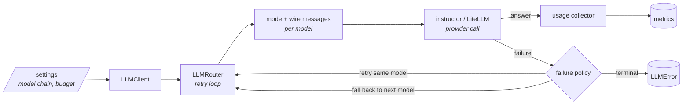

# LLM

`llm` is the one client through which Spec Forge talks to a language model. It
reads the model configuration, routes each call along a chain of models with a
retry and fallback policy, returns structured output validated by
[instructor](https://python.useinstructor.com/), prices a batch of calls before
any is sent, and reports what every call actually cost. Calls reach the
providers through [LiteLLM](https://docs.litellm.ai/).

> Its job is to answer one question: *"send these messages to the configured
model and give me back a validated answer — or tell me exactly why not, and what
it cost either way."*

The package is a leaf. It knows nothing about endpoints, prompts or contracts:
callers hand it a list of messages and, for a structured call, the Pydantic class
the answer must validate against. Its caller in the pipeline is
[Semantic Inference](../semantic-inference/index.md), which builds the prompts
and turns the answer into a contract.

## What a call goes through



1. **Settings** name the model chain — the primary model, then the fallbacks —
   and the time budget of one call. `LLMClient` checks every model has its key.
2. **The router** walks the chain inside one loop shared by text and structured
   calls, picking each provider's structured-output mode and marking the
   cacheable prompt prefix where the provider honours it.
3. **The policy** classifies a failed attempt into a `FailureKind`: retry the
   same model after a backoff, fall back to the next model, or stop.
4. **Metrics** fold the usage of every request into what the call returns, or
   into the error it raises.

The details of each step are in the [Reference](reference.md).

## Public API

The root package exports 27 names. Import them from `llm`; the sub-packages are
internal.

| Purpose | Names |
| --- | --- |
| Make a call | `LLMClient`, `LLMRouter`, `Message` |
| Configure | `LLMSettings`, `get_settings`, `ensure_credentials`, `get_required_api_key_env_vars`, `has_credentials_for_model` |
| Know a model | `ModelCatalog` |
| Read what a call cost | `LLMUsageMetrics`, `StructuredCompletionMetrics`, `format_cost_usd` |
| Price calls before sending them | `estimate_structured_calls`, `CostEstimate`, `CallEstimate`, `TokenBasis` |
| Understand a failure | `FailureKind`, `ModelFailure` |
| Catch a failure | `LLMError`, `EmptyCompletionError`, `LLMConfigurationError`, `LLMCompletionError`, `LLMAuthenticationError`, `LLMRequestRejectedError`, `LLMCallBudgetExceededError`, `LLMAllProvidersExhaustedError`, `LLMEstimationError` |

`LLMClient` is the entry point for callers. `LLMRouter` is the same machinery
with its collaborators injectable — the completion function, the instructor
factory, the clock, the random source, the usage collector and the catalog —
which is how the suites drive it without a network.

Every exception the package raises is an `LLMError`. LiteLLM's and instructor's
exceptions never cross the boundary: they are classified in one place and
re-raised as the hierarchy described in
[Failures and the policy](reference.md#failures-and-the-policy).

## Development requirements

The package targets Python 3.11+. It depends on LiteLLM, instructor,
Pydantic, pydantic-settings, python-dotenv and platformdirs. General setup and
test conventions are in
[Contributing & Testing](../../developer-guide/contributing.md#local-setup).

Install it in editable mode from `lib/llm`:

```bash
cd lib/llm
pip install -e ".[dev]"
```

The suite runs without a network. Tests marked `integration` make real calls
and need real credentials; they are excluded by default.

```bash
python -m pytest -q
python -m pytest -m integration
```

## Configuration

The package reads its configuration from the process environment and from an
env file. The file is `lib/llm/.env.local` in a source checkout (copy
`lib/llm/.env.local.example` to start), or the path named by `LLM_ENV_FILE`.
When a variable is set in both places, the process environment wins.

The variables, the providers and the key each one needs are listed in
[LLM Providers](../../user-guide/llm-providers.md) and
[Environment Variables](../../user-guide/environment.md). How the file is found
and how the sources combine is in
[Settings and the model chain](reference.md#settings-and-the-model-chain).

## Quick start

A text completion:

```python
from llm import LLMClient

client = LLMClient()
content, usage = client.complete_text(
    messages=[{"role": "user", "content": "Ping"}],
    max_tokens=5,
    temperature=0,
)
print(content, usage.total_tokens, usage.cost_usd)
```

A structured completion, validated against a Pydantic model:

```python
from pydantic import BaseModel

from llm import LLMClient, LLMCompletionError, LLMConfigurationError


class Answer(BaseModel):
    value: int


try:
    client = LLMClient()
    answer, metrics = client.complete_structured(
        messages=[{"role": "user", "content": "What is 6 * 7?"}],
        response_model=Answer,
    )
except LLMConfigurationError as exc:
    print("fix the configuration:", exc.missing)
except LLMCompletionError as exc:
    print("no answer:", [failure.kind for failure in exc.failures])
else:
    print(answer.value, metrics.total_cost_usd, metrics.parse_errors)
```

`LLMClient()` raises `LLMConfigurationError` before any call when `LLM_MODEL` is
missing or a model of the chain has no key. A call that ends without an answer
raises a subclass of `LLMCompletionError`, whose `failures` names what happened
to each model tried — or `LLMConfigurationError` again when a model refuses a
parameter or instructor cannot build its client, which no other model would fix.

## Read next

| If you want to | Read |
| --- | --- |
| Know what each failure does, how retries are timed, or how a cost is estimated | [Reference](reference.md) |
| Know *why* the policy, the modes and the estimate are shaped this way | [Decision records](adr/index.md) |
| Configure a provider | [LLM Providers](../../user-guide/llm-providers.md) |
| See the caller that builds the prompts | [Semantic Inference](../semantic-inference/index.md) |
