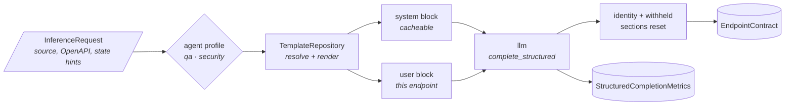

# Semantic Inference

`semantic_inference` turns the code context of one endpoint into a semantic
contract. It renders a prompt from the handler's source, the endpoint's OpenAPI
definition and the state links the orchestrator derived, sends it through the
[LLM client](../llm/index.md), and returns the answer as the kernel's
[`EndpointContract`](../contracts/index.md) together with what the call cost.

> Its job is to answer one question: *"given what the code and the OpenAPI
document say about this endpoint, which constraints, risks and rules should the
fuzzer know?"*

The package owns the domain side of inference: the agent profiles, the prompt
templates, the vocabulary the prompts name and the fingerprint of a prompt. It
owns none of the model machinery — model chain, retries, fallbacks, structured
output, pricing and usage all live in [`llm`](../llm/index.md). Its caller in the
pipeline is [Core](../core/index.md), which picks the profile from the fuzz mode,
caches the contracts and fuses each one with the OpenAPI definition through
[Contract Assembly](../contract-assembly/index.md).

The import package is `ai`; the distribution is `semantic-inference`.

## What an inference goes through



1. **The profile** is resolved from the agent slug before anything else; an
   unknown slug fails without rendering a template.
2. **The template** the profile resolves to is rendered into two blocks. The
   `system` block is the same for every endpoint under one profile; the `user`
   block carries the endpoint itself.
3. **`llm`** sends both as one structured completion validated against
   `EndpointContract`, with the `system` block marked cacheable.
4. **The contract** gets the request's `method` and `path_url`, whatever the
   model wrote there, and every section the profile does not fill is reset to
   its default.

How the prompt is built is in [Prompts](prompts.md); each step of a call, the
estimate and the errors are in [Inference engine](inference-engine.md).

## The two agent profiles

A profile is the lens the prompt is written from. There are two, `AgentProfile.QA`
(`qa`) and `AgentProfile.SECURITY` (`security`).

| Profile | Lens |
| --- | --- |
| `qa` | Functional correctness: boundary values, required and optional fields, type coercion, domain formats. |
| `security` | The trust boundary: authorization checks, injection-prone fields, encoding ambiguities, identifiers that must resist tampering. |

Both answer with JSON Schema for `parameters` and `body`, plus the contract
sections `sections_for(profile)` names. The prompt teaches exactly those
sections, and the engine keeps exactly those.

| `ContractSection` | `qa` | `security` | What the model is asked for |
| --- | :---: | :---: | --- |
| `required_parameters` | ✓ | ✓ | path, query and header parameters the code rejects a request without |
| `risk` | ✓ | ✓ | risk score, criticality, sensitivity and the side-effect flags |
| `attack` | | ✓ | the fields to attack, how hard, and per-field payload families |
| `transitions` | ✓ | ✓ | what a follow-up request must observe after this one succeeds |
| `semantic_properties` | ✓ | ✓ | business rules as closed expression trees |
| `access` | ✓ | ✓ | who may call the endpoint |

`qa` never asks for `attack`: the engine reads that section for hacker-mode
payloads and for the fields a finding redacts, and redaction already covers its
built-in list without it.

## Public surface

| Name | Where | What it is |
| --- | --- | --- |
| `SemanticInferenceEngine` | `ai.engine` | The entry point (below). |
| `EXPECTED_CONTRACT_OUTPUT_TOKENS` | `ai.engine` | The output size an estimate assumes per contract. |
| `InferenceRequest`, `StateHints`, `ProducedBundle`, `ConsumedBundle` | `ai.models` | The input of one inference. |
| `PromptFingerprint`, `RenderedPrompt` | `ai.models` | What shapes a prompt; a rendered prompt. |
| `AgentProfile`, `ContractSection`, `resolve_agent_profile`, `sections_for` | `ai.agents` | The profile registry. |
| `TemplateRepository` | `ai.prompts.loader` | Resolves and renders templates. |
| `CONTRACT_VOCABULARY`, `contract_prompt_context` | `ai.prompts.vocabulary`, `ai.prompts.context` | What the templates render with. |
| `inference_settings`, `required_api_key_env_vars` | `ai.config` | `llm` settings with overrides; the key a model needs. |
| `SemanticInferenceError` and its subclasses | `ai.models` | Everything the package raises. |

### `SemanticInferenceEngine`

| Method | Returns | Calls the model |
| --- | --- | --- |
| `generate_contract(request, *, agent)` | `(EndpointContract, StructuredCompletionMetrics)` | yes, once per call |
| `estimate_contracts(requests, *, agent, prompt_cache=True)` | `llm.CostEstimate` for the prompts `generate_contract` would send, in order | no |
| `prompt_fingerprint(agent)` | `PromptFingerprint` of the agent's prompt | no |

The constructor takes three optional keyword arguments: `llm_client`,
`templates` (a `TemplateRepository`) and `settings` (`llm.LLMSettings`). Without
them it builds the client from `llm.get_settings()` and loads the packaged
templates.

## Inputs

`InferenceRequest` is everything one inference needs. It is declared from
primitives, so the package never imports the stages that produce its fields.

| Field | Type | Meaning |
| --- | --- | --- |
| `system_context` | `str` | The endpoint's source context, as the static analysis packed it. |
| `is_partial_context` | `bool` | Some called code could not be resolved; the prompt warns the model. |
| `estimated_tokens` | `int` | The analysis' size estimate of the context. Carried with the request; the engine counts the rendered prompt itself. |
| `method`, `path_url` | `str` | The endpoint's identity; the contract always keeps these. |
| `openapi_endpoint` | `dict` | The endpoint's OpenAPI definition, including its resolved `security`. |
| `state_hints` | `StateHints \| None` | The state-link bundles the endpoint produces and consumes. |

`StateHints` holds two lists. A `ProducedBundle` (`bundle`, `response_field`) is
a value the orchestrator captures from this endpoint's response. A
`ConsumedBundle` (`bundle`, `target_zone`, `target_field`) is a value it injects
into this endpoint's request. The bundle names come from the route topology, not
from the handler, so the model cannot guess them: `transitions[].bundle` and
`access.owner_bundle` must name one of them. A request without hints renders as
an endpoint that produces and consumes nothing.

## Development requirements

The package targets Python 3.11+ and depends on Jinja2, Pydantic, the shared
kernel `specforge-contracts` and `specforge-llm`. General setup is in
[Contributing & Testing](../../developer-guide/contributing.md#local-setup).

Install it with its two local dependencies from `lib/semantic_inference`:

```bash
cd lib/semantic_inference
pip install -e ../contracts -e ../llm -e ".[dev]"
```

The test commands are in
[Contributing & Testing](../../developer-guide/contributing.md#exceptions). Tests
marked `integration` call a real model and need a configured `LLM_MODEL` and its
key. The compatibility gates under `tests/compat/` import Contract Assembly and
the execution engine at test time and skip when those are not installed.

The package has no configuration of its own: the model chain and the keys are
`llm` settings, described in [LLM › Configuration](../llm/index.md#configuration).

## Quick start

```python
from ai.engine import SemanticInferenceEngine
from ai.models import InferenceRequest

engine = SemanticInferenceEngine()

request = InferenceRequest(
    system_context="<xml>handler...</xml>",
    is_partial_context=False,
    estimated_tokens=512,
    method="POST",
    path_url="/orders",
    openapi_endpoint={"path": "/orders", "method": "post"},
    state_hints={"produces": [{"bundle": "orders_id", "response_field": "id"}]},
)

estimate = engine.estimate_contracts([request], agent="qa")
print(estimate.input_tokens, estimate.cost_usd)

contract, metrics = engine.generate_contract(request, agent="qa")
print(contract.method, contract.path_url, metrics.total_cost_usd)
```

`SemanticInferenceEngine()` raises `InferenceConfigurationError` when `LLM_MODEL`
is missing or a model of the chain has no key. The estimate sends nothing; the
second call sends one structured completion.

## Read next

| If you want to | Read |
| --- | --- |
| Know what the model is told, and how a prompt is identified | [Prompts](prompts.md) |
| Follow a call, an estimate or an error | [Inference engine](inference-engine.md) |
| Know *why* the prompt carries what it carries | [Decision records](adr/index.md) |
| Configure a model or a provider | [LLM](../llm/index.md) |
| Read the contract the model answers with | [Contracts](../contracts/index.md) |
