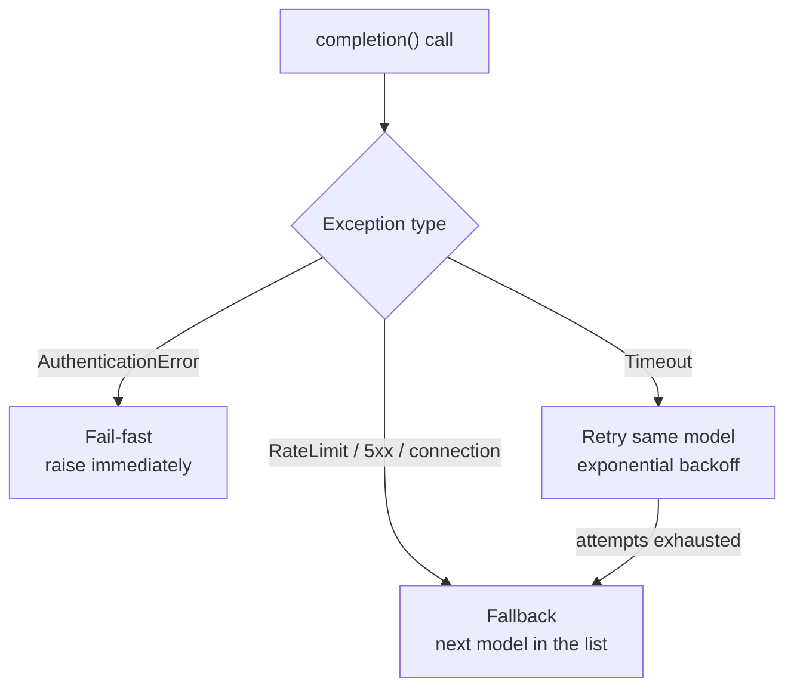

# Semantic Inference — LLM router

`ModelRouter` is the single choke point every inference call goes through. It
wraps [LiteLLM](https://github.com/BerriAI/litellm) so the rest of the codebase
never talks to a provider SDK directly, and layers retry/fallback resilience on
top so a flaky provider doesn't take the pipeline down with it.

## Why centralize on LiteLLM

- **One call shape, any provider.** `litellm.completion(...)` is the only call
  site — OpenAI, Anthropic, Gemini, Groq and Mistral are configuration, not code.
- **Adding a provider is a config change.** New models plug in via
  [environment variables](../../user-guide/llm-providers.md), not new client code.

## Resilience: retry vs. fallback

Not every failure means "try someone else." The router classifies each LiteLLM
exception and reacts differently:

| Error | Likely cause | Router behavior |
|---|---|---|
| `AuthenticationError` | Invalid or expired API key. | **Fail-fast** — raises immediately. No retry: a bad key never recovers on its own, and retrying would just mask the misconfiguration. |
| `Timeout` | Model is slow to respond. | **Retry**, same model, waiting `RETRY_BACKOFF_BASE_SECONDS * attempt` between tries. |
| `RateLimitError`, `InternalServerError`, `ServiceUnavailableError`, `APIConnectionError`, `BadGatewayError` | Quota exhausted or provider-side outage. | **Fallback** — moves to the next model in the configured list. |

A retry spiral always happens **before** a fallback: `complete_text` exhausts the
current model's retry budget first, and only then advances to the next model. Each
fallback switch and retry attempt is logged via `logging.warning` — wire up log
handlers at the entrypoint/service level to see them; the logging calls exist
today, a global log configuration is the piece left for whoever owns that
entrypoint.

## Structured completion (Instructor)

Beyond plain text, `ModelRouter.complete_structured()` returns a **validated
Pydantic object** instead of raw text, using [Instructor](https://python.useinstructor.com/)
for schema-guided generation and self-correction:

- Picks an `instructor.Mode` matched to the provider behind the model name
  (`ANTHROPIC_JSON`, `JSON_SCHEMA`, `MISTRAL_STRUCTURED_OUTPUTS`, `TOOLS`, …).
- On a Pydantic validation failure, re-asks the model with the validation error
  and its own previous (invalid) response attached, up to `max_retries` times.
- Gemini/Vertex AI go through a dedicated JSON-loop path instead of Instructor's
  hook system, since those providers need different structured-output handling.
- Returns `(validated_model, StructuredCompletionMetrics)` — the metrics track
  attempts, retries, token usage and cost per call, aggregated across every
  attempt (including failed ones), so callers can account for the full cost of
  a self-correcting request.

## Read next

- [User Guide → LLM Providers](../../user-guide/llm-providers.md): the
  provider/variable table and credential setup.
- [Semantic Inference overview](index.md): where the router sits in the
  inference pipeline, and the test tiers.
