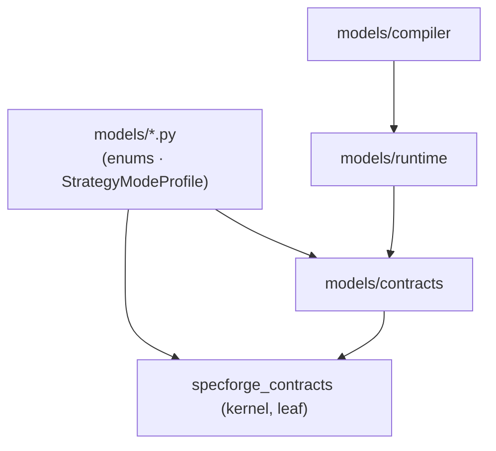
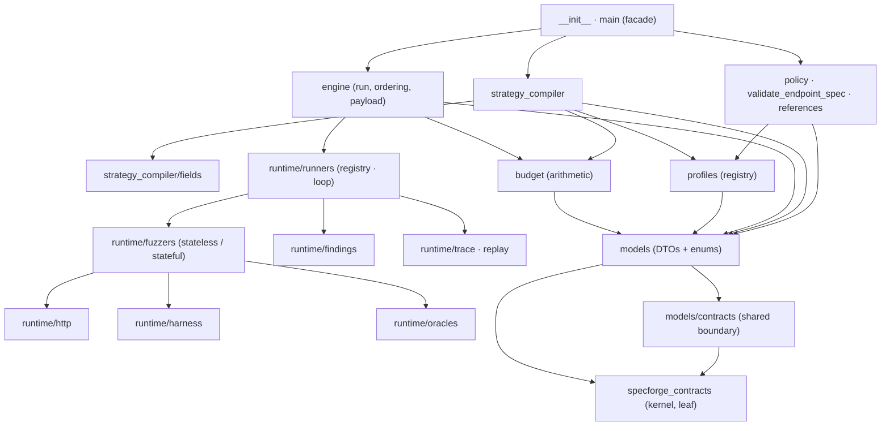

# Architecture

The engine is a one-directional pipeline of three stages over a shared set of
DTOs and vocabulary enums. Every stage takes a typed input and emits a typed
output; dependencies point one way only.

## Layers

| Layer | Package | Responsibility | Never does |
|---|---|---|---|
| **policy** | `policy/` | validate the compiler input at the boundary | HTTP, LLM calls |
| **strategy_compiler** | `strategy_compiler/` | validated contracts → `SearchStrategy`s | HTTP, re-validation |
| **engine** | `runtime/` | execute, check, minimize, report | see a `StrategyMode` |

Three leaf packages sit under the stages and are shared without inverting the
direction:

- **`models/`** — the single owner of every domain DTO and vocabulary enum.
- **`profiles/`** — the strategy-mode registry (`DEFAULT`, `HACKER`).
- **`budget/`** — the single home of example-budget arithmetic.

The leaf of the whole graph is [`specforge_contracts`](../contracts/index.md),
the shared kernel: it owns the closed vocabularies `Zone`, `Criticality`,
`Sensitivity`, `AttackProfile` and the semantic DTOs `EndpointRisk`,
`EndpointAttack`, `TransitionInvariant`, `SemanticProperty`. The engine imports
the kernel; the kernel never imports the engine.

## Module layout

```text
src/specforge_engine/
├── __init__.py            # Public facade, curated __all__
├── main.py                # compile_strategies() and run(): thin delegators
├── constants.py           # Engine-health numbers shared by two or more layers
├── exceptions.py          # Domain exception taxonomy
├── phase_extension_builtins.py  # composition root: registers the builtin SEMANTIC extension
├── shared/                # Stage-neutral helpers; import only models, never a stage
│   ├── numeric.py         # is_multiple_of: exact arithmetic shared by compiler and oracles
│   ├── field_addressing.py # is_field_addressed: which zone/field a directive targets
│   ├── semantic_properties.py # has_input_constraint: the neutral leaf both layers read
│   └── phase_extensions.py # PhaseExtension value object + its registry (isolated, register, lookup)
├── models/                # DTOs and enums (see below)
├── profiles/              # Strategy-mode profiles: registry, builtin DEFAULT / HACKER
├── budget/                # Example allocation, aggressiveness, risk weighting, shares
├── policy/                # validate_endpoint_spec, field-reference checks
├── strategy_compiler/     # Per-endpoint compile, zones, planning, fields/
│   ├── compiler.py        # compile(): per-endpoint orchestration, exclusions
│   ├── zone.py            # ZoneCompileContext, compile_zone
│   ├── planning.py        # build_generation_plan, estimate_parameter_space
│   ├── effective_phases.py # effective_phases / effective_split: read the extension registry
│   ├── constants.py       # boundary tables, choice counts, attack-profile maps
│   └── fields/            # Field → SearchStrategy
│       ├── context.py     # GenerationContext, EMPTY_CONTEXT
│       ├── schema_view.py # SchemaView: typed reader over a contract
│       ├── registry.py    # phase registry: register_phase, resolve_phase, isolated
│       ├── builtin.py     # the seven built-in phase registrations
│       ├── default/       # valid · boundary · invalid · constraints
│       └── hacker/        # request · mutation · mutation_operators · payloads · builders · tables
└── runtime/                # Execution
    ├── facade.py          # run(): resolve the mode, open one client, dispatch, hold safe endpoints
    ├── safety_guard.py    # partition_by_safety: hold declared side-effect endpoints back
    ├── payload.py         # ZonedPayload: the value object a strategy draws
    ├── ordering.py        # order_by_risk: most-risky-first, before dispatch
    ├── progress/          # Throttled counters and lifecycle events pushed to an observer
    ├── http/              # Async orchestrator, request injection, credentials, error classifier
    ├── harness/           # The Hypothesis bridge: one event loop, settings, identity strategy
    ├── oracles/           # Response oracles: verdict leaf, intrinsic rules, registry, precedence, the nine builtins
    ├── findings/          # Group, deduplicate, materialize, shrink, stats
    ├── fuzzers/           # stateless/ and stateful/ procedures
    ├── state_link/        # Shared bundle capture and status matching (stateful + auth)
    ├── trace/             # Record, rehydrate, canonical JSON, URL userinfo
    ├── replay/            # Fidelity assessment, pacing
    └── runners/           # One runner per ExecutionMode, the shared loop, resilience/, auth/
```

The two root leaves — `constants.py` and `exceptions.py` — import nothing from
the package, so any layer, `models/` included, can import them without a cycle.
`constants.py` holds only the engine-health numbers two or more layers read
(`MAX_AGGRESSIVENESS`, `MAX_INFRA_FAILURES`, the status-class thresholds,
`CANCELLATION_POLL_INTERVAL_S`); every stage keeps its own
`constants.py` for what only it uses. The two phase splits are not shared
constants: they are the data with which `profiles/builtin.py` registers the
`DEFAULT` and `HACKER` profiles
([ADR-002](adr/foundations.md#adr-002)).

## The models package

`models/` owns every DTO and vocabulary enum. Nothing else in the package
declares a domain type.

```text
models/
├── execution_mode.py · strategy_mode.py · phase.py · schema.py   # vocabulary enums (StrEnum)
├── profile.py          # StrategyModeProfile: what one strategy mode decides
├── contracts/          # the contract vocabulary: kernel re-exports + the engine's own contracts
│   ├── dialect.py · normalization.py · response.py · state_link.py · endpoint_controls.py
│   └── strategies/     # BaseStrategyContract, HackerStrategyContract
├── compiler/           # compiler-side DTOs: CompilerInput, EndpointSpec, RequestZones, CompilationOutcome
└── runtime/             # engine-side DTOs: EngineInput, GenerationPlan, runtime, options, results, trace, replay
```

The enums sit at the package root because both the compiler and the engine key
on them. `StrategyModeProfile` (a frozen dataclass) also sits at the root: it
binds a `StrategyMode` to its phase split, allowed-field matrix and contract
type, and belongs to neither stage. The registry that holds the profiles is in
`profiles/`, so `models/` stays purely DTOs and enums.

Dependencies inside `models/` are acyclic and point downward:



`models/compiler` depends on `models/runtime` because `CompilationOutcome`
carries the `EngineInput` the engine consumes; `models/runtime` depends on
`models/contracts` because compiled endpoints keep the contract's risk, attack,
response and state-link DTOs; `models/contracts` re-exports the kernel and adds
the engine's own contracts. `GenerationPlan` lives in `models/runtime/plan.py`
because it is a field of `CompiledEndpointStrategies` — part of the shape of
`EngineInput`, produced by the compiler and read by the engine
([ADR-006](adr/models.md#adr-006), [ADR-011](adr/models.md#adr-011)).

## Package map



## Dependency rules

- Upstream never imports downstream at runtime: `policy` → `strategy_compiler`
  → `engine`.
- Stages communicate through frozen DTOs, never shared mutable state. The one
  sanctioned module-level state is a registry, populated at import and reset
  through a public `isolated()` seam ([Extension guide](extension-guide.md)).
- The engine consumes `EngineInput` alone and knows nothing about contracts or
  `StrategyMode`.
- Inside `strategy_compiler/fields/`, `hacker/` may import `default/`, never
  the reverse.
- Every vocabulary enum is `enum.StrEnum`, so an enum-keyed map serializes to
  its wire strings ([ADR-004](adr/models.md#adr-004)).

## `ExecutionResult` is the canonical record of a request

Every request the engine sends produces one `ExecutionResult`. The stats
builders in `runtime/findings/` and the trace recorder in `runtime/trace/` are
projections of that stream — a read model each, never a second source of
truth. That is why a counter has exactly one producer and why the trace and
the stats of one run always agree ([ADR-017](adr/engine.md#adr-017)).

## The rules the shape answers to

| Rule | How the shape honours it |
|---|---|
| The three-stage boundary is strict | policy / strategy_compiler / engine, each testable alone |
| Models have one owner and are closed by default | `models/` owns every DTO; `extra="forbid"` everywhere |
| Extension by Protocol and registry, never by `if` or inheritance | five registries: runners, profiles, phases, oracles, transports |
| Determinism where it matters | policy and compiler are pure; mutable state is run-scoped |
| HTTP execution rules stay put | one event loop in a daemon thread; the orchestrator is required |
| Honest signal | one producer per counter; flaky is measured, not subtracted |
| User policy is separate from engine stability | `*Options` for user policy; `constants.py` for stability numbers |
| Domain exceptions, no `print` | `SpecforgeEngineError` taxonomy; the engine raises, the CLI renders |
| Dependencies point one way | the kernel is the leaf; the engine imports it, never the reverse |
