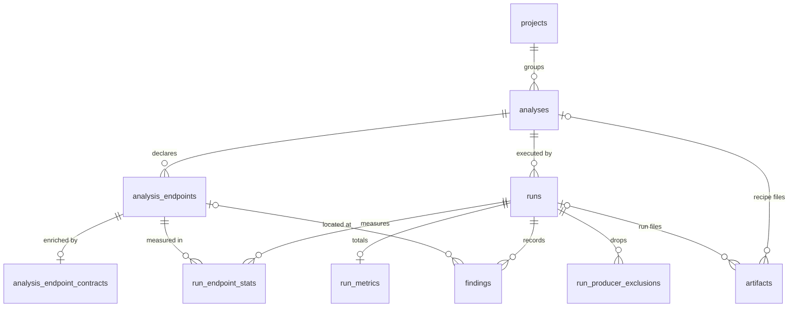

# Data model

Storage keeps its data in eleven SQLite tables, declared in `schema.sql`, and exposes each one
as a frozen pydantic record. A record's fields are exactly its table's columns, in order: the
repository derives its column list from the record, and a test compares that list with the
columns SQLite reports. So each table below documents the schema and the record at once.

Ten tables form the project → analysis → run hierarchy drawn below. The eleventh,
[`inferred_contracts`](#inferred_contracts), stands outside it: the cache of the contracts
the inference producer already paid for, keyed by what determines the prompt.

Deleting a parent row deletes its children (`ON DELETE CASCADE`), with one exception: deleting
an analysis endpoint keeps its findings and sets their `analysis_endpoint_id` to NULL
(`ON DELETE SET NULL`). The schema and every connection turn on `PRAGMA foreign_keys`. No
foreign key reaches `inferred_contracts`, so no delete in the hierarchy touches it.

## Conventions

- **One record per table.** Frozen, rejects unknown fields, built from a row. The database assigns
  `id`, `analyses.created_at`, `runs.executed_at` and `inferred_contracts.created_at`: a record
  passed to `create()` or `put()` leaves them `None`.
- **Structured data is JSON text.** A column holding a list or a map is `TEXT` with
  serialized JSON, and its record field says so. Storage never parses it.
- **A missing fact is NULL.** `run_endpoint_stats` never stores an empty JSON list or object.
- **No secondary indexes.** Only those SQLite creates for primary keys and UNIQUE constraints.
- **Booleans are integers.** `is_original`, `critical`, `compressed`: `0`/`1`, a `bool` in the record.

## Tables

### `projects` — `ProjectRecord` { #projects }

The root of the hierarchy: the repository a set of analyses belongs to.

| Column | Type | Null | Default | Meaning |
| --- | --- | --- | --- | --- |
| `id` | INTEGER | no | — | Primary key, assigned by the database. |
| `name` | TEXT | no | — | Human-readable project name. |
| `repo_path` | TEXT | no | — | Filesystem path to the project's repository. |

Constraints: `UNIQUE (name, repo_path)`.

### `analyses` — `AnalysisRecord` { #analyses }

The replicable recipe a run executes: resolved contracts, strategy and execution configuration.

| Column | Type | Null | Default | Meaning |
| --- | --- | --- | --- | --- |
| `id` | INTEGER | no | — | Primary key, assigned by the database. |
| `project_id` | INTEGER | no | — | The project (`projects.id`). |
| `created_at` | DATETIME | yes | `CURRENT_TIMESTAMP` | When the analysis was created; set by the database. |
| `label` | TEXT | yes | — | An optional human-readable label. |
| `generated_against_repo_hash` | TEXT | no | — | Repository hash the analysis, and its recorded trace, was generated against. |
| `strategy_mode` | TEXT | no | — | The strategy mode the trace was generated with. |
| `execution_mode` | TEXT | no | — | How the trace was generated: `stateless`, `stateful`, `performance`, `resilience` or `auth`. Replay is never an analysis's mode: a replay re-sends an existing analysis's trace. |
| `execution_options` | TEXT | yes | — | The execution mode's effective options as JSON; NULL for a mode without options. |
| `execution_config` | TEXT | no | — | The execution configuration as JSON, headers already sanitized. |
| `engine_version` | TEXT | yes | — | Engine version that produced the analysis; provenance only. |
| `contracts_hash` | TEXT | yes | — | Hash of the produced contracts, ordered by (method, path); NULL when the analysis is schema-only. |
| `producer` | TEXT | yes | — | JSON provenance of the contract producer; NULL when the analysis is schema-only. |

Constraints: none beyond the foreign key; `execution_mode` is not CHECKed.

### `analysis_endpoints` — `AnalysisEndpointRecord` { #analysis_endpoints }

Every endpoint the analysis declared, plus every undeclared one a run reached: a filterable
summary, since the concrete values probed live in the recorded trace.

| Column | Type | Null | Default | Meaning |
| --- | --- | --- | --- | --- |
| `id` | INTEGER | no | — | Primary key, assigned by the database. |
| `analysis_id` | INTEGER | no | — | The analysis (`analyses.id`). |
| `method` | TEXT | no | — | HTTP method, e.g. `GET`. |
| `path` | TEXT | no | — | URL path, e.g. `/api/v1/users`. |
| `disposition` | TEXT | no | — | The partition the endpoint fell in: one of the [coverage dispositions](../core/protocol/vocabularies.md#coverage). |
| `exclusion_reason` | TEXT | yes | — | Why the compiler rejected the endpoint; set exactly when `disposition` is `excluded`. |

Constraints: `UNIQUE (analysis_id, method, path)`; `disposition` CHECK in the four
dispositions; `exclusion_reason` [paired](#paired-columns) with `excluded`.

### `analysis_endpoint_contracts` — `AnalysisEndpointContractRecord` { #analysis_endpoint_contracts }

One row per endpoint enriched with a produced contract; a schema-only endpoint has none. It
hangs off the endpoint, not the run, because the enriched contract is part of the recipe.

| Column | Type | Null | Default | Meaning |
| --- | --- | --- | --- | --- |
| `id` | INTEGER | no | — | Primary key, assigned by the database. |
| `analysis_endpoint_id` | INTEGER | no | — | The endpoint (`analysis_endpoints.id`). |
| `contract_json` | TEXT | no | — | Canonical JSON of the fused `EndpointContract`. |
| `contract_sha256` | TEXT | no | — | SHA-256 of `contract_json`. |
| `kernel_version` | TEXT | yes | — | Version of the contracts kernel (`specforge-contracts`) that shaped the contract. |

Constraints: `UNIQUE (analysis_endpoint_id)`.

### `runs` — `RunRecord` { #runs }

One execution of an analysis. The original run generates and records the trace, with
shrinking; a replay re-executes that trace without generating anything new.

| Column | Type | Null | Default | Meaning |
| --- | --- | --- | --- | --- |
| `id` | INTEGER | no | — | Primary key, assigned by the database. |
| `analysis_id` | INTEGER | no | — | The analysis this run executes (`analyses.id`). |
| `executed_at` | DATETIME | yes | `CURRENT_TIMESTAMP` | When the run started executing; set by the database. |
| `duration_ms` | INTEGER | yes | — | How long the engine ran, in milliseconds; producing the contracts is not included. |
| `production_duration_ms` | INTEGER | yes | — | How long producing the run's contracts took before the engine ran, tracing and pricing included, in milliseconds; NULL when the run had no producer, and always for a replay. |
| `executed_against_repo_hash` | TEXT | no | — | Repository hash the run was actually executed against. |
| `status` | TEXT | no | — | The materialized [run outcome](../core/protocol/vocabularies.md#run-status). `safety_breached` is not a cut: it records no truncation of its own. |
| `oracle_scope` | TEXT | no | — | [Which oracles](../core/protocol/vocabularies.md#oracle-scope) judged the responses: the contract's, or only those that need none. |
| `ordinal` | INTEGER | no | — | Position of the run within its analysis; `1` is the original. |
| `is_original` | INTEGER | no | `0` | `1` for the run that generated and recorded the trace. |
| `fidelity` | TEXT | yes | — | Replay fidelity, `exact` or `reduced`; NULL for an original run. |
| `truncation_reason` | TEXT | yes | — | Why the run was cut short (an engine reason token); NULL when it was not. |
| `truncation_endpoint_id` | TEXT | yes | — | The endpoint being explored when the run was cut short; NULL when it was not. |
| `truncation_detail` | TEXT | yes | — | What happened when the run was cut short. |
| `target_down_verdict` | TEXT | yes | — | How the target was ruled down (an engine verdict token). |
| `contract_cache_hits` | INTEGER | yes | — | Endpoints whose contract the [inferred-contract cache](#inferred_contracts) reused; NULL when the run used no cache. |
| `contract_cache_misses` | INTEGER | yes | — | Endpoints whose contract the run inferred anew; NULL when the run used no cache. |
| `inference_estimated_input_tokens` | INTEGER | yes | — | Input tokens the estimate expected for the inferences the run had to pay for; NULL when the run had no inference producer. |
| `inference_estimated_output_tokens` | INTEGER | yes | — | Output tokens the estimate expected; NULL when the run had no inference producer. |
| `inference_estimated_cost_usd` | REAL | yes | — | The estimate's cost, in US dollars; NULL when the run had no inference producer or the model is unpriced. |
| `inference_input_tokens` | INTEGER | yes | — | Input tokens the run's inferences really consumed; NULL when the run had no inference producer. |
| `inference_output_tokens` | INTEGER | yes | — | Output tokens the run's inferences really produced; NULL when the run had no inference producer. |
| `inference_cost_usd` | REAL | yes | — | What the run's inferences really cost, in US dollars; NULL when the run had no inference producer or the model is unpriced. |

Constraints: `UNIQUE (analysis_id, ordinal)`; `status` and `oracle_scope` CHECK in their
[closed vocabularies](#closed-vocabularies); the truncation columns are [paired](#paired-columns).

The cache and inference columns follow one null policy: NULL means the run had no producer to
report, or no price, never a zero. A run with no inference producer (a fixture producer, no
producer, and always a replay) leaves all six `inference_*` columns NULL. A run whose contracts
all came from the cache stores zeros: a real spend of nothing. An unpriced model leaves its
cost NULL while its token counts stay set. The schema alone enforces these columns, with no
check in `create()`; a write that breaks one fails as `ConstraintViolationError`:

- `contract_cache_hits` and `contract_cache_misses` are both set or both NULL, and not negative.
- The four `inference_*` token counts are all set or all NULL, and not negative.
- A cost is set only next to the token counts, and is not negative.

### `run_metrics` — `RunMetricsRecord` { #run_metrics }

The aggregate counts of one run. Coverage is not stored here: a denominator is a `GROUP BY`
over `analysis_endpoints` and `run_endpoint_stats`.

| Column | Type | Null | Default | Meaning |
| --- | --- | --- | --- | --- |
| `run_id` | INTEGER | no | — | The run (`runs.id`), and the primary key: at most one row per run. |
| `total_requests` | INTEGER | no | — | Requests the run attempted, including any that never left the client. |
| `findings_raw` | INTEGER | no | — | Violations found during exploration, before shrinking. |
| `findings_confirmed` | INTEGER | no | — | Findings that reproduced after shrinking. |
| `findings_unique` | INTEGER | no | — | Distinct defects found; equal to the run's confirmed rows in `findings`. |
| `findings_flaky` | INTEGER | no | — | Findings that did not reproduce after shrinking. |
| `findings_collapsed` | INTEGER | no | `0` | Findings never shrunk because another with their signature was. |
| `findings_unverified` | INTEGER | no | `0` | Findings never attempted: the run was cut before shrinking, or the strategy could not produce a candidate. |
| `requests_shrink` | INTEGER | no | `0` | Requests sent while shrinking (in a stateful run, also while minimizing the sequence); not part of `total_requests`. |
| `by_phase` | TEXT | yes | — | JSON breakdown of requests per phase. |
| `by_category` | TEXT | yes | — | JSON breakdown of requests per error category. |

Constraints: none beyond the foreign key. The three defaulted counts are zero in a mode
that never shrinks; a stateful run, which shrinks inside each pass, records its
`requests_shrink` but leaves the other two at zero.

### `run_endpoint_stats` — `RunEndpointStatsRecord` { #run_endpoint_stats }

The per-endpoint detail of a run. The seven `latency_*` columns are the record's `latency`
field, a [`LatencyRecord`](#value-objects), sampling only requests that reached the wire.

| Column | Type | Null | Default | Meaning |
| --- | --- | --- | --- | --- |
| `id` | INTEGER | no | — | Primary key, assigned by the database. |
| `run_id` | INTEGER | no | — | The run (`runs.id`). |
| `analysis_endpoint_id` | INTEGER | no | — | The endpoint (`analysis_endpoints.id`). |
| `requests` | INTEGER | no | — | Requests attempted against the endpoint, counted like `total_requests`. |
| `examples_planned` | INTEGER | no | `0` | Examples the fuzzer planned for the endpoint, drawn or not; `requests` may exceed it. |
| `findings_raw` | INTEGER | no | — | Violations found at the endpoint, before shrinking. |
| `findings_confirmed` | INTEGER | no | `0` | Count of the endpoint's confirmed rows in `findings`. |
| `latency_count` | INTEGER | no | `0` | `latency.count`: latency samples timed, so it can be lower than `requests`; `0` tells "nothing timed" apart from zero latencies. |
| `latency_min_ms` | REAL | no | `0` | `latency.min_ms`: minimum latency, in milliseconds. |
| `latency_max_ms` | REAL | no | `0` | `latency.max_ms`: maximum latency, in milliseconds. |
| `latency_mean_ms` | REAL | no | `0` | `latency.mean_ms`: mean latency, in milliseconds. |
| `latency_p50_ms` | REAL | no | `0` | `latency.p50_ms`: 50th percentile (nearest-rank). |
| `latency_p95_ms` | REAL | no | `0` | `latency.p95_ms`: 95th percentile (nearest-rank). |
| `latency_p99_ms` | REAL | no | `0` | `latency.p99_ms`: 99th percentile (nearest-rank). |
| `starved_identities` | TEXT | yes | — | JSON list of the identity labels the budget could not fund here. |
| `undecided_rules` | TEXT | yes | — | JSON list of the ids of declared rules evaluated here that the run could never decide. |
| `held_back_by` | TEXT | yes | — | The risk flag that kept the safety guard from probing the endpoint; NULL when it was probed. |
| `held_back_via` | TEXT | yes | — | The id of the endpoint whose risk flag held this one back, its own id when its own flag did; NULL exactly when `held_back_by` is. |
| `unprobed_reason` | TEXT | yes | — | Why the run sent nothing here: by the mode's design, or because an access precondition could not be met (one of the [`unprobed_reason` values](../core/protocol/vocabularies.md#unprobed-reason)). |
| `load_profile` | TEXT | yes | — | JSON list of the concurrency-ladder steps a performance run measured here. |
| `by_category` | TEXT | yes | — | JSON object: error category → requests at this endpoint that ended in it. |
| `held_back_transitions` | TEXT | yes | — | JSON object: follow-up endpoint id the safety guard kept from being sent → why. |
| `truncation_reason` | TEXT | yes | — | Why this endpoint's own pass was cut short (an engine reason token); NULL when it ran to completion or the mode has no per-endpoint pass. |
| `truncation_detail` | TEXT | yes | — | What happened when this endpoint's own pass was cut short. |

Constraints: `UNIQUE (run_id, analysis_endpoint_id)`; `truncation_detail` only with a
`truncation_reason`; `held_back_by` and `held_back_via` [paired](#paired-columns). A cancellation before the endpoint started is the run's cut, not its own.

### `findings` — `FindingRecord` { #findings }

One row per finding, confirmed or not. The record refuses a `confirmed` row without its full
reproducer: `status_code`, `minimal_payload`, `sanitized_headers` and `response_body`.

| Column | Type | Null | Default | Meaning |
| --- | --- | --- | --- | --- |
| `id` | INTEGER | no | — | Primary key, assigned by the database. |
| `run_id` | INTEGER | no | — | The run (`runs.id`). |
| `analysis_endpoint_id` | INTEGER | yes | — | The endpoint (`analysis_endpoints.id`); NULL for a finding whose stateful chain spans several endpoints. |
| `method` | TEXT | no | — | HTTP method, e.g. `GET`. |
| `path` | TEXT | no | — | URL path, e.g. `/api/v1/users`. |
| `phase` | TEXT | no | — | Generation phase: `valid`, `boundary`, `invalid`, `attack`, `mutation`, `semantic` or `transition`. |
| `invariant_violated` | TEXT | no | — | The invariant the finding violated. |
| `state` | TEXT | no | — | The finding's outcome: `confirmed`, `flaky` or `unverified`. |
| `status_code` | INTEGER | yes | — | HTTP status code of the failing response. |
| `minimal_payload` | TEXT | yes | — | JSON minimal reproducible payload, keyed by zone; NULL with no reproducer. |
| `sanitized_headers` | TEXT | yes | — | JSON request headers, secrets already redacted by the engine; NULL with no reproducer. |
| `response_body` | TEXT | yes | — | The failing response body; NULL with no reproducer. |
| `stack_trace` | TEXT | yes | — | The stack trace the engine attached to a confirmed finding, when it had one. |
| `transition_sequence` | TEXT | yes | — | JSON request chain that built a stateful finding's state; NULL otherwise. |
| `represented_findings` | INTEGER | no | `1` | Raw findings this row stands for, itself included: its unshrunk group mates and the duplicates it absorbed. The record requires it. |
| `identity_label` | TEXT | yes | — | The identity the failing request was sent under; NULL when the run declared none. |
| `rule_id` | TEXT | yes | — | The rule the finding broke, declared by the contract or intrinsic to its invariant; NULL when the engine named none. |
| `rule_description` | TEXT | yes | — | Human-readable text of `rule_id`. |
| `body_fingerprint` | TEXT | yes | — | Shape, never values, of the response body behind an unconfirmed finding; `''` when there was no body, NULL for a confirmed finding. |

Constraints: `analysis_endpoint_id` is `ON DELETE SET NULL`. `phase` and `state` are free
text: the engine owns those vocabularies, and storage does not CHECK them.

### `run_producer_exclusions` — `RunProducerExclusionRecord` { #run_producer_exclusions }

One row per endpoint whose produced contract the run could not use: a `schema_only` one stayed
targeted without its contract; a `withheld` one was never fuzzed as a target, because its contract
declared a risk flag and could not be used. It is a fact about the run, not about the endpoint
catalog.

| Column | Type | Null | Default | Meaning |
| --- | --- | --- | --- | --- |
| `id` | INTEGER | no | — | Primary key, assigned by the database. |
| `run_id` | INTEGER | no | — | The run (`runs.id`). |
| `method` | TEXT | no | — | HTTP method, e.g. `GET`. |
| `path` | TEXT | no | — | URL path, e.g. `/api/v1/users`. |
| `reason` | TEXT | no | — | Why the producer's contract was dropped for this endpoint. |
| `disposition` | TEXT | no | — | What the run did with the endpoint: `schema_only` or `withheld`. |

Constraints: `disposition` CHECK in its [two values](#closed-vocabularies).

### `artifacts` — `ArtifactRecord` { #artifacts }

The index of the files on disk: recipe files at the analysis level (the execution trace),
report files at the run level. The file is written before its row ([ADR-082](adr/artifacts.md#adr-082)).

| Column | Type | Null | Default | Meaning |
| --- | --- | --- | --- | --- |
| `id` | INTEGER | no | — | Primary key, assigned by the database. |
| `analysis_id` | INTEGER | yes | — | The analysis (`analyses.id`), for an analysis-level artifact. |
| `run_id` | INTEGER | yes | — | The run (`runs.id`), for a run-level artifact. |
| `kind` | TEXT | no | — | Free-text artifact kind, e.g. `execution_trace` or `report_html`. |
| `path` | TEXT | no | — | Filesystem path of the file. |
| `sha256` | TEXT | no | — | SHA-256 of the logical, uncompressed content. |
| `size_bytes` | INTEGER | no | — | Bytes on disk: the compressed size once compressed. |
| `critical` | INTEGER | no | `0` | `1` when losing the artifact breaks reproducibility. |
| `compressed` | INTEGER | no | `0` | `1` when the file is stored gzipped; set by retention, never by the producer. |

Constraints: exactly one of `analysis_id` and `run_id` is set ([paired](#paired-columns)).

### `inferred_contracts` — `InferredContractRecord` { #inferred_contracts }

The cache of LLM-inferred endpoint contracts: one row per prompt input, kept as the inference
returned it, before it is fused over the OpenAPI base. A later inference over unchanged code
reuses the row instead of calling the model again. The key is content, so the table is global
to the store: the same handler in two projects shares its entry.

| Column | Type | Null | Default | Meaning |
| --- | --- | --- | --- | --- |
| `id` | INTEGER | no | — | Primary key, assigned by the database; a replaced entry gets a new one. |
| `cache_key` | TEXT | no | — | Content key of everything that shapes the prompt (core builds it as a SHA-256 digest of the endpoint, its code context, the agent profile, the kernel version and the prompt identity); the lookup key. |
| `method` | TEXT | no | — | HTTP method, e.g. `GET`. |
| `path_url` | TEXT | no | — | URL path, e.g. `/api/v1/users`. |
| `agent_profile` | TEXT | no | — | The agent profile the inference ran under. |
| `primary_model` | TEXT | no | — | The model the inference asked first. |
| `answering_model` | TEXT | yes | — | The model that actually answered; NULL when unreported. |
| `kernel_version` | TEXT | yes | — | Version of the contracts kernel (`specforge-contracts`) that shaped the contract. |
| `prompt_fingerprint` | TEXT | no | — | Serialized JSON identity of the prompt the contract answers; it is part of what `cache_key` digests. |
| `contract_json` | TEXT | no | — | JSON of the inferred `EndpointContract`. |
| `input_tokens` | INTEGER | no | — | Prompt tokens the inference consumed. |
| `output_tokens` | INTEGER | no | — | Completion tokens the inference produced. |
| `cost_usd` | REAL | yes | — | Cost of the inference, in US dollars; NULL when the model is unpriced. |
| `created_at` | DATETIME | yes | `CURRENT_TIMESTAMP` | When the inference behind this row ran; set by the database. |

Constraints: `UNIQUE (cache_key)`; token counts and `cost_usd` not negative (CHECK). No
foreign key in or out: deleting a project, an analysis or a run never touches the table, and
neither does retention. `InferredContractsRepository.put()` writes by replacement: an entry
under the same `cache_key` is deleted and a new row inserted, with a new `id` and a new
`created_at` ([put replaces](repositories.md#put-replaces)). How the key is built and when an
entry is reused is the caller's rule: the rows come from core's inference contract producer,
which replaces an entry on a refresh, or when the current kernel cannot parse it.

## Value objects { #value-objects }

| Record | Fields | Used for |
| --- | --- | --- |
| `LatencyRecord` | `count` (int, default `0`); `min_ms`, `max_ms`, `mean_ms`, `p50_ms`, `p95_ms`, `p99_ms` (float, default `0.0`) | An endpoint's latency distribution in milliseconds, percentiles by nearest rank; stored as the `latency_*` columns of `run_endpoint_stats`. |
| `ProducedContractRecord` | `method`, `path`, `contract_json` | The read projection `uow.analysis_endpoint_contracts.list_by_analysis()` returns, ordered by (method, path); it has no id. |
| `RunFilter` | `status`, `executed_since` (a date), `endpoint_path`, `limit` (at least 1) | Narrows `uow.runs.list_by_analysis()`. Every field is optional and additive: an exact status, runs executed on or after a UTC calendar date, runs with stats for an endpoint path, a cap on the count. |

The retention outcomes (`ReclaimOutcome`, `OrphanScan`, `CollectOutcome`) are described with
[retention](artifacts.md#retention).

## Closed vocabularies { #closed-vocabularies }

Four columns accept only a closed set of values. Each set is exported from `storage` as a
tuple and enforced twice: by a CHECK in the schema, and by the repository's `create()`, which
raises a typed error before the INSERT ([ADR-080](adr/repositories.md#adr-080)).

| Column | Tuple | Values | Rejected with |
| --- | --- | --- | --- |
| `runs.status` | `RUN_STATUSES` | `completed`, `truncated`, `aborted`, `cancelled`, `safety_breached` | `InvalidRunStatusError` |
| `runs.oracle_scope` | `ORACLE_SCOPES` | `contract`, `contract_free` | `InvalidOracleScopeError` |
| `analysis_endpoints.disposition` | `ENDPOINT_DISPOSITIONS` | `targeted`, `excluded`, `filtered`, `reached_by_transition` | `InvalidDispositionError` |
| `run_producer_exclusions.disposition` | `PRODUCER_EXCLUSION_DISPOSITIONS` | `schema_only`, `withheld` | `InvalidDispositionError` |

What each value means to a reader: [run status](../core/protocol/vocabularies.md#run-status),
[oracle scope](../core/protocol/vocabularies.md#oracle-scope), [coverage](../core/protocol/vocabularies.md#coverage),
[producer exclusion disposition](../core/protocol/vocabularies.md#producer-exclusion-disposition).

## Paired columns { #paired-columns }

Some columns only make sense together. A CHECK keeps each pair consistent, and the writer checks
it first so the caller gets a typed error naming the values ([ADR-079](adr/repositories.md#adr-079)).

| Table | Rule | Rejected with |
| --- | --- | --- |
| `runs` | `truncation_reason` and `truncation_endpoint_id` are both set or both NULL. | `IncompleteTruncationError` |
| `runs` | `truncation_detail` and `target_down_verdict` qualify a cut: set only with a `truncation_reason`. | `TruncationQualifierWithoutReasonError` |
| `run_endpoint_stats` | `truncation_detail` is set only with a `truncation_reason`. | `TruncationQualifierWithoutReasonError` |
| `run_endpoint_stats` | `held_back_by` and `held_back_via` are both set or both NULL. | `IncompleteHoldError` |
| `analysis_endpoints` | `exclusion_reason` is set exactly when `disposition` is `excluded`. | `IncompleteExclusionError` |
| `artifacts` | Exactly one of `analysis_id` and `run_id` is set. | `InvalidArtifactLevelError`, raised by `save_artifact` before any file is written |

## Fingerprint { #fingerprint }

`schema.sql` is applied with `CREATE TABLE IF NOT EXISTS`, which never adds a column to an
existing table. So the engine stamps SQLite's `user_version` with a CRC32 of the schema text,
read with line endings normalized so a CRLF and an LF checkout agree.

Opening a file whose `user_version` differs from the fingerprint and that already has tables
raises `SchemaMismatchError` with `db_path`, `expected_fingerprint` and `actual_fingerprint`;
an empty file is stamped and created. There are no migrations: when the schema changes,
delete the local database and let storage create it again ([ADR-076](adr/foundations.md#adr-076)).
