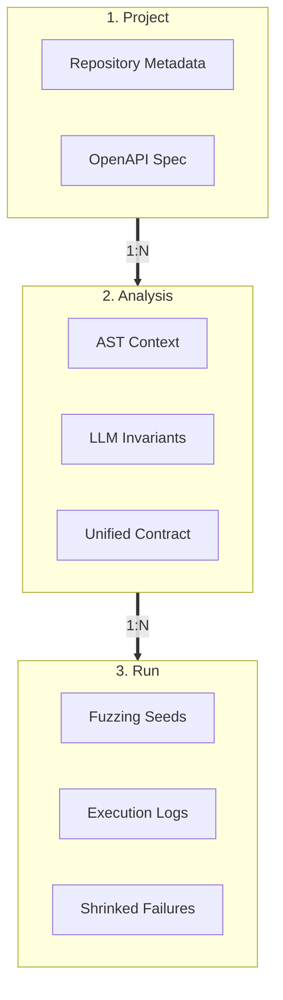

# Storage Engine

`lib/storage` persists Spec Forge executions in SQLite so analyses can be audited,
compared and replayed. Its unit of organization is:

An **analysis** is the reproducible recipe (resolved contracts and execution settings);
a **run** is one execution of that recipe. Repositories encapsulate parameterized SQL,
Pydantic DTOs validate data at the boundary, and domain exceptions prevent SQLite
driver errors from leaking to callers. A composed multi-table write (persisting a run)
runs as one all-or-nothing transaction through a **Unit of Work** — see the
[data model](data-model.md#transactional-boundary-unit-of-work).

## Read next

- [Data model](data-model.md): every persisted record, relationship and test setup.
- [Custom Schemathesis](../custom-schemathesis/index.md): producer of execution
  results and crash reports.
- [Core commands](../core/commands.md): the `fuzz` command persists each run
  through this engine (on by default, `--no-save` to opt out).
