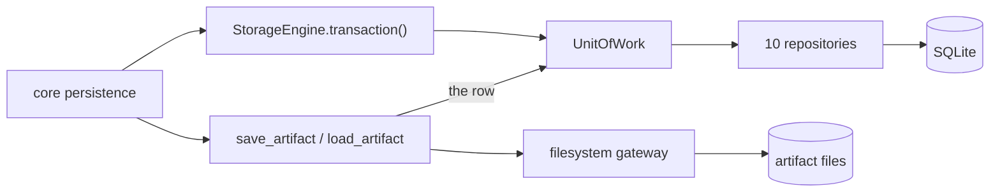

# Storage

Storage persists projects, analyses, runs, their findings and per-endpoint stats
in SQLite, and the files a run produces (traces, reports) on disk. It keeps what
a run needs to be audited, compared with another run and reproduced.


```mermaid
flowchart LR
    Core["core persistence"] --> Tx["StorageEngine.transaction()"]
    Tx --> UoW["UnitOfWork"]
    UoW --> Repos["10 repositories"]
    Repos --> DB[("SQLite")]
    Core --> Ops["save_artifact / load_artifact"]
    Ops -->|"the row"| UoW
    Ops --> Gw["filesystem gateway"]
    Gw --> Disk[("artifact files")]
```

## Project, analysis, run

| Entity | What it is |
| --- | --- |
| **project** | A repository under test, identified by its name and repository path. |
| **analysis** | The reproducible recipe: the endpoints it declared, their produced contracts and the execution settings. |
| **run** | One execution of an analysis. The first one recorded the trace; later ones are replays of it, numbered by `ordinal`. |

A project has many analyses and an analysis has many runs. Findings, metrics and
per-endpoint stats belong to a run. Every table is described in the
[data model](data-model.md).

## Quick start

Open an in-memory engine, open a transaction, and register the same project
twice:

```python
from storage import PersistedRecordError, ProjectRecord, StorageEngine

with StorageEngine(":memory:") as engine:
    with engine.transaction() as uow:
        demo = ProjectRecord(name="demo", repo_path="/repos/demo")
        first = uow.projects.get_or_create(demo)
        again = uow.projects.get_or_create(demo)
        print(first)
        print("same row:", first == again)
        try:
            uow.projects.get_or_create(first)
        except PersistedRecordError as exc:
            print(type(exc).__name__, exc.assigned)
```

```text
id=1 name='demo' repo_path='/repos/demo'
same row: True
PersistedRecordError ('id',)
```

The second call returns the row the first one stored. A record that already
carries a storage-assigned field, such as the `id` of `first`, is refused with
`PersistedRecordError`: a write takes a record that has not been stored yet
([the contract](repositories.md#the-contract)). The transaction commits when the
block exits and rolls back on any exception ([transactions](transactions.md)).

## Public API { #public-api }

Import from the top-level `storage` package. It exports 71 names:

| Group | Names | Described in |
| --- | --- | --- |
| Engine (2) | `StorageEngine`, `UnitOfWork` | [Transactions](transactions.md) |
| Artifact operations (7) | `save_artifact`, `load_artifact`, `compress_artifact`, `reclaim_artifacts`, `scan_orphans`, `collect_orphans`, `MIN_COMPRESSIBLE_BYTES` | [Artifacts](artifacts.md) |
| Records and value objects (16) | `ProjectRecord`, `AnalysisRecord`, `AnalysisEndpointRecord`, `AnalysisEndpointContractRecord`, `ProducedContractRecord`, `RunRecord`, `RunFilter`, `RunMetricsRecord`, `RunEndpointStatsRecord`, `LatencyRecord`, `FindingRecord`, `RunProducerExclusionRecord`, `ArtifactRecord`, `ReclaimOutcome`, `OrphanScan`, `CollectOutcome` | [Data model](data-model.md); the last three in [retention](artifacts.md#retention) |
| Vocabularies (3) | `RUN_STATUSES`, `ORACLE_SCOPES`, `ENDPOINT_DISPOSITIONS` | [Closed vocabularies](data-model.md#closed-vocabularies) |
| Repositories (10) | `ProjectRepository`, `AnalysisRepository`, `AnalysisEndpointRepository`, `AnalysisEndpointContractRepository`, `RunRepository`, `RunMetricsRepository`, `RunEndpointStatsRepository`, `FindingsRepository`, `RunProducerExclusionsRepository`, `ArtifactRepository` | [Repositories](repositories.md#reference) |
| Configuration (1) | `get_artifacts_root` | [Where the data lives](#where-the-data-lives) |
| Exceptions (32) | `StorageError` and every subclass | [Errors](errors.md) |

`get_db_path` and `resolve_data_dir` are exported from `storage.config`, not
from `storage`.

## Where the data lives { #where-the-data-lives }

Three environment variables decide where storage reads and writes. Each one
wins over the default when it is set:

| Variable | Default | Created by |
| --- | --- | --- |
| `SPECFORGE_DATA_DIR` | see the precedence below | storage, when it opens the default database or saves an artifact under the default root; resolving it never creates it |
| `CORETEST_DB_PATH` | `coretest.db` in the data directory | storage creates its parent directory |
| `CORETEST_ARTIFACTS_ROOT` | `artifacts/` in the data directory | storage creates the per-entity directories under it when it writes ([layout](artifacts.md#layout)) |

The data directory is resolved in this order:

1. `SPECFORGE_DATA_DIR`, if set.
2. `<repo>/data`, when running from a source checkout. The repository root is
   the first ancestor directory holding both `core/` and `lib/`.
3. The platform's user data directory for `spec-forge`.

The variables are listed with the rest of the user-facing settings in
[Environment variables](../../user-guide/environment.md).

## Who uses it

[Core](../core/index.md) is the only caller. It opens one transaction per
persisted run, fuzz or replay, and writes every row inside it: the transaction
belongs to core.

Core imports storage at runtime through one dependency gateway; nothing else in
core imports it outside type checking, and core's source never imports `sqlite3`. A
storage failure while persisting a run reaches the user as core's
`PersistenceError`.

## Read next

| If you want to | Read |
| --- | --- |
| Open an engine, run a transaction, know why scopes do not nest | [Transactions](transactions.md) |
| Know what each repository writes and reads, or add a table | [Repositories](repositories.md) |
| Look up a table, a column or a record field | [Data model](data-model.md) |
| Save, load, compress or reclaim a file on disk | [Artifacts](artifacts.md) |
| Know what a storage call raises and what to catch | [Errors](errors.md) |
| Know what the suite guarantees and how CI runs it | [Testing](testing.md) |
| Know *why* storage is built this way | [Decision records](adr/index.md) |
