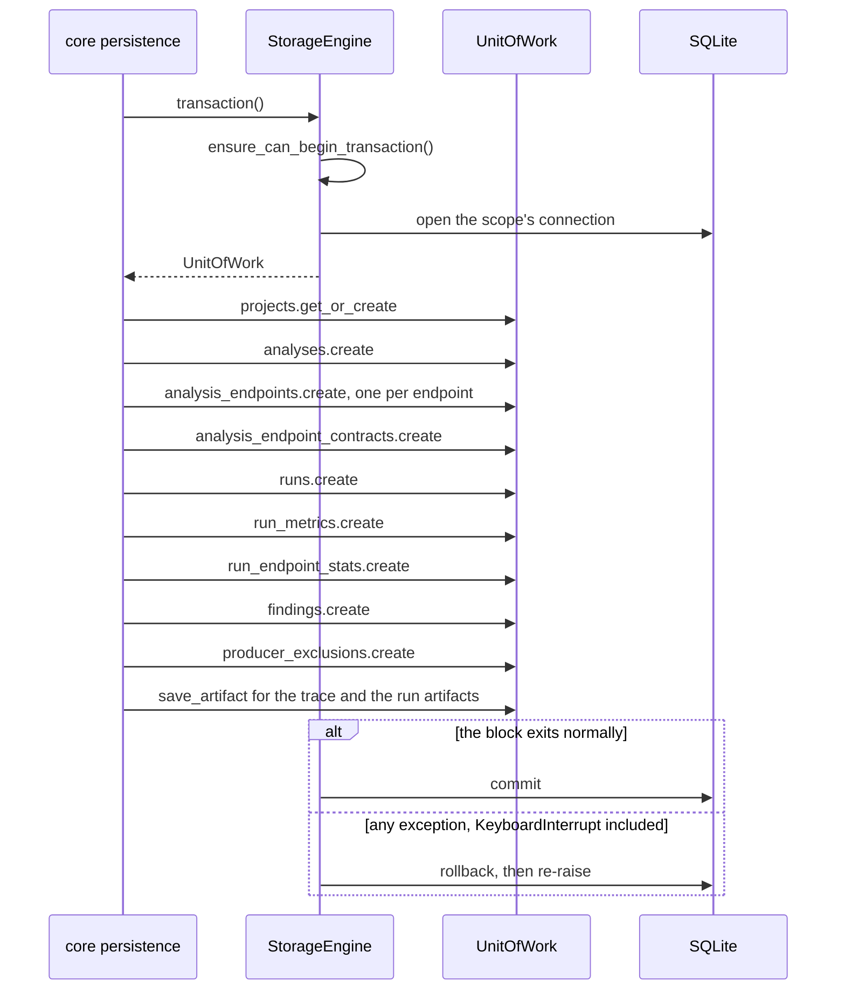

# Transactions

A composed write is all-or-nothing. Persisting a run writes the project, the
analysis, its endpoints and their contracts, the run, its metrics, its
per-endpoint stats, its findings, its producer exclusions and its artifacts
inside one `transaction()`; any exception rolls all of it back. This page covers
the engine that opens that scope, the connections it runs on, the Unit of Work
it yields, and the one rule every caller has to know: scopes do not nest.



## Opening an engine

`StorageEngine` takes one optional argument, the database to open:

| Argument | Database |
|---|---|
| omitted (`None`) | the file `get_db_path()` resolves; an OS error while resolving it raises `DatabaseOperationError` |
| `":memory:"` | an in-memory database that lives as long as the engine |
| any other `str`, or a `Path` | the database file at that path |

Opening an engine applies `schema.sql` and checks the
[fingerprint](data-model.md#fingerprint) stamped in the file. A file built from
a different schema raises `SchemaMismatchError`. If anything fails while
opening, the engine closes itself before the exception leaves the constructor.

Every connection the engine opens returns rows addressable by column name and
gets these settings:

| Setting | Applies to | Effect |
|---|---|---|
| `foreign_keys = ON` | every connection | foreign keys are enforced |
| `busy_timeout = 5000` | every connection | a blocked reader or writer waits up to 5 seconds instead of failing at once |
| `journal_mode = WAL` | file databases | readers run alongside a writer; if the file system refuses WAL, the database stays in the default rollback journal |

## Connections

An in-memory engine keeps one connection for its whole life, and every scope
runs on it. A file engine opens a fresh connection for each transaction and
closes it when the scope ends.

`get_connection()` returns a connection for callers that only read: the shared
one for an in-memory engine, a fresh one for a file, which the caller closes.
Failing to connect raises a storage error. SQL run on the returned connection
raises the driver's own errors, not storage exceptions. With a driver misuse
(`sqlite3.ProgrammingError`), it is the only place where `sqlite3` errors reach a
caller
([ADR-075](adr/foundations.md#adr-075)).

## The Unit of Work

`transaction()` is a context manager that yields a `UnitOfWork`. Leaving the
block normally commits. Any exception, `KeyboardInterrupt` included, rolls back
and is re-raised.

A driver error inside the block or at commit leaves as the storage exception it
classifies to (see [errors](errors.md)). A `StorageError` raised in the block
passes through unchanged.

The `UnitOfWork` exposes the scope's connection and one repository per table,
each built on first use and bound to that connection:

| Property | Repository | Table |
|---|---|---|
| `connection` | — | the scope's `sqlite3.Connection` |
| `projects` | `ProjectRepository` | [`projects`](data-model.md#projects) |
| `analyses` | `AnalysisRepository` | [`analyses`](data-model.md#analyses) |
| `analysis_endpoints` | `AnalysisEndpointRepository` | [`analysis_endpoints`](data-model.md#analysis_endpoints) |
| `analysis_endpoint_contracts` | `AnalysisEndpointContractRepository` | [`analysis_endpoint_contracts`](data-model.md#analysis_endpoint_contracts) |
| `runs` | `RunRepository` | [`runs`](data-model.md#runs) |
| `run_metrics` | `RunMetricsRepository` | [`run_metrics`](data-model.md#run_metrics) |
| `run_endpoint_stats` | `RunEndpointStatsRepository` | [`run_endpoint_stats`](data-model.md#run_endpoint_stats) |
| `findings` | `FindingsRepository` | [`findings`](data-model.md#findings) |
| `producer_exclusions` | `RunProducerExclusionsRepository` | [`run_producer_exclusions`](data-model.md#run_producer_exclusions) |
| `artifacts` | `ArtifactRepository` | [`artifacts`](data-model.md#artifacts) |

A `UnitOfWork` has no `commit()`: the scope that opened it commits. No
repository commits either; see [repositories](repositories.md).

## Scopes do not nest { #scopes-do-not-nest }

Opening `transaction()` while one is already open on the same engine and the
same thread raises `NestedTransactionError`. Scopes never nest, and an inner
block never joins the outer one.

The rule is per engine and per thread. Another thread can open its own scope on
the same engine, and another engine can open its own scope on the same thread.

`ensure_can_begin_transaction()` raises what `transaction()` would refuse with,
without opening a connection: `NestedTransactionError` when a scope is open,
then `EngineClosedError` when the engine is closed.

Some operations take the engine rather than a `UnitOfWork`: `compress_artifact`,
`reclaim_artifacts`, `scan_orphans` and `collect_orphans`. Each opens its own
scope, so call it after your block closes; called inside one, it raises before
touching the disk. Retention depends on this: it removes files only after its
own transaction commits ([ADR-077](adr/foundations.md#adr-077)).

```python
from storage import EngineClosedError, NestedTransactionError, StorageEngine

engine = StorageEngine(":memory:")
with engine.transaction():
    try:
        with engine.transaction():
            pass
    except NestedTransactionError:
        print("a nested scope is refused")
with engine.transaction():
    print("a new scope opens after the first closes")
engine.close()
try:
    with engine.transaction():
        pass
except EngineClosedError:
    print("a closed engine is refused")
```

```text
a nested scope is refused
a new scope opens after the first closes
a closed engine is refused
```

## Closing

`close()` is idempotent and releases the in-memory connection. Any later use of
a closed engine raises `EngineClosedError`.

`StorageEngine` is a context manager: entering it checks the engine is open, and
leaving it closes the engine. Prefer `with StorageEngine(...) as engine:` so a
failure inside the block still closes it.

## Read next

- [Repositories](repositories.md): what each repository writes and reads, and how
  to add a table.
- [Errors](errors.md): every exception a scope can raise.
- [Data model](data-model.md): the tables the Unit of Work exposes.
- [Decision records](adr/index.md): why storage is built this way.
