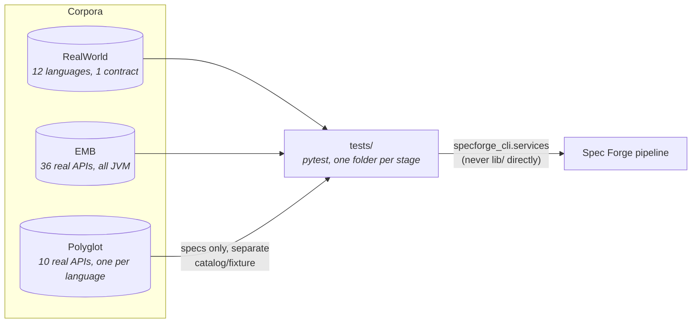

# Test Corpora

`tests-repos` is a separate repository that exists to test Spec Forge against
**real APIs, not fabricated examples**. It holds three corpora of real
OpenAPI contracts and source code, and the pytest suite that drives the Spec
Forge CLI against them.

Each corpus answers a different question and none of them overlap:

| | Question it answers | What it is |
|---|---|---|
| [RealWorld](real-world.md) | Does Spec Forge tolerate all 12 languages? | 12 implementations of the **same** contract, one per `core_ast`-supported language |
| [EMB](emb.md) | Does it find real bugs? | 36 real open-source APIs — the EvoMaster benchmark |
| [Polyglot](polyglot.md) | Does it find real bugs outside the JVM? | One real production API per language (10/11 wired) |
| [Integration suite](suite.md) | Does the pipeline hold together end to end? | One folder per module, exercised against all 37 contracts and 12 implementations, plus a separate `polyglot` track (10 contracts) |

In RealWorld the spec is held constant and the source code is the only
variable, which isolates language support. In EMB it's the opposite: real
applications with real bugs, all JVM, measuring how much Spec Forge actually
finds. Polyglot sits between the two: real applications like EMB, but one per
language like RealWorld.

## Quick start

```bash
# the suite -- nothing needs to be installed or running
cd tests && ./run.sh

# 12 languages -- the source is already in the repo
cd real-world && general/up.sh go

# 36 real APIs -- compile once first
cd emb && ./bootstrap.sh 8 maven && ./up.sh features-service

# 1 real API per language -- clone once first
cd polyglot && ./bootstrap.sh python && ./up.sh python
```

All three corpora expose the same interface: `up.sh <target>` leaves one API
on `http://localhost:8000`, `down.sh` tears it down, and only one target runs
at a time. `up.sh` with no arguments lists the available targets.

## Requirements

Docker and `docker compose` (or the standalone `docker-compose` v2 binary —
the scripts detect whichever is present). `emb/` and `polyglot/` additionally
need `git`, and `emb/` also needs `python3` and `curl`. No JDK, Maven, Node,
Ruby or any of the target stacks need to be installed on the host: everything
builds and runs inside containers.

## Rules shared by all three corpora

**Port 8000, one target at a time.** Everything downstream — the fuzzing
stage, the suite — always points at the same place.

**State is ephemeral on purpose.** Databases live in `tmpfs` or in the
container's writable layer — no named volumes, with one documented exception
in `polyglot/` where two containers need to share files on disk (see
[Polyglot → Rules of the stack](polyglot.md#rules-of-the-stack)). A fuzzer
mutates state; if the database persists, a second run doesn't reproduce the
first and the metrics stop being comparable. Reset = `down` + `up`.

**Everything is pinned by SHA.** Each corpus ships a `MANIFEST.tsv` with the
exact repo and commit of every API it contains. Without that pin the corpus
stops being reproducible and results stop being comparable across runs.

## Only the fuzzing stage needs a live API

Contract parsing, static AST analysis and LLM inference are all static
analysis — `core_ast` reads source code, it never executes it — so those
stages only need the files already checked into the repo. The fuzzing stage
is the only one that needs a SUT actually answering on port 8000.

That's why `real-world/` already ships `corpus.py` (a Python API to boot
implementations without shelling out to the scripts) while **`emb/` and
`polyglot/` are still missing their own** — it's the infrastructure gap to
close before their fuzzing-stage test folders can exist. See
[EMB → Pending](emb.md#pending-a-python-api).

`polyglot/`'s **specs** are wired into `contract_engine/`'s static track — see
[Polyglot → Consumers](polyglot.md#consumers) — but its **APIs** aren't
bootable from the suite yet, for the same reason `emb/` isn't: no Python
class like `real-world/corpus.py` exists for it, and nothing needs one until
the fuzzing-stage folder does.



## Where to go next

- [RealWorld corpus](real-world.md) — the 12-language matrix, `corpus.py`, and
  what it cost to get each stack running.
- [EMB corpus](emb.md) — the 36-SUT benchmark, what each SUT exposes, and the
  seeded-state caveat to keep in mind when reading `500`s.
- [Polyglot corpus](polyglot.md) — 10 of 11 language candidates wired, what
  each one's OpenAPI contract actually comes from, and the rules its
  implementation follows.
- [Integration suite](suite.md) — how `esperado/`/`output/` decide
  correctness, current status, and the roadmap.
