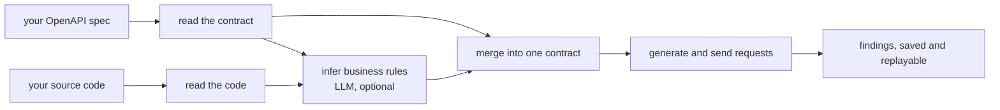
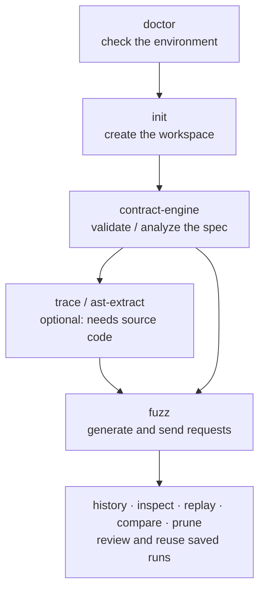
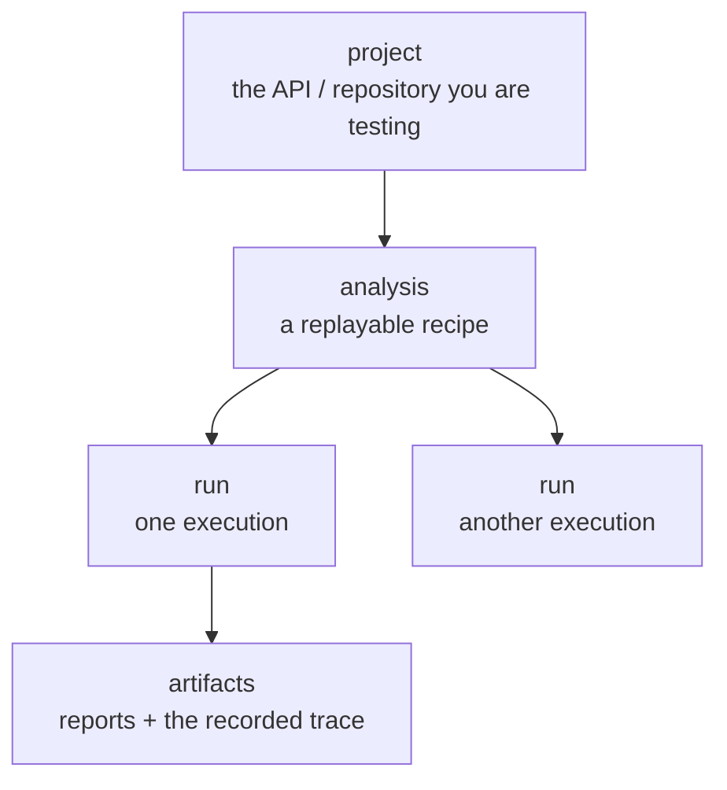
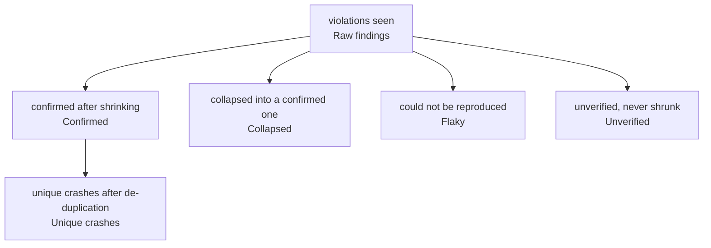

# Core Concepts

This page explains, in plain terms, what Spec Forge does and the words it uses. If a
term is new, it is defined the first time it appears and collected in the
[Glossary](glossary.md).

## Property-based testing in two paragraphs

Most tests check one example: send *this* request, expect *that* answer. **Property-based
testing** turns that around. Instead of writing examples by hand, you describe the *shape*
of a valid input — "a string between 1 and 40 characters", "a positive integer", "an object
with these fields" — and the tool generates many inputs that fit the description, hundreds
of them, including the awkward ones a human rarely thinks to try (empty strings, huge
numbers, missing fields, unexpected types).

For every generated input, the tool checks a **rule that must always hold** — a *property*.
For an API, the rules come free from its contract: a valid request must not cause a
`500 Server Error`, the response must match the declared schema, an undeclared status code
is a bug. When one input breaks a rule, Spec Forge does not just report it — it **shrinks**
it, repeatedly simplifying the failing input until it finds the smallest one that still
fails. A minimal reproducer ("the field `age` set to `-1`") is far easier to act on than the
random 4-KB blob that first tripped the bug.

## What Spec Forge does

You give Spec Forge two things: your API's **OpenAPI spec** (the machine-readable
description of its endpoints, requests and responses) and, optionally, the API's **source
code**. It reads both, works out what each endpoint is supposed to do, generates a stream of
requests against a running copy of your API, and reports the requests that broke a rule.



The source-code and LLM steps are optional. With the spec alone, Spec Forge already fuzzes
every endpoint straight from the schema. Reading the code and inferring business rules (with
a large language model) adds rules the schema cannot express — "you cannot delete an article
you do not own" — so the fuzzer can find deeper, logic-level bugs.

## The workflow

Spec Forge is an interactive shell (a **REPL**: you type a command, it answers, you type the
next). In typical use, you run these commands in order:



- **`doctor`** checks that every piece Spec Forge needs is installed, and `doctor --fix`
  installs what is missing.
- **`init`** creates the local workspace (a `.specforge` folder and a config file).
- **`contract-engine`** validates your spec (`--validate`) or analyzes it (`--analyze`).
- **`trace`** and **`ast-extract`** read the API's source to locate an endpoint's handler and
  the code it depends on. Both are optional and both need the source checked out.
- **`fuzz`** does the real work: it compiles test-case generators from the spec, sends
  requests to the live API, and reports what broke.
- **`history`**, **`inspect`**, **`replay`**, **`compare`** and **`prune`** work with runs
  already saved (see below).

See the [CLI Reference](cli-reference.md) for every command and flag.

## What gets saved

Every `fuzz` run is saved, so you can review it later, reproduce it exactly, or compare it to
another. Saved data is organized in three levels:



- A **project** is the API or repository you are testing.
- An **analysis** is a *replayable recipe*: the contracts Spec Forge resolved plus the
  ordered **trace** — the exact list of requests a run sent — needed to reproduce it.
- A **run** is one execution of that recipe. The first run generates and records the trace; a
  **replay** re-sends that recorded trace verbatim.
- **Artifacts** are the files a run leaves on disk: its reports and the trace file.

Reproducibility here is by *record and replay*, not by a random seed: the original run writes
down every request it sent, and reproducing means re-sending that exact list.

## What a finding is, and how the counters relate

A **finding** is a single request (or, in stateful mode, a sequence) that broke a rule. Not
every finding is a distinct bug, so the `fuzz` report walks the findings through a funnel and
reports a counter at each stage:



| Counter | Meaning |
| --- | --- |
| **Requests** | How many requests the run sent. |
| **Shrink requests** | Extra requests spent shrinking failures to their minimal form (not counted in Requests). |
| **Raw findings** | Every rule violation seen while exploring. |
| **Confirmed** | Findings that still failed after shrinking — one per distinct symptom. |
| **Collapsed** | Findings with the same symptom as a confirmed one, so not shrunk again. |
| **Unverified** | Findings the run collected but never got to shrink (it was cut short first). |
| **Flaky** | Findings that could not be reproduced on a second try, so dropped. |
| **Unique crashes** | Distinct bugs left after removing duplicates — the number that matters. |

The bottom line of any run is its **unique crashes**: the count of genuinely distinct
defects, after everything else has been de-duplicated away.

## The five ways to run

The `fuzz` command has four modes, chosen with `--mode`, plus the separate `replay` command:

- **`--mode stateless`** (the default) fuzzes each endpoint on its own, one request at a time.
- **`--mode stateful`** chains requests into sequences, surfacing bugs that only appear when
  operations run in a certain order.
- **`--mode performance`** sustains load and, with `--latency-sla-ms`, fails any endpoint
  slower than the threshold you set.
- **`--mode resilience`** sends a fixed battery of malformed-transport requests (slow, partial,
  oversized, deeply nested, wrong content type) and flags any endpoint that answers with a
  server error, hangs or crashes instead of refusing cleanly.
- **`replay`** re-sends a saved run's recorded trace against the live API, to check whether a
  bug is still there.

## Identities

Many APIs need authentication, and the credentials never come from the spec. You supply them
in an **identities** file: a TOML file that declares named sets of request headers.

```toml
[[identities]]
label = "anonymous"

[[identities]]
label = "alice"
[identities.headers]
Authorization = "Bearer alice-token"
```

Pass the file with `fuzz --identities identities.toml`. Requests are built and sent under each
identity you declare, so the fuzzer exercises the API as different users. Credentials live
only in this file — never in the OpenAPI spec, never invented by the LLM.
